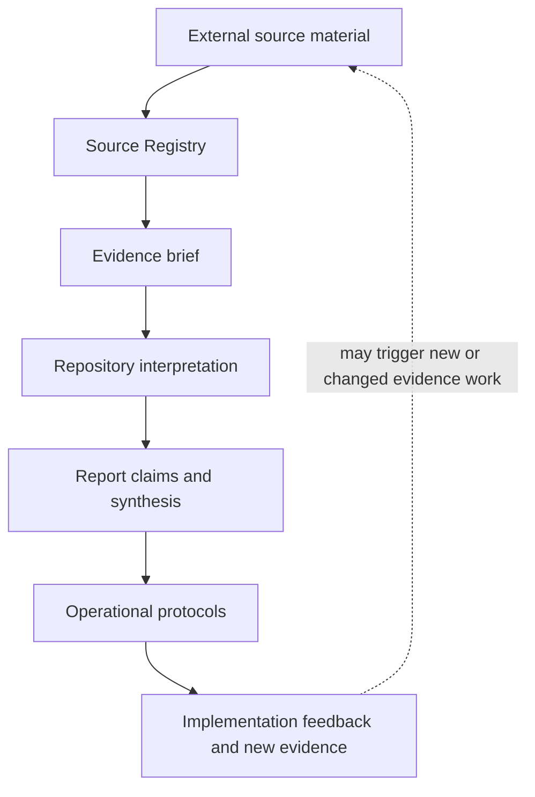

# Repository Artifact Model

## Status and precedence

This document is the dedicated reader-facing map of the repository's artifacts and their relationships. It expands the artifact relationships defined in [`DOCTRINE.md`](DOCTRINE.md) without replacing the Doctrine as the canonical content authority.

[`AGENTS.md`](AGENTS.md) governs workflows, approval gates, source states, verification, contributor obligations, and independent review. [`DOCTRINE.md`](DOCTRINE.md) governs research and interpretation principles and artifact boundaries. [`GLOSSARY.md`](GLOSSARY.md) governs canonical terminology. [`SCOPE.md`](SCOPE.md) expands the repository's research boundary.

This artifact model does not create a workflow, change source status, establish verification, or strengthen a claim. Original sources remain authoritative for what they report, and [`evidence/SOURCES.md`](evidence/SOURCES.md) remains canonical for source identity and status.

## Core artifact flow

The flow is directional, but it is not a claim that every artifact is produced mechanically or that every protocol follows from one source. Interpretation, claims, and protocols remain subject to the evidence and claim boundaries in the Repository Doctrine.

## Core artifacts

| Artifact | Purpose | Boundary |
| --- | --- | --- |
| **External source material** | Original papers, datasets, filings, standards, documentation, and other records used as evidence | Authoritative only for what the source itself reports; not automatically accepted or verified repository evidence |
| **Source Registry** | Canonical identity, classification, evidence-review status, integration-audit status, verification date, and actual repository use | Not a narrative argument, evidence brief, or compact bibliography |
| **Evidence brief** | Source-oriented review of methods or documentary purpose, findings, calculations, interpretations, limitations, and repository use | Not a report chapter, endorsement of the thesis, or proof that every repository use has been audited |
| **Repository interpretation** | Project-authored synthesis, application, systems inference, or bounded extrapolation from one or more sources and methods | Not a finding directly reported by an external source |
| **Report claims and synthesis** | Structured argument connecting bounded findings, documentary records, interpretations, mechanisms, implications, and scenarios | Not a collection of unbounded summaries or one universal causal chain |
| **Operational protocol** | Adaptable controls, roles, signals, gates, decision rights, escalation paths, and feedback loops derived from identified risks | Not empirical proof, universal policy, or a fixed threshold for every organization |
| **Implementation feedback and new evidence** | Measured experience, case studies, failures, corrections, and new sources that may qualify or revise claims and protocols | Anecdotes remain anecdotes; feedback does not change canonical evidence state without the applicable repository flow |

## Cross-cutting artifacts

These artifacts inspect, bound, govern, cite, record, or navigate the core flow. They are not additional evidence stages. Reader-facing groupings such as the README repository map are navigation aids, not alternative artifact classifications.

| Artifact | Purpose | Boundary |
| --- | --- | --- |
| [`SCOPE.md`](SCOPE.md) | Expands what the repository studies, what it excludes, and how adjacent topics may be used | Does not decide whether a specific factual claim is true or override the boundaries in `AGENTS.md` and Doctrine |
| [`DOCTRINE.md`](DOCTRINE.md) | Defines research, evidence, interpretation, protocol, claim-boundary, and artifact principles | Does not create workflows or source states |
| [`GLOSSARY.md`](GLOSSARY.md) | Defines canonical meanings for recurring repository terms | Does not provide factual evidence |
| [`README.md`](README.md) | Primary reader entry point, Key Takeaways, repository-level maps, major navigation, and citation guidance | Not canonical for source status and not a substitute for the report, evidence briefs, or Source Registry |
| [`CHANGELOG.md`](CHANGELOG.md) | Records selected material reader-facing, evidence, protocol, content-architecture, attribution, citation, and governance changes | Not an exhaustive commit ledger, source-status registry, evidence brief, or release certification |
| **Claim confidence map** | Assesses the current support and class of selected major repository claims | Not a source-quality ranking or mandatory workflow stage |
| **Evidence Map** | Classifies evidence types, repository interpretation, and protocols by role | Not a confidence scorecard or source-status registry |
| **Crisis Map** | Visualizes the proposed systems mechanism and bounded scenarios | Not a chronology or a measured end-to-end causal chain |
| [`evidence/README.md`](evidence/README.md) and evidence-class indexes | Define evidence taxonomy, brief standards, and navigation to available source reviews | Not canonical for source identity, status, verification date, or actual current use |
| [`REFERENCES.md`](REFERENCES.md) | Compact human-readable bibliography and navigation aid | Not canonical for source identity, status, or current use |
| [`TERMINOLOGY_AND_ATTRIBUTION.md`](TERMINOLOGY_AND_ATTRIBUTION.md) | Documents public-record terminology provenance and attribution boundaries | Not a definitive etymology, ownership claim, or substitute for its documentary evidence brief |
| [`CITATION.cff`](CITATION.cff) | Machine-readable repository citation metadata | Not a change history, release ledger, evidence source, or attribution analysis |
| [`CONTRIBUTING.md`](CONTRIBUTING.md) | Explains contributor mechanics, expectations, and repository entry points | Cannot override `AGENTS.md`, Doctrine, the status model, or source evidence |
| [`governance/`](governance/README.md) playbooks | Provide mandatory procedural extensions selected by the workflow in `AGENTS.md` | Cannot override or independently change `AGENTS.md`, statuses, gates, or contributor obligations |
| Repository navigation | Helps readers move among the report, evidence, protocols, and supporting documents | Must not introduce stronger claims than the underlying artifacts |
| [`AGENTS.md`](AGENTS.md) | Governs how repository work is classified, performed, synchronized, reviewed, and escalated | Not a source of empirical evidence or a substitute for the content artifacts |

## Relationship rules

1. A registered source is not the same thing as a reviewed evidence brief.
2. A reviewed evidence brief does not imply that repository integration is verified.
3. A repository interpretation must remain distinguishable from a source finding or documented fact.
4. A report claim must preserve the evidence scope, uncertainty, and claim class from which it was formed.
5. A protocol translates a bounded risk into operating practice; it does not prove the risk or the control universally valid.
6. Maps and confidence assessments are views over repository claims and artifacts; they do not replace the Source Registry, evidence briefs, or report argument.
7. Implementation feedback may support, weaken, or redesign a protocol, but it enters the evidence system through the applicable process in `AGENTS.md`.
8. Contributor, governance, citation, attribution, history, and navigation artifacts must remain synchronized with the canonical content they expose, but they cannot silently redefine it.

## Where to start

| Reader need | Start here |
| --- | --- |
| Understand the research boundary | [`SCOPE.md`](SCOPE.md) |
| Understand the repository's reasoning rules | [`DOCTRINE.md`](DOCTRINE.md) |
| Resolve a recurring term | [`GLOSSARY.md`](GLOSSARY.md) |
| Inspect material repository evolution | [`CHANGELOG.md`](CHANGELOG.md) |
| Inspect source identity or status | [`evidence/SOURCES.md`](evidence/SOURCES.md) |
| Inspect a source's methods, findings, and limitations | [Evidence Library](evidence/README.md) |
| Read the complete argument | [Report](report/01_the_illusion.md) |
| Apply practical controls | [Operational Protocols](protocols/README.md) |
| Understand name provenance or attribution | [`TERMINOLOGY_AND_ATTRIBUTION.md`](TERMINOLOGY_AND_ATTRIBUTION.md) |
| Cite the repository | [`README.md`](README.md#citation-attribution-and-history) and [`CITATION.cff`](CITATION.cff) |
| Contribute or change the repository | [`AGENTS.md`](AGENTS.md), [`CONTRIBUTING.md`](CONTRIBUTING.md), and the applicable [governance playbooks](governance/README.md) |

## Change discipline

Change this model only when the repository's actual artifact types or relationships change. A new file, navigation link, or editorial preference does not automatically justify a new artifact class.

Substantive changes remain subject to the approval and independent-review requirements in [`AGENTS.md`](AGENTS.md).
