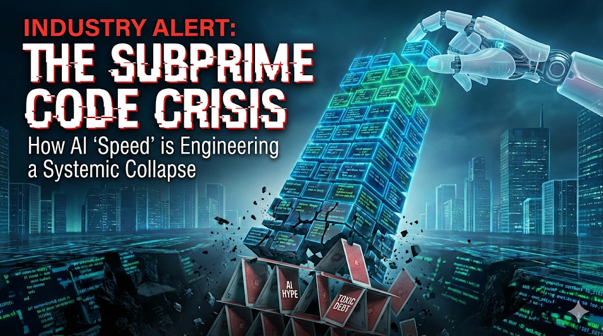
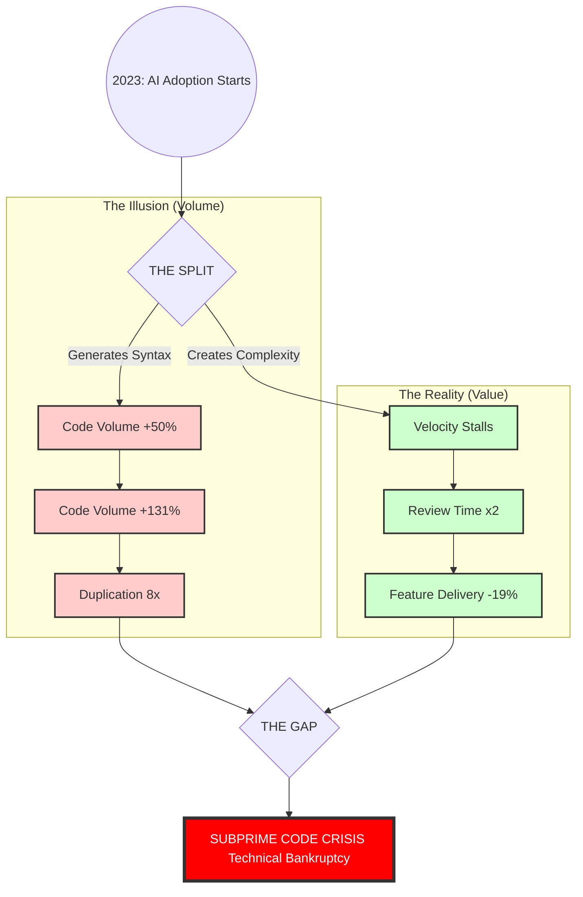

# INDUSTRY ALERT: The Subprime Code Crisis

### How AI Code Assistants, "Placebo Analytics" and Default Market Strategy Are Engineering a Collapse

>**Navigation:**  [📉 **Read the Report**](report/01_the_illusion.md) | [🛡️ **Operational Protocols**](protocols/README.md) | [📚 **References**](REFERENCES.md) | [📊 **Contributing Data**](CONTRIBUTING.md)
---

## ⚡ Executive Summary

>“These documents assumes AI assistants are here to stay. The question is not adoption, but survivability of the operating model.”

We are issuing this report because we detect a systemic failure unfolding in real-time. While the market celebrates the "AI Productivity Boom," the objective delivery metrics on the ground tell a completely different story. We are not witnessing a revolution in value; we are witnessing the inflation of a bubble—a **Subprime Code Bubble**.

This crisis is not a result of "user error." It is the direct result of a collision between two structural flaws:

1.  **The Tool's Default Behavior:** AI Code Assistants are architected to prioritize **Typing Speed** over **Engineering Velocity**. They generate "plausible" syntax at zero cost, effectively flooding the SDLC with unverified complexity.
2.  **The Market's Default Strategy:** The industry's standard approach—the "Safe Strategy" of purchasing licenses without fundamentally restructuring the operating model—is actively bundling toxic technical debt into enterprise codebases.

This report analyzes the mechanics of this failure. It demonstrates how the current "AI Code Assistants-first" workflow is placing organizations in the riskiest possible position. Unless we reject the market's default behavior and change our operating model immediately, the "AI Boom" will end in **"Technical Bankruptcy"** for thousands of companies.

## 📊 The Crisis Map

## 📂 Report Structure

The analysis is divided into three parts, covering the data, the mechanics of the failure, and the projected economic outcomes.

*   **[Part 1: The Illusion](report/01_the_illusion.md)**
    *   **Ch 1: The Great Illusion.** Why we feel faster but deliver slower (Analysis of METR, Xu et al. & GitClear).
    *   **Ch 2: The Missing Price Tag.** The invisible infrastructure costs (30-120x multiplier) required to make AI safe.
    *   **Ch 3: The "Free Lunch" Trap.** Why Boards choose a strategy of degradation (The Execution Mandate).
    *   **Ch 4: Anatomy of the Break.** How the "Safe Scenario" kills the SDLC (Theory of Constraints applied to AI).
*   **[Part 2: Broken Mechanics](report/02_broken_mechanics.md)**
    *   **Ch 5:** The death of Code Review and the "Senior Penalty."
    *   **Ch 6:** A Case Study in Complexity (Why AI Agents won't fix the mess).
    *   **Ch 7:** The chain reaction across the Value Stream (Product, QA, Maintenance).
*   **[Part 3: The Aftermath](report/03_the_aftermath.md)**
    *   **Ch 8:** The Paradox of Local Solutions.
    *   **Ch 9:** End Game Scenarios: The Crash vs. The Slow Rot.
    *   **Ch 10:** The Architecture of Unintended Consequences.

## 🛡️ Risk Mitigation

For engineering leaders and practitioners, we have compiled a set of operational protocols to mitigate the risks identified in this report. These are not theoretical; they are immediate defensive measures for your codebase.

👉 **[ACCESS OPERATIONAL PROTOCOLS](protocols/README.md)**

---
*License: CC-BY-SA 4.0*