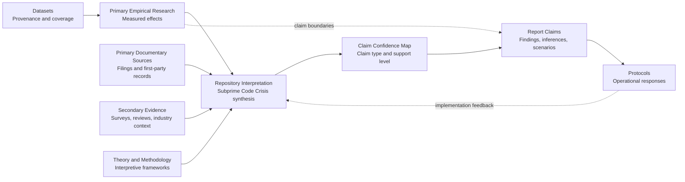
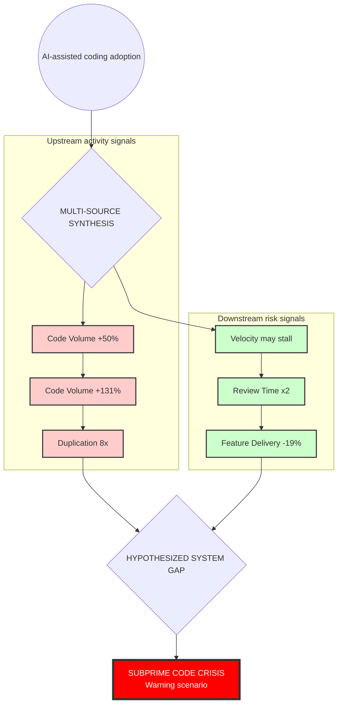
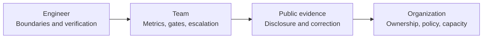

# The Subprime Code Crisis

# An independent research synthesis on AI-assisted software delivery risk

How AI code assistants can create local productivity gains while shifting cost into review, QA, security, architecture, maintenance, and production stability.

> **Navigation:** [📉 **Read the Report**](report/01_the_illusion.md) | [🧾 **Evidence Library**](evidence/README.md) | [🗂️ **Source Registry**](evidence/SOURCES.md) | [🛡️ **Operational Protocols**](protocols/README.md) | [📚 **References**](REFERENCES.md) | [📊 **Contributing Data**](CONTRIBUTING.md)

## Research framing

This repository is an independent research synthesis on AI-assisted software delivery risk.

It aggregates public empirical studies, documentary sources, industry reports, and delivery-system analysis to examine one core hypothesis:

AI-assisted coding can create local productivity gains while shifting cost into downstream delivery constraints such as code review, QA, security validation, architecture, maintenance, and production stability.

This is not an argument against AI-assisted development. The goal is to prevent poor adoption models from creating technical debt, organizational backlash, and loss of trust in a genuinely important technology.

The report is written in a strong practitioner voice, but its claims should be read across three levels:

- evidence-backed findings;
- system-level inferences;
- risk scenarios requiring further validation.

## What this is

This is a delivery-system risk analysis of AI-assisted software development.

It focuses on what happens when organizations treat faster code generation as equivalent to faster software delivery, without rebalancing code review, QA, security validation, architecture, deployment, maintenance, and governance.

## What this is not

This is not a claim that AI coding tools are useless.

This is not an argument against AI-assisted software development.

This is not a prediction that every organization will fail.

This is not a rejection of developer productivity gains in isolated tasks.

It is a warning that local acceleration does not automatically become system-level throughput.

## Executive Summary

AI code assistants are powerful tools, but their current adoption model is often incomplete.

Most enterprise rollouts measure local productivity gains: faster code generation, faster task completion, more output per developer. But software delivery is not limited by typing speed. In mature engineering organizations, important constraints often sit downstream: code review, testing, security validation, architecture, deployment, maintenance, and production stability.

This report argues that unmanaged AI-assisted coding can create a Subprime Code Bubble: a growing volume of plausible, syntactically valid, but insufficiently reviewed and poorly integrated code that shifts cost into the future.

The risk is not caused by AI alone. It emerges from the collision of two forces:

1. Tool behavior: AI code assistants reduce the effort required to generate code-like output, but they do not necessarily reduce the verification burden at the same rate.
2. Market behavior: organizations often adopt AI tools as productivity multipliers without redesigning the operating model around the increased output flow.

The result can be a mismatch: code generation scales faster than the organization’s capacity to review, test, understand, secure, and maintain that code.

The alternative is not to reject AI-assisted development. The alternative is to govern it as a delivery-system change.

## Claim confidence map

The **Claim confidence map** evaluates the repository's conclusions: what kind of claim each statement is and how strongly the current body of evidence supports it. It does not classify sources.

| Claim | Type | Confidence |
| --- | --- | --- |
| AI tools can accelerate isolated coding tasks | Empirical finding | High |
| Local code generation speed does not guarantee SDLC throughput | Systems inference | High |
| AI-assisted coding can shift bottlenecks into review, QA, security, and maintenance | Evidence-backed inference | Medium-High |
| Unmanaged adoption may inflate technical debt | Risk scenario | Medium |
| Industry-wide “technical bankruptcy” is possible under aggressive cost-cutting adoption models | Warning scenario | Medium-Low |

These ratings are repository judgments and must be reassessed when source integration audits materially change the evidence base.

## 🧾 Evidence Map

The **Evidence Map** classifies the materials used to build those claims. It answers a different question from the Claim confidence map: not *how confident are we in a claim?*, but *what kind of source, interpretation, or operational artifact is this?*

The table below is a repository-level map. The canonical and complete source inventory, review state, integration state, verification date, and current use live in the [Source Registry](evidence/SOURCES.md). [References](REFERENCES.md) is the compact human-readable bibliography.

| Layer | Purpose | Current coverage in this repository |
| --- | --- | --- |
| **Primary empirical research** | Original studies and measurement reports with inspectable methods and results | [NBER: Writing Code vs. Shipping Code](evidence/primary/2026-writing-code-vs-shipping-code.md); METR developer-productivity RCT and long-task measurement; Xu et al.; Agarwal et al.; Peng et al.; GitClear measurement reports |
| **Primary documentary sources** | First-party records used for infrastructure, spending, and organizational claims | Alphabet, Meta, and Microsoft filings; official product and engineering documentation; published engineering-system descriptions |
| **Secondary evidence and industry context** | Reviews, surveys, practitioner analyses, and synthesis used for triangulation or context | DORA reports; McKinsey and Deloitte enterprise surveys; practitioner reviews and commentary |
| **Theory and methodology** | Frameworks used to interpret delivery-system behavior rather than to measure AI effects directly | Goldratt's Theory of Constraints; software-productivity frameworks; weak-link and production-hierarchy reasoning |
| **Datasets** | Documented data sources and datasets used by cited studies or future independent analysis | [Dataset registry](evidence/datasets/README.md); datasets documented in cited studies |
| **Repository interpretation** | The Subprime Code Crisis synthesis: bottleneck migration, production attenuation, risk scenarios, and system-level implications | [Report](report/01_the_illusion.md), Claim confidence map, and the Crisis Map below |
| **Protocols** | Practical responses, controls, metrics, and decision rules derived from the risk analysis | [Operational protocols](protocols/README.md) |

```mermaid
flowchart LR
    P[Primary Empirical Research<br/>Measured effects]
    F[Primary Documentary Sources<br/>Filings and first-party records]
    S[Secondary Evidence<br/>Surveys, reviews, industry context]
    T[Theory and Methodology<br/>Interpretive frameworks]
    D[Datasets<br/>Provenance and coverage]
    I[Repository Interpretation<br/>Subprime Code Crisis synthesis]
    C[Claim Confidence Map<br/>Claim type and support level]
    R[Report Claims<br/>Findings, inferences, scenarios]
    O[Protocols<br/>Operational responses]

    D --> P
    P --> I
    F --> I
    S --> I
    T --> I
    I --> C
    C --> R
    R --> O

    P -. claim boundaries .-> R
    O -. implementation feedback .-> I
```

The evidence flow is intentionally directional:

1. Sources report findings, records, or context.
2. The repository interprets those materials.
3. The Claim confidence map labels the resulting claims and support level.
4. The report develops bounded findings, inferences, and risk scenarios.
5. Protocols translate those risks into operating practices.

A protocol is not empirical proof, a repository interpretation is not a source finding, and a confidence rating is not a source category. Detailed classification and verification rules are in the [Evidence Library](evidence/README.md) and [AGENTS.md](AGENTS.md).

## 📊 The Crisis Map

> **Provisional multi-source synthesis.** The figures below come from different sources, samples, periods, and metric definitions. They are not one observed longitudinal causal chain. Each node must be retained, corrected, relabeled, or removed through the source-by-source integration audits before this map is treated as verified.

```mermaid
flowchart TD
    %% Setup Styles
    classDef volume fill:#ffcccc,stroke:#333,stroke-width:2px;
    classDef value fill:#ccffcc,stroke:#333,stroke-width:2px;
    classDef crisis fill:#ff0000,color:white,stroke:#333,stroke-width:4px;

    Start((AI-assisted coding adoption)) --> Split{MULTI-SOURCE SYNTHESIS}

    subgraph Illusion ["Upstream activity signals"]
        Split --> Vol1[Code Volume +50%]
        Vol1 --> Vol2[Code Volume +131%]
        Vol2 --> Vol3[Duplication 8x]
    end

    subgraph Reality ["Downstream risk signals"]
        Split --> Val1[Velocity may stall]
        Val1 --> Val2[Review Time x2]
        Val2 --> Val3[Feature Delivery -19%]
    end

    Vol3 --> Gap{HYPOTHESIZED SYSTEM GAP}
    Val3 --> Gap

    Gap --> Crisis[SUBPRIME CODE CRISIS<br/>Warning scenario]

    class Vol1,Vol2,Vol3 volume;
    class Val1,Val2,Val3 value;
    class Crisis crisis;
```

The source audits must verify every number, label source boundaries, and determine whether the arrows represent evidence, repository synthesis, or a warning scenario.

## How to read this report

This report is written for engineering leaders, senior developers, architects, QA leaders, delivery managers, and AI-adoption decision-makers.

It can be read in three ways:

- as a warning about unmanaged AI-assisted coding adoption;
- as a delivery-system analysis of bottleneck migration;
- as a starting point for engineering governance patterns around AI-generated code.

Readers looking for the evidence base should start with the [Source Registry](evidence/SOURCES.md), then open the relevant evidence briefs and use [References](REFERENCES.md) as the compact bibliography.

Readers looking for immediate operating practices should start with the [Operational Protocols](protocols/README.md).

## 📂 Report Structure

The analysis is divided into three parts:

- **[Part 1: The Illusion](report/01_the_illusion.md)** — task-level gains, source claims, infrastructure costs, and bottleneck framing.
- **[Part 2: Broken Mechanics](report/02_broken_mechanics.md)** — review, complexity, QA, maintenance, and value-stream consequences.
- **[Part 3: The Aftermath](report/03_the_aftermath.md)** — scenarios, organizational consequences, and systemic risk.

## 🛡️ Risk Mitigation

The repository's operational response is organized as a four-layer control stack:

```mermaid
flowchart LR
    A[Engineer<br/>Boundaries and verification]
    --> B[Team<br/>Metrics, gates, escalation]
    --> C[Public evidence<br/>Disclosure and correction]
    --> D[Organization<br/>Ownership, policy, capacity]
```

| Layer | Protocol | Primary question |
| --- | --- | --- |
| **Engineer** | [Personal Defense](protocols/01_personal_defense.md) | What generated output may cross into durable code, and under what verification? |
| **Team** | [Operational Defense](protocols/02_operational_defense.md) | Is local acceleration improving or degrading delivery-system outcomes? |
| **Public evidence** | [Public Evidence and Disclosure](protocols/03_public_defense.md) | What can be claimed, with what support, limitations, and correction path? |
| **Organization** | [Systemic Cure](protocols/04_systemic_cure.md) | Who owns adoption policy, capacity, exceptions, escalation, and learning? |

These are practical operating patterns, not universal thresholds or empirical proof. Teams should adapt them to local risk, architecture, regulation, and delivery constraints, then feed implementation results back into the evidence base.

👉 **[ACCESS OPERATIONAL PROTOCOLS](protocols/README.md)**

---
*License: CC-BY-SA 4.0*
