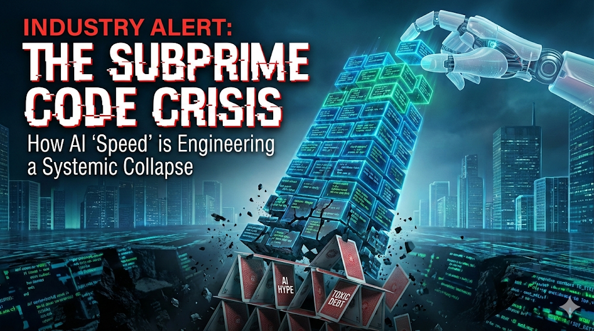
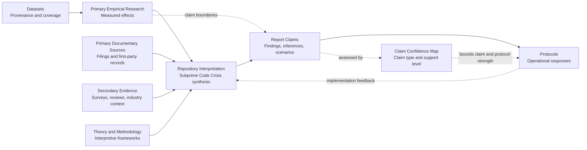
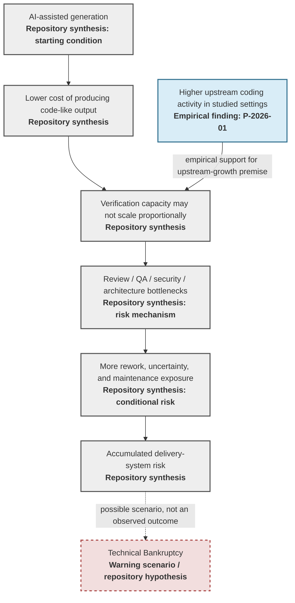
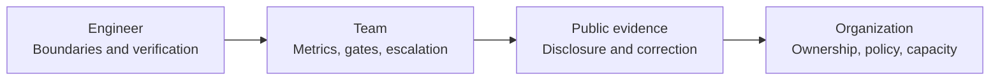

# The Subprime Code Crisis

**An independent research synthesis on AI-assisted software delivery risk**

How AI code assistants can create local productivity gains while shifting cost into review, QA, security, architecture, maintenance, and production stability.

> **Navigation:** [📉 **Read the Report**](report/01_the_illusion.md) | [🧭 **Doctrine**](DOCTRINE.md) | [📖 **Glossary**](GLOSSARY.md) | [🧾 **Evidence Library**](evidence/README.md) | [🛡️ **Operational Protocols**](protocols/README.md) | [🏷️ **Terminology & Attribution**](TERMINOLOGY_AND_ATTRIBUTION.md) | [📚 **References**](REFERENCES.md) | [📊 **Contributing Data**](CONTRIBUTING.md)

## Repository purpose and boundaries

This repository examines one core hypothesis: AI-assisted coding can create local productivity gains while shifting cost into downstream delivery constraints such as code review, QA, security validation, architecture, maintenance, and production stability.

It treats AI-assisted coding as a delivery-system change rather than only a code-generation tool. The goal is not to reject AI assistance, but to prevent incomplete adoption models from creating technical debt, organizational backlash, and loss of trust in a genuinely important technology.

The repository distinguishes source-reported empirical findings and documented facts from repository interpretations, including evidence-backed and systems inferences, and from risk or warning scenarios. It does not claim that AI coding tools are useless, that every organization will fail, or that isolated productivity gains are unreal. Local acceleration simply does not automatically become end-to-end throughput.

## Foundation documents

| Document | Purpose |
| --- | --- |
| [Repository Doctrine](DOCTRINE.md) | Research philosophy, evidence and interpretation principles, protocol principles, claim boundaries, and artifact model |
| [Glossary](GLOSSARY.md) | Canonical definitions for recurring repository terms |
| [Terminology and Attribution](TERMINOLOGY_AND_ATTRIBUTION.md) | Public-record provenance of the name and boundaries of the repository's attributable contribution |
| [`AGENTS.md`](AGENTS.md) | Canonical operating specification for workflows, approval, evidence states, verification, and independent review |

`AGENTS.md` governs repository work. The doctrine and glossary govern content meaning and vocabulary; they do not override source evidence or workflow rules.

> **Name and attribution:** This repository does not claim ownership of, or exclusive authorship over, the phrase **Subprime Code Crisis**. Its attributable contribution is the evidence-governed delivery-system synthesis, claim boundaries, risk mechanism, maps, and operational protocols. See [Terminology and Attribution](TERMINOLOGY_AND_ATTRIBUTION.md) for the documented public record and citation boundaries.

## How to cite this repository

> Oborskyi, Vitalii, and contributors. *The Subprime Code Crisis: An Independent Research Synthesis on AI-Assisted Software Delivery Risk*. Uncertainty Architecture Group, 2026. https://github.com/UncertaintyArchitectureGroup/The-Subprime-Code-Crisis

Citation managers and GitHub's **Cite this repository** function can use [`CITATION.cff`](CITATION.cff). When reusing a specific diagram, report chapter, evidence brief, or protocol, cite that artifact in addition to the repository. Attribution applies to the repository's analysis and artifacts; it does not imply ownership of the general phrase **Subprime Code Crisis**.

## Executive Summary

AI code assistants are powerful tools, but their current adoption model is often incomplete.

Most enterprise rollouts measure local productivity gains: faster code generation, faster task completion, more output per developer. But software delivery is not limited by typing speed. In mature engineering organizations, the real constraints often sit downstream: code review, testing, security validation, architecture, deployment, maintenance, and production stability.

This report argues that unmanaged AI-assisted coding can create a Subprime Code Bubble: a growing volume of plausible, syntactically valid, but insufficiently reviewed and poorly integrated code that shifts cost into the future.

The risk is not caused by AI alone. It emerges from the collision of two forces:

1. Tool behavior: AI code assistants reduce the effort required to generate code-like output, but they do not reduce the verification burden at the same rate.
2. Market behavior: organizations often adopt AI tools as productivity multipliers without redesigning the operating model around the increased output flow.

The result is a dangerous mismatch: code generation scales faster than the organization’s capacity to review, test, understand, secure, and maintain that code.

The alternative is not to reject AI-assisted development. The alternative is to govern it as a delivery-system change.

## Claim confidence map

The **Claim confidence map** evaluates the repository's conclusions: what kind of claim each statement is and how strongly the current body of evidence supports it. It does not classify sources.

| Claim                                                                                          | Type                      | Confidence  |
| ---------------------------------------------------------------------------------------------- | ------------------------- | ----------- |
| AI tools can accelerate isolated coding tasks                                                  | Empirical finding         | High        |
| Local code generation speed does not guarantee SDLC throughput                                 | Systems inference         | High        |
| AI-assisted coding can shift bottlenecks into review, QA, security, and maintenance            | Evidence-backed inference | Medium-High |
| Unmanaged adoption may inflate technical debt                                                  | Risk scenario             | Medium      |
| Industry-wide “technical bankruptcy” is possible under aggressive cost-cutting adoption models | Warning scenario          | Medium-Low  |

Canonical definitions for these claim types are maintained in the [Glossary](GLOSSARY.md); their use is governed by the claim boundaries in the [Repository Doctrine](DOCTRINE.md#claim-boundaries).

## 🧾 Evidence Map

The **Evidence Map** classifies the materials used to build those claims. It answers a different question from the Claim confidence map: not *how confident are we in a claim?*, but *what kind of source, interpretation, or operational artifact is this?*

The table below is a repository-level map, not a replacement for the canonical source inventory and status registry in [`evidence/SOURCES.md`](evidence/SOURCES.md). [`REFERENCES.md`](REFERENCES.md) remains a compact human-readable bibliography and navigation aid.

| Layer | Purpose | Current coverage in this repository |
| --- | --- | --- |
| **Primary empirical research** | Original studies and measurement reports with inspectable methods and results | [NBER: Writing Code vs. Shipping Code](evidence/primary/2026-writing-code-vs-shipping-code.md); METR developer-productivity RCT and long-task measurement; Xu et al. large-scale developer study; Agarwal et al. code-structure analysis; Peng et al. Copilot RCT; GitClear code-change and productivity measurement reports |
| **Primary documentary sources** | First-party records used for infrastructure, spending, organizational, and terminology-provenance claims | Alphabet, Meta, and Microsoft filings; official product and engineering documentation; published engineering-system descriptions; [terminology provenance records](evidence/documentary/terminology-provenance.md) |
| **Secondary evidence and industry context** | Reviews, surveys, practitioner analyses, and synthesis used for triangulation or context | DORA reports; McKinsey and Deloitte enterprise surveys; SoftwareSeni review analysis; TechnoDiaries practitioner reporting; Andreas Horn industry commentary |
| **Theory and methodology** | Frameworks used to interpret delivery-system behavior rather than to measure AI effects directly | Goldratt's Theory of Constraints; software-engineering productivity frameworks; weak-link and production-hierarchy reasoning |
| **Datasets** | Documented data sources and datasets used by cited studies or future independent analysis | [Dataset registry](evidence/datasets/README.md); GitHub activity and marketplace datasets documented in cited studies |
| **Repository interpretation** | The Subprime Code Crisis synthesis: bottleneck migration, production attenuation, risk scenarios, and system-level implications | [Report](report/01_the_illusion.md), Claim confidence map, and the Crisis Map below |
| **Protocols** | Practical responses, controls, metrics, and decision rules derived from the risk analysis | [Operational protocols](protocols/README.md) |

```mermaid
flowchart LR
    P[Primary Empirical Research<br/>Measured effects]
    F[Primary Documentary Sources<br/>Filings and first-party records]
    S[Secondary Evidence<br/>Surveys, reviews, industry context]
    T[Theory and Methodology<br/>Interpretive frameworks]
    D[Datasets<br/>Provenance and coverage]
    I[Repository Interpretation<br/>Subprime Code Crisis synthesis]
    R[Report Claims<br/>Findings, inferences, scenarios]
    C[Claim Confidence Map<br/>Claim type and support level]
    O[Protocols<br/>Operational responses]

    D --> P
    P --> I
    F --> I
    S --> I
    T --> I
    I --> R
    R --> O
    R -. assessed by .-> C
    C -. bounds claim and protocol strength .-> O

    P -. claim boundaries .-> R
    O -. implementation feedback .-> I
```

The evidence flow is intentionally directional:

1. **Sources report findings, records, or context.**
2. **The repository interprets those materials.**
3. **The report formulates bounded findings, inferences, mechanisms, and risk scenarios.**
4. **Protocols translate those bounded risks into operating practices.**

The Claim confidence map is a cross-cutting assessment of selected report claims, not a mandatory processing stage that every claim must pass through before a protocol can be formulated.

A protocol is therefore not empirical proof, a repository interpretation is not a finding directly reported by a source, and a confidence rating is not a source category. Detailed classification rules and evidence-brief standards are documented in the [Evidence Library](evidence/README.md). The canonical source inventory and status registry is [`evidence/SOURCES.md`](evidence/SOURCES.md); [`REFERENCES.md`](REFERENCES.md) is the compact human-readable bibliography and navigation aid.

## 📊 The Crisis Map

The Crisis Map is an **explanatory systems synthesis**, not a chronology, an evidence
scorecard, or a causal chain measured by one study. Each node states its claim type.
Solid arrows show the repository's proposed system mechanism; they do not imply that
one population, tool, period, or metric was followed from end to end.

```mermaid
flowchart TD
    classDef empirical fill:#d9edf7,stroke:#31708f,stroke-width:2px;
    classDef synthesis fill:#eeeeee,stroke:#555,stroke-width:2px;
    classDef scenario fill:#f2dede,stroke:#a94442,stroke-width:2px,stroke-dasharray: 5 5;

    A[AI-assisted generation<br/><b>Repository synthesis: starting condition</b>]
    B[Lower cost of producing code-like output<br/><b>Repository synthesis</b>]
    C[Higher upstream coding activity in studied settings<br/><b>Empirical finding: P-2026-01</b>]
    D[Verification capacity may not scale proportionally<br/><b>Repository synthesis</b>]
    E[Review / QA / security / architecture bottlenecks<br/><b>Repository synthesis: risk mechanism</b>]
    F[More rework, uncertainty, and maintenance exposure<br/><b>Repository synthesis: conditional risk</b>]
    G[Accumulated delivery-system risk<br/><b>Repository synthesis</b>]
    H[Technical Bankruptcy<br/><b>Warning scenario / repository hypothesis</b>]

    A --> B
    B --> D
    C -->|empirical support for upstream-growth premise| D
    D --> E --> F --> G
    G -. possible scenario, not an observed outcome .-> H

    class C empirical;
    class A,B,D,E,F,G synthesis;
    class H scenario;
```

### Evidence boundary for the map

- **P-2026-01** is a 2022–2026 observational matched event study of more than
  100,000 developers, supplemented by Microsoft telemetry and four application
  marketplaces. It reports increased upstream activity after adoption of successive
  AI-tool generations and attenuation toward projects and releases. The map does not
  reproduce its percentages because they refer to distinct outcomes, samples, and
  specifications; see the [reviewed evidence brief](evidence/primary/2026-writing-code-vs-shipping-code.md).
- The arrows after the empirical node are **repository synthesis, not a single
  measured causal chain**. P-2026-01 does not establish general code-quality decline,
  review as the only bottleneck, technical debt, security effects, or Technical
  Bankruptcy.
- The former `+50%`, `+131%`, `8x`, `x2`, and `-19%` nodes have been removed. They
  came from different sources, populations, periods, units, and metric definitions;
  placing them in sequence overstated what the combined evidence measured.
- **Technical Bankruptcy** remains only as a warning scenario and repository
  hypothesis. It is not an empirically measured final outcome. The map's final
  synthesis outcome is **Accumulated delivery-system risk**.

## How to read this report

This report is intentionally written for engineering leaders, senior developers, architects, QA leaders, delivery managers, and AI adoption decision-makers.

It can be read in three ways:

- As a warning about unmanaged AI-assisted coding adoption.
- As a delivery-system analysis of bottleneck migration.
- As a starting point for engineering governance patterns around AI-generated code.

Readers looking for the evidence base should start with the [Evidence Library](evidence/README.md), use the canonical [Source Registry](evidence/SOURCES.md) for inventory and status, and use [References](REFERENCES.md) as the compact human-readable bibliography and navigation aid.

Readers looking for immediate operating practices should start with the [Operational Protocols](protocols/README.md).

## 📂 Report Structure

The analysis is divided into three parts, covering the data, the mechanics of the failure, and the projected economic outcomes.

*   **[Part 1: The Illusion](report/01_the_illusion.md)**
    *   **Ch 1: The Great Illusion.** Why we feel faster but deliver slower (Analysis of METR, Xu et al. & GitClear).
    *   **Ch 2: The Missing Price Tag.** The invisible infrastructure costs (30-120x multiplier) required to make AI safe.
    *   **Ch 3: The "Free Lunch" Trap.** Why Boards choose a strategy of degradation (The Execution Mandate).
    *   **Ch 4: Anatomy of the Break.** How the "Safe Scenario" kills the SDLC (Theory of Constraints applied to AI).
*   **[Part 2: Broken Mechanics](report/02_broken_mechanics.md)**
    *   **Ch 5:** The death of Code Review and the "Senior Penalty."
    *   **Ch 6:** A Case Study in Complexity (Why AI Agents won't fix the mess).
    *   **Ch 7:** The chain reaction across the Value Stream (Product, QA, Maintenance).
*   **[Part 3: The Aftermath](report/03_the_aftermath.md)**
    *   **Ch 8:** The Paradox of Local Solutions.
    *   **Ch 9:** End Game Scenarios: The Crash vs. The Slow Rot.
    *   **Ch 10:** The Architecture of Unintended Consequences.

## 🛡️ Risk Mitigation

The repository's operational response is organized as a four-layer control stack:

```mermaid
flowchart LR
    A[Engineer<br/>Boundaries and verification]
    --> B[Team<br/>Metrics, gates, escalation]
    --> C[Public evidence<br/>Disclosure and correction]
    --> D[Organization<br/>Ownership, policy, capacity]
```

| Layer | Protocol | Primary question |
| --- | --- | --- |
| **Engineer** | [Personal Defense](protocols/01_personal_defense.md) | What generated output may cross into durable code, and under what verification? |
| **Team** | [Operational Defense](protocols/02_operational_defense.md) | Is local acceleration improving or degrading delivery-system outcomes? |
| **Public evidence** | [Public Evidence and Disclosure](protocols/03_public_defense.md) | What can be claimed, with what support, limitations, and correction path? |
| **Organization** | [Systemic Cure](protocols/04_systemic_cure.md) | Who owns adoption policy, capacity, exceptions, escalation, and learning? |

These are practical operating patterns, not universal thresholds or empirical proof. Teams should adapt them to local risk, architecture, regulation, and delivery constraints, then feed implementation results back into the evidence base.

👉 **[ACCESS OPERATIONAL PROTOCOLS](protocols/README.md)**

---
*License: CC-BY-SA 4.0*
