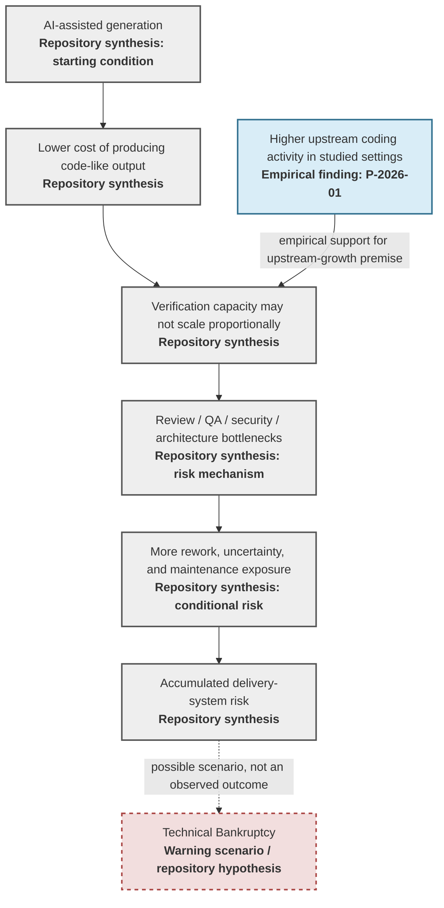

# The Subprime Code Crisis

**An independent research synthesis on AI-assisted software delivery risk**

How AI code assistants can create local productivity gains while shifting cost into review, QA, security, architecture, maintenance, and production stability.

> **Navigation:** [📉 **Read the Report**](report/01_the_illusion.md) | [🧾 **Evidence Library**](evidence/README.md) | [🛡️ **Operational Protocols**](protocols/README.md)

## Quick Start

| Need | Start here |
| --- | --- |
| Understand the complete argument | [Read the report](report/01_the_illusion.md) |
| Inspect sources, evidence briefs, and source status | [Evidence Library](evidence/README.md) and [Source Registry](evidence/SOURCES.md) |
| Apply practical controls | [Operational Protocols](protocols/README.md) |
| Understand the research and reasoning boundaries | [Scope](SCOPE.md), [Doctrine](DOCTRINE.md), and [Artifact Model](ARTIFACT_MODEL.md) |
| Contribute or change the repository | [`AGENTS.md`](AGENTS.md) and [Contributing](CONTRIBUTING.md) |

## Key Takeaways

1. **Empirical finding:** AI tools can accelerate isolated coding work.
2. **Systems inference:** Local code-generation speed does not guarantee end-to-end software-delivery throughput.
3. **Evidence-backed inference:** Additional output can shift constraints into downstream verification and delivery stages.
4. **Repository risk framing:** The risk comes from unmanaged adoption and insufficient verification capacity, not from AI assistance alone.
5. **Proposed practice:** Redesign the delivery control system rather than reject the technology.

The repository examines this as a delivery-system problem. It distinguishes source-reported findings and documented facts from repository interpretations, systems inferences, risk scenarios, and warning scenarios. It does not claim that AI coding tools are useless, that every organization will fail, or that isolated productivity gains are unreal. The detailed research boundary is defined in [Repository Scope](SCOPE.md).

## Repository Map

| Area | Purpose | Start here |
| --- | --- | --- |
| **Report** | Complete argument about local acceleration, downstream constraints, and accumulated delivery-system risk | [Part 1: The Illusion](report/01_the_illusion.md) |
| **Evidence** | Source registry, evidence taxonomy, source-oriented briefs, limitations, and integration status | [Evidence Library](evidence/README.md) |
| **Protocols** | Adaptable controls for engineers, teams, public evidence, and organizations | [Operational Protocols](protocols/README.md) |
| **Scope and Doctrine** | Subject boundaries, evidence principles, claim boundaries, and reasoning rules | [Scope](SCOPE.md) and [Doctrine](DOCTRINE.md) |
| **Artifact Model and Glossary** | Repository structure, artifact relationships, and canonical terminology | [Artifact Model](ARTIFACT_MODEL.md) and [Glossary](GLOSSARY.md) |
| **Governance** | Workflows, approval, source states, verification, synchronization, and independent review | [`AGENTS.md`](AGENTS.md) and [governance playbooks](governance/README.md) |
| **Citation and attribution** | Repository citation metadata, terminology provenance, and attribution boundaries | [`CITATION.cff`](CITATION.cff) and [Terminology & Attribution](TERMINOLOGY_AND_ATTRIBUTION.md) |
| **History** | Selected material evolution of the repository | [Changelog](CHANGELOG.md) |

`AGENTS.md` governs repository work. The Doctrine governs content principles and claim boundaries. Scope and the Artifact Model expand those boundaries for readers. The Glossary governs recurring repository vocabulary. None of these documents overrides original source evidence or the canonical source-state rules.

## Claim confidence map

The **Claim confidence map** evaluates selected repository conclusions: what kind of claim each statement is and how strongly the current evidence supports it. It does not classify sources.

| Claim                                                                                          | Type                      | Confidence  |
| ---------------------------------------------------------------------------------------------- | ------------------------- | ----------- |
| AI tools can accelerate isolated coding tasks                                                  | Empirical finding         | High        |
| Local code generation speed does not guarantee SDLC throughput                                 | Systems inference         | High        |
| AI-assisted coding can shift bottlenecks into review, QA, security, and maintenance            | Evidence-backed inference | Medium-High |
| Unmanaged adoption may inflate technical debt                                                  | Risk scenario             | Medium      |
| Industry-wide “technical bankruptcy” is possible under aggressive cost-cutting adoption models | Warning scenario          | Medium-Low  |

Canonical definitions for these claim types are maintained in the [Glossary](GLOSSARY.md); their use is governed by the [Repository Doctrine](DOCTRINE.md#claim-boundaries).

## 🧾 Evidence Map

The **Evidence Map** classifies materials by role. It answers a different question from the Claim confidence map: not *how confident are we in a claim?*, but *what kind of source, interpretation, or operational artifact is this?*

| Layer | Purpose | Current coverage in this repository |
| --- | --- | --- |
| **Primary empirical research** | Original studies and measurement reports with inspectable methods and results | [NBER: Writing Code vs. Shipping Code](evidence/primary/2026-writing-code-vs-shipping-code.md); METR developer-productivity RCT and long-task measurement; Xu et al. large-scale developer study; Agarwal et al. code-structure analysis; Peng et al. Copilot RCT; GitClear code-change and productivity measurement reports |
| **Primary documentary sources** | First-party records used for infrastructure, spending, organizational, and terminology-provenance claims | Alphabet, Meta, and Microsoft filings; official product and engineering documentation; published engineering-system descriptions; [terminology provenance records](evidence/documentary/terminology-provenance.md) |
| **Secondary evidence and industry context** | Reviews, surveys, practitioner analyses, and synthesis used for triangulation or context | DORA reports; McKinsey and Deloitte enterprise surveys; SoftwareSeni review analysis; TechnoDiaries practitioner reporting; Andreas Horn industry commentary |
| **Theory and methodology** | Frameworks used to interpret delivery-system behavior rather than to measure AI effects directly | Goldratt's Theory of Constraints; software-engineering productivity frameworks; weak-link and production-hierarchy reasoning |
| **Datasets** | Documented data sources and datasets used by cited studies or future independent analysis | [Dataset registry](evidence/datasets/README.md); GitHub activity and marketplace datasets documented in cited studies |
| **Repository interpretation** | The Subprime Code Crisis synthesis: bottleneck migration, production attenuation, risk scenarios, and system-level implications | [Report](report/01_the_illusion.md), Claim confidence map, and Crisis Map |
| **Protocols** | Practical responses, controls, metrics, and decision rules derived from the risk analysis | [Operational Protocols](protocols/README.md) |

The canonical source inventory and status registry is [`evidence/SOURCES.md`](evidence/SOURCES.md). [`REFERENCES.md`](REFERENCES.md) is a compact bibliography and navigation aid. The [Artifact Model](ARTIFACT_MODEL.md) explains the complete relationship among sources, briefs, interpretation, claims, protocols, and feedback.

## 📊 The Crisis Map

The Crisis Map is an **explanatory systems synthesis**, not a chronology, an evidence scorecard, or a causal chain measured by one study. Each node states its claim type. Solid arrows show the repository's proposed system mechanism; they do not imply that one population, tool, period, or metric was followed from end to end.

```mermaid
flowchart TD
    classDef empirical fill:#d9edf7,stroke:#31708f,stroke-width:2px;
    classDef synthesis fill:#eeeeee,stroke:#555,stroke-width:2px;
    classDef scenario fill:#f2dede,stroke:#a94442,stroke-width:2px,stroke-dasharray: 5 5;

    A[AI-assisted generation<br/><b>Repository synthesis: starting condition</b>]
    B[Lower cost of producing code-like output<br/><b>Repository synthesis</b>]
    C[Higher upstream coding activity in studied settings<br/><b>Empirical finding: P-2026-01</b>]
    D[Verification capacity may not scale proportionally<br/><b>Repository synthesis</b>]
    E[Review / QA / security / architecture bottlenecks<br/><b>Repository synthesis: risk mechanism</b>]
    F[More rework, uncertainty, and maintenance exposure<br/><b>Repository synthesis: conditional risk</b>]
    G[Accumulated delivery-system risk<br/><b>Repository synthesis</b>]
    H[Technical Bankruptcy<br/><b>Warning scenario / repository hypothesis</b>]

    A --> B
    B --> D
    C -->|empirical support for upstream-growth premise| D
    D --> E --> F --> G
    G -. possible scenario, not an observed outcome .-> H

    class C empirical;
    class A,B,D,E,F,G synthesis;
    class H scenario;
```

### Evidence boundary for the map

- **P-2026-01** combines public GitHub activity for more than 100,000 developers, Microsoft Copilot telemetry, and data from four application marketplaces. Its developer-level analysis uses an observational matched event-study design covering tool adoption from 2022 through 2026 and reports increased upstream activity, with attenuation toward projects and releases; see the [reviewed evidence brief](evidence/primary/2026-writing-code-vs-shipping-code.md).
- The arrows after the empirical node are **repository synthesis, not one measured causal chain**. P-2026-01 does not establish general code-quality decline, review as the only bottleneck, technical debt, security effects, or Technical Bankruptcy.
- **Technical Bankruptcy** remains a warning scenario and repository hypothesis, not an empirically measured outcome. The map's final synthesis outcome is **Accumulated delivery-system risk**.

The Doctrine defines why these maps remain bounded views rather than substitutes for evidence, report argument, or source status.

## 🛡️ Operational Response

The repository organizes its practical response as a four-layer control stack:

| Layer | Protocol | Primary question |
| --- | --- | --- |
| **Engineer** | [Personal Defense](protocols/01_personal_defense.md) | What generated output may cross into durable code, and under what verification? |
| **Team** | [Operational Defense](protocols/02_operational_defense.md) | Is local acceleration improving or degrading delivery-system outcomes? |
| **Public evidence** | [Public Evidence and Disclosure](protocols/03_public_defense.md) | What can be claimed, with what support, limitations, and correction path? |
| **Organization** | [Systemic Cure](protocols/04_systemic_cure.md) | Who owns adoption policy, capacity, exceptions, escalation, and learning? |

These are adaptable operating patterns, not universal thresholds or empirical proof. Teams should adapt them to local risk, architecture, regulation, and delivery constraints, then return measured implementation feedback to the evidence system.

## Citation, Attribution, and History

> Oborskyi, Vitalii, and contributors. *The Subprime Code Crisis: An Independent Research Synthesis on AI-Assisted Software Delivery Risk*. Uncertainty Architecture Group, 2026. https://github.com/UncertaintyArchitectureGroup/The-Subprime-Code-Crisis

Use [`CITATION.cff`](CITATION.cff) with GitHub's **Cite this repository** function. When reusing a specific diagram, report chapter, evidence brief, or protocol, cite that artifact in addition to the repository. See [Terminology & Attribution](TERMINOLOGY_AND_ATTRIBUTION.md) for name provenance and contribution boundaries, and [Changelog](CHANGELOG.md) for selected material history.

This repository does not claim ownership of, or exclusive authorship over, the phrase **Subprime Code Crisis**. Its attributable contribution is the evidence-governed delivery-system synthesis, claim boundaries, risk mechanism, maps, and operational protocols.

---
*License: CC-BY-SA 4.0*
