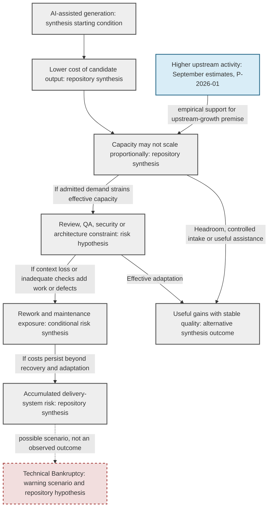

# The Subprime Code Crisis

**An independent research synthesis on AI-assisted software delivery risk**

**Primary author:** [Vitalii Oborskyi](https://www.linkedin.com/in/vitaliioborskyi) · **Project:** [Uncertainty Architecture Group](https://github.com/UncertaintyArchitectureGroup)

**For technical leaders responsible for a team's delivery:** use this report to decide what AI-assisted work to accept, where to invest, and what the team must still be able to understand and support. Engineers can start with the [individual practice guide](protocols/01_personal_defense.md); organization-wide decisions require accountable engineering, product and operating owners together with budget and policy owners.

## The research thesis

**AI coding tools have increased our ability to produce software changes faster than teams have adapted the rest of the work needed to make those changes useful. Improving code generation alone is therefore not a sufficient delivery strategy.** This is the report's research thesis, with separately tested parts—not a claim that every team is overloaded or every AI adoption is harmful.

### What makes this worth investigating

In the [September 2026 NBER working paper](evidence/primary/2026-writing-code-vs-shipping-code.md#numeric-findings-and-uncertainty), the pooled synchronous-agent estimates for weeks 21–30 are **153.2% more commits and 19.8% more repository releases**. Releases increased; the smaller gain is not a measured loss of the remaining work. These observational estimates use different outcome samples and do not measure deployed feature value.

A separate observational [Chen–Stratton firm study](evidence/primary/2026-chen-stratton-firm-production.md#published-estimates-and-reproduced-calculations) reports positive coding-activity estimates, a smaller uncertain tracked-completion estimate, and about **49% longer elapsed time from PR submission to merge** after agent adoption. Non-random adoption and pre-adoption trends limit causal interpretation; elapsed time is not active review labor. Together, these findings justify examining the work around code, not declaring a universal bottleneck.

### The mechanism we are testing

When a team accepts changes faster than it can understand, check, integrate and maintain them at the required quality, coding gains can become waiting, rework or obligations left for later. The relevant system is the complete software development lifecycle (**SDLC**):

**Intent → requirements → design → code → review → test → integration → deployment → operation → realized user outcomes → business economics → feedback to Intent.**

These functions overlap and repeat. Review has two jobs: check the change and make sure the team can take care of it. Someone beyond its producer must be able to explain important behavior, diagnose problems and recover the system. An approval click is not that capability. AI or another practice may provide a better way to preserve a function; retaining every manual activity is not the goal.

The strongest direct challenge is that existing capacity or better tools already handle the extra work. Teams may also adapt, while useful experiments, changed task scope or release batching can explain an apparent activity-to-release gap. Those explanations need testing too. Sustained gains in comparable useful delivery, with adequate quality, team capability and total cost under unchanged practice, would limit the need for rebalancing in that setting. Benefits and added burdens can coexist; persistent debt, burnout and negative overall value need their own evidence, and a proposed remedy must justify its cost.

### Start with one delivery stream

Choose one kind of change your team already delivers. Name its intended user outcome, decision owner and minimum acceptable quality and operating capability. State the AI-assisted workflow and observation period, then compare its path from request through release and support with a credible baseline. Separate active work from waiting; include checking, rework and operating effort. Check whether the team can explain and recover the result, and record what remains unmeasured.

Then decide whether to **continue the current approach, address a specific constraint, or limit a use case that cannot meet its requirements**. Rebalancing may mean better automation, smaller changes, clearer requirements or less unnecessary work—not automatically more reviewers or more process. The [team guide](protocols/02_operational_defense.md) supplies the existing measurement and decision loop. **The goal is useful outcomes at justified total cost and risk; delivering the same useful service at lower cost can be a gain.** These are proposed practices, not experimentally proven universal remedies.

## Quick Start

| Your question | Read next |
| --- | --- |
| What supports this argument, and what challenges it? | [Part 1: evidence and delivery outcomes](report/01_the_illusion.md) → [Part 2: mechanisms and understanding](report/02_broken_mechanics.md) → [Part 3: decisions and outcomes](report/03_the_aftermath.md) |
| What should my team do? | [Team measurement and decision guide](protocols/02_operational_defense.md); for budget and policy decisions, [organizational guide](protocols/04_systemic_cure.md) |
| Can I inspect the evidence or challenge the explanation? | [Nine-study comparison](report/appendices/mechanism-hypotheses.md#nine-source-comparison), [other explanations](report/appendices/mechanism-hypotheses.md#competing-explanations), and [Source Registry](evidence/SOURCES.md) |

The [Repository Map](#repository-map) below contains the full library, appendices, contribution guidance and [live work plan](https://github.com/UncertaintyArchitectureGroup/The-Subprime-Code-Crisis/issues/84). For specific management examples, see [what the records actually show](report/01_the_illusion.md#what-management-records-actually-show).

## Key Takeaways

**Faster coding is a local result; useful, supportable software at justified total cost and risk is the goal.**

Further reading and contribution routes

Explore the [delivery-activity index](report/appendices/mechanism-hypotheses.md#node-index), [Review's two functions](report/appendices/mechanism-hypotheses.md#review--rev-1-and-rev-2), [thesis and outcome boundary](report/appendices/mechanism-hypotheses.md#the-thesis-and-the-outcome-that-matters), and [existing evidence coverage](report/appendices/mechanism-hypotheses.md#existing-evidence-and-its-exact-coverage). The [evaluation guide](governance/hypothesis-evaluation.md) explains [how to compare explanations](governance/hypothesis-evaluation.md#compare-explanations).

For corrections or evidence, use [Issues](https://github.com/UncertaintyArchitectureGroup/The-Subprime-Code-Crisis/issues) and [Contributing](CONTRIBUTING.md). The [issue workflow](governance/issue-workflow.md), [repository ownership map](governance/repository-map.md) and [dated backlog audit](governance/issue-backlog-audit.md) support contributors; the live plan remains the current sequence owner.

## Repository Map

| Area | Purpose | Start here |
| --- | --- | --- |
| **Report** | Evidence, conditional delivery mechanisms, alternative scenarios and adoption decisions | [Part 1](report/01_the_illusion.md), [Part 2](report/02_broken_mechanics.md), [Part 3](report/03_the_aftermath.md) |
| **Hypotheses and appendices** | What each part of delivery contributes, how to test our claims, source context and reproducible calculations | [Hypothesis register](report/appendices/mechanism-hypotheses.md) and [appendix guide](#appendices-and-analytical-tools) |
| **Evidence** | Source list, study summaries, limitations and records of what has been checked | [Evidence Library](evidence/README.md) |
| **Protocols** | Adaptable controls for engineers, teams, public evidence, and organizations | [Operational Protocols](protocols/README.md) |
| **Scope and Doctrine** | Subject boundaries, evidence principles, claim boundaries, and reasoning rules | [Scope](SCOPE.md) and [Doctrine](DOCTRINE.md) |
| **Artifact Model and Glossary** | How the documents fit together and what recurring terms mean | [Artifact Model](ARTIFACT_MODEL.md) and [Glossary](GLOSSARY.md) |
| **Governance and work plan** | Workflows, approval, source states, verification, synchronization, independent review and current priorities | [`AGENTS.md`](AGENTS.md), [governance playbooks](governance/README.md), and [live plan #84](https://github.com/UncertaintyArchitectureGroup/The-Subprime-Code-Crisis/issues/84) |
| **Citation and attribution** | Repository citation metadata, terminology provenance, and attribution boundaries | [`CITATION.cff`](CITATION.cff) and [Terminology & Attribution](TERMINOLOGY_AND_ATTRIBUTION.md) |
| **History and review records** | Material evolution, dated assessments and inspectable work records | [Changelog](CHANGELOG.md), [dated reviews](governance/reviews/), and [work records](governance/work-records/) |

`AGENTS.md` governs repository work. The Doctrine governs content principles and claim boundaries. Scope and the Artifact Model expand those boundaries for readers. The Glossary governs recurring repository vocabulary. None of these documents overrides original source evidence or the canonical source-state rules.

### Appendices and analytical tools

| Material | What to use it for |
| --- | --- |
| [SDLC hypothesis register](report/appendices/mechanism-hypotheses.md) | The thesis, what each delivery activity contributes, available evidence, other explanations, and tests that could show where the argument or a remedy is wrong |
| [Cost context](report/appendices/cost-context.md) | Historical company records, market estimates and budget intentions, with their accounting and inference boundaries |
| [Conditional cost sensitivity](report/appendices/tco-sensitivity.md) | A hypothetical pilot-cost example with declared assumptions; it is not an empirical TCO estimate or ROI calculation |
| [Model inputs](report/appendices/tco-scenarios.json), [reproduced results](report/appendices/tco-results.json), and [calculator](tools/tco_sensitivity.py) | Inspect and reproduce the illustrative arithmetic using the appendix's [reproduction instructions](report/appendices/tco-sensitivity.md#reproduction-and-validation) |

## Claim confidence map

The **Claim confidence map** shows what kind of claim each selected conclusion is and how strongly the current evidence supports it. It assesses the claim; source types are listed separately in the Evidence Map below.

| Claim                                                                                          | Type                      | Confidence  |
| ---------------------------------------------------------------------------------------------- | ------------------------- | ----------- |
| AI tools can accelerate isolated coding tasks                                                  | Empirical finding         | High        |
| Local code generation speed does not guarantee SDLC throughput                                 | Systems inference         | High        |
| Additional admitted work may strain downstream verification under the stated conditions | Systems inference | Conditional; stage and prevalence not established |
| Unresolved verification or maintenance work may accumulate under the stated conditions | Risk scenario | Conditional; magnitude and prevalence not established |
| Industry-wide “technical bankruptcy” under aggressive cost-cutting adoption models | Warning scenario | Not estimated; no calibrated probability |

Canonical definitions for these claim types are maintained in the [Glossary](GLOSSARY.md); their use is governed by the [Repository Doctrine](DOCTRINE.md#claim-boundaries).

The debt-risk row describes a [conditional local scenario](report/03_the_aftermath.md#local-delivery-deterioration), not a measured debt balance or probability. Rework and structural metrics motivate investigation; they do not alone establish persistent maintenance burden. Test accumulation and recovery over a defined period alongside useful delivery, total effort and quality.

## 🧾 Evidence Map

The **Evidence Map** explains what each kind of material contributes: measured research, documentary records, interpretation or practical guidance. Use it to find the material behind a claim; use the Claim confidence map above to see our assessment of that claim.

Browse the [Evidence Library](evidence/README.md) through its class indexes: [primary empirical research](evidence/primary/README.md), [primary documentary sources](evidence/documentary/README.md), [secondary evidence](evidence/secondary/README.md), [theory and methodology](evidence/methodology/README.md), and [datasets](evidence/datasets/README.md). The coverage below points to the briefs behind the report; source-processing states remain in the [Source Registry](evidence/SOURCES.md).

| Layer | Purpose | Current coverage in this repository |
| --- | --- | --- |
| **Primary empirical research: coding and delivery** | Original task and delivery studies with inspectable methods and results | [NBER: September revision, positive releases and bounded attenuation](evidence/primary/2026-writing-code-vs-shipping-code.md); [Peng bounded Copilot experiment](evidence/primary/2023-copilot-task-productivity.md); [METR early-2025 task-time RCT](evidence/primary/2025-metr-experienced-developer-productivity.md) and [2026 follow-up with identification limits](evidence/primary/2026-metr-productivity-design-update.md); [METR v1 long-task methods and verification limits](evidence/primary/2025-metr-task-horizon.md) |
| **Primary empirical research: firm production and review** | Firm-level activity, tracked completion and review-process estimates | [Chen–Stratton, August 2026 (P-2026-04)](evidence/primary/2026-chen-stratton-firm-production.md): positive agent coding-activity estimates, a smaller uncertain Jira-completion estimate, longer PR submission-to-merge elapsed time, and more formal change requests, comments and reviewer participation. Observational design and pre-period movements constrain causality; earlier assistant estimates differ. These measures establish neither active review labor nor competent ownership. See the [hypothesis assessment](report/appendices/mechanism-hypotheses.md#e-chen-stratton) |
| **Primary empirical research: individual learning** | Immediate skill acquisition after unfamiliar programming tasks | [Shen–Tamkin skill-formation experiment (P-2026-05)](evidence/primary/2026-ai-impacts-skill-formation.md): lower immediate unassisted assessment scores with AI assistance, higher observed second-task completion and an inconclusive mean time comparison. Delayed retention and collective ownership were not measured; prompting patterns are exploratory. See [HUM-1 and the remaining capability questions](report/appendices/mechanism-hypotheses.md#hum-1--practice-understanding-and-collective-ownership) |
| **Primary empirical research: activity and structure** | Observational activity, rework and structural measures with source-specific boundaries | [Xu OSS activity/rework with proxy and uncertainty limits](evidence/primary/2025-xu-copilot-oss-activity.md); [Agarwal adoption-mode activity/structure estimates](evidence/primary/2026-agarwal-agent-adoption.md); [GitClear historical code-change/clone signals](evidence/primary/2025-gitclear-code-quality.md) and [separate developer-output measures](evidence/primary/2025-gitclear-developer-output.md) |
| **Primary empirical research: spending and reported outcomes** | Market estimates, adoption and respondent reports, distinct from measured delivery effects | [Menlo market-size estimates](evidence/primary/2025-menlo-enterprise-ai-spend.md) and [CloudZero budget intentions](evidence/primary/2025-cloudzero-ai-budget-intentions.md), distinct from delivery outcomes; [McKinsey 2025 adoption/value](evidence/primary/2025-mckinsey-ai-adoption-value.md), [Deloitte Q4 reported ROI/scaling expectations](evidence/primary/2025-deloitte-genai-q4.md) and [Stack Overflow 2024 attitudes](evidence/primary/2024-stackoverflow-ai-attitudes.md), distinct respondent-reported outcomes |
| **Primary documentary sources** | First-party records used for infrastructure, spending, organizational, and terminology-provenance claims | [Alphabet CY2024](evidence/documentary/2024-alphabet-financial-context.md), [Meta CY2024](evidence/documentary/2024-meta-financial-context.md) and [Microsoft FY2024](evidence/documentary/2024-microsoft-financial-context.md) company-wide filings; [Google historical engineering practices](evidence/documentary/2020-google-engineering-practices.md); [Microsoft FY25Q2 AI-business run rate](evidence/documentary/2025-microsoft-fy25q2-ai-run-rate.md), distinct from Copilot revenue/customer ROI; [terminology provenance records](evidence/documentary/terminology-provenance.md); [project-analysis provenance](evidence/documentary/project-provenance.md) |
| **Secondary evidence and industry context** | Reviews, practitioner analyses, and synthesis used for context without treating them as independent measurements | [Techno Diaries single accessible anecdote](evidence/secondary/2025-technodiaries-review-anecdote.md); Horn’s personal [capability forecast](evidence/secondary/2026-horn-capability-commentary.md) and [engineering commentary](evidence/secondary/2026-horn-engineering-commentary.md); [Markus cost commentary](evidence/secondary/2026-inference-cost-commentary.md); [SoftwareSeni discovery/correction record](evidence/secondary/2025-softwareseni-review-synthesis.md), without live report/protocol use |
| **Theory and methodology** | Frameworks used to interpret delivery-system behavior rather than to measure AI effects directly | [Goldratt/Cox methodology and original-access gap](evidence/methodology/1984-the-goal.md) |
| **Datasets** | Documented data sources and datasets used by cited studies or future independent analysis | [Dataset registry](evidence/datasets/README.md); GitHub activity and marketplace datasets documented in cited studies |
| **Repository interpretation** | The Subprime Code Crisis synthesis: bottleneck migration, production attenuation, risk scenarios, and system-level implications | [Report](report/01_the_illusion.md), [hypothesis register](report/appendices/mechanism-hypotheses.md), [Claim confidence map](#claim-confidence-map), and [Crisis Map](#-the-crisis-map) |
| **Protocols** | Practical responses, controls, metrics, and decision rules derived from the risk analysis | [Operational Protocols](protocols/README.md) |

The canonical source inventory and status registry is [`evidence/SOURCES.md`](evidence/SOURCES.md). [`REFERENCES.md`](REFERENCES.md) is a compact bibliography and navigation aid. The [Artifact Model](ARTIFACT_MODEL.md) explains the complete relationship among sources, briefs, interpretation, claims, protocols, and feedback.

## 📊 The Crisis Map

The Crisis Map shows **our proposed explanation of how delivery problems could develop**. Each box says what kind of claim it contains. The arrows show proposed relationships. No single study followed one group, tool or measure through this whole chain; the map does not establish the order in which events actually happened or rate the strength of the evidence.

```mermaid
flowchart TD
    classDef empirical fill:#d9edf7,stroke:#31708f,stroke-width:2px;
    classDef synthesis fill:#eeeeee,stroke:#555,stroke-width:2px;
    classDef scenario fill:#f2dede,stroke:#a94442,stroke-width:2px,stroke-dasharray: 5 5;

    A["AI-assisted generation: synthesis starting condition"]
    B["Lower cost of candidate output: repository synthesis"]
    C["Higher upstream activity: September estimates, P-2026-01"]
    D["Capacity may not scale proportionally: repository synthesis"]
    E["Review, QA, security or architecture constraint: risk hypothesis"]
    F["Rework and maintenance exposure: conditional risk synthesis"]
    G["Accumulated delivery-system risk: repository synthesis"]
    H["Technical Bankruptcy: warning scenario and repository hypothesis"]

    A --> B
    B --> D
    C -->|empirical support for upstream-growth premise| D
    D -->|If admitted demand strains effective capacity| E
    E -->|"If context loss or inadequate checks add work or defects"| F
    F -->|"If costs persist beyond recovery and adaptation"| G
    E -->|"Effective adaptation"| I
    D -->|Headroom, controlled intake or useful assistance| I["Useful gains with stable quality: alternative synthesis outcome"]
    G -. possible scenario, not an observed outcome .-> H

    class C empirical;
    class A,B,D,E,F,G,I synthesis;
    class H scenario;
```

### Evidence boundary for the map

- **P-2026-01, September 2026 revision:** selected public GitHub tool cohorts, matched event studies and agent-authored interrupted time series. Coding and release estimates are positive, with outcome-specific populations, uncertainty and magnitude sensitivity. Separate marketplace series use three early-usage proxies, including modest Android growth; SourceForge contributes only an entry comparison. The [brief](evidence/primary/2026-writing-code-vs-shipping-code.md) pins the original and keeps older versions as history. These data support bounded attenuation, not identification of a particular verification stage.
- The capacity branch depends on admitted work/risk mix, effective capacity, utilization/variation and WIP/release policy. Headroom and successful adaptation may produce useful gains. The [SDLC hypothesis register](report/appendices/mechanism-hypotheses.md) contains the full function/outcome inventory and retains the [earlier claim graph and tests](report/appendices/mechanism-hypotheses.md#claim-classes-and-permitted-edges). These are repository synthesis with separate trigger, endpoint and net-benefit tests; they assign no scenario probabilities.
- The arrows after the empirical node are **repository synthesis, not one measured causal chain**. P-2026-01 does not establish general code-quality decline, review as the only bottleneck, technical debt, security effects, or Technical Bankruptcy.
- **Technical Bankruptcy** remains a warning scenario and repository hypothesis, not an empirically measured outcome. The adverse branch ends in **Accumulated delivery-system risk**; useful gains and recovery remain possible.

The Doctrine defines why these maps remain bounded views rather than substitutes for evidence, report argument, or source status.

## 🛡️ Operational Response

The practical guides address four levels of responsibility:

| Layer | Protocol | Primary question |
| --- | --- | --- |
| **Engineer** | [Personal Defense](protocols/01_personal_defense.md) | What verification is required before generated output changes durable code, data, or operations? |
| **Team** | [Operational Defense](protocols/02_operational_defense.md) | Is local acceleration improving or degrading delivery-system outcomes? |
| **Public evidence** | [Public Evidence and Disclosure](protocols/03_public_defense.md) | What can be claimed, with what support, limitations, and correction path? |
| **Organization** | [Organizational Control Model](protocols/04_systemic_cure.md) | Who owns adoption policy, capacity, exceptions, escalation, and learning? |

These are adaptable operating patterns, not universal thresholds or empirical proof. Teams should adapt them to local risk, architecture, regulation, and delivery constraints, then return measured implementation feedback to the evidence system.

## Project provenance

The public records for this repository's own analysis are documented separately from phrase history. The [2026-01-05 DOU precursor](https://dou.ua/forums/topic/57244/) by Vitalii Oborskyi discusses generation/review asymmetry and downstream delivery constraints. The [2026-02-10 Subprime Code publication](https://dou.ua/forums/topic/57846/) attributes its follow-up investigation to work on that article and reader discussion. This is the author's documented continuity account, not independent empirical validation. GitHub records repository-object creation at `2026-02-06T17:16:44Z`; it does not establish when the repository became public. The currently inspected February-dated DOU page links the repository, but the link's insertion date and historical public-opening time remain unestablished.

See the [project provenance brief](evidence/documentary/project-provenance.md) and [Terminology & Attribution](TERMINOLOGY_AND_ATTRIBUTION.md) for the source record and boundaries. This chronology documents development of this project's delivery-system synthesis; it is **not** a claim that the repository invented the general phrase **Subprime Code Crisis** or that similar work elsewhere was derived from it.

## Citation, Attribution, and History

> Oborskyi, Vitalii, and contributors. *The Subprime Code Crisis: An Independent Research Synthesis on AI-Assisted Software Delivery Risk*. Uncertainty Architecture Group, 2026. https://github.com/UncertaintyArchitectureGroup/The-Subprime-Code-Crisis

Use [`CITATION.cff`](CITATION.cff) with GitHub's **Cite this repository** function. When reusing a specific diagram, report chapter, evidence brief, or protocol, cite that artifact in addition to the repository. See [Terminology & Attribution](TERMINOLOGY_AND_ATTRIBUTION.md) for name provenance and contribution boundaries, and [Changelog](CHANGELOG.md) for selected material history.

This repository does not claim ownership of, or exclusive authorship over, the phrase **Subprime Code Crisis**. Its attributable contribution is the evidence-governed delivery-system synthesis, claim boundaries, risk mechanism, maps, and operational protocols.

---
*License: [CC-BY-SA 4.0](LICENSE.md)*
