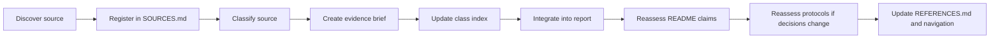

# Evidence Library

This directory separates external evidence from the report's interpretation and from the repository's operational protocols.

The goal is not to flatten every source into one confidence score. Different source types answer different questions and support different claims.

## Start here

- [`SOURCES.md`](SOURCES.md) — canonical registry of all external sources, classifications, review status, and report usage.
- [`../REFERENCES.md`](../REFERENCES.md) — compact human-readable bibliography derived from the registry.
- [`../AGENTS.md`](../AGENTS.md) — workflow for reading the repository and adding or updating evidence.

## Evidence classes

### [Primary empirical research](primary/README.md)

Original studies, working papers, controlled experiments, large-scale observational analyses, and original measurement reports with inspectable methods.

Use these sources for claims about measured effects. Record publication status, dataset, method, directly observed findings, model-derived estimates, and limitations.

### [Primary documentary sources](documentary/README.md)

First-party records such as filings, official documentation, standards, policies, and published engineering-system descriptions.

Use these sources for factual claims about what an organization reported, documented, spent, implemented, or required. Documentary evidence does not automatically establish independent validation or causal effect.

### [Secondary evidence](secondary/README.md)

Industry reports, practitioner analyses, reviews, replications, critiques, and materials that synthesize or interpret primary evidence.

Use these sources for triangulation, context, and hypothesis generation. Do not substitute them for an available primary source.

### [Theory and methodology](methodology/README.md)

Frameworks used to interpret delivery-system behavior, such as Theory of Constraints, productivity models, queueing, reliability, and control concepts.

These sources support analytical reasoning. They are not direct empirical evidence of AI effects unless they include an empirical study.

### [Datasets](datasets/README.md)

Public or documented datasets used by cited research or maintained for independent analysis.

Dataset entries should describe provenance, coverage, transformations, access conditions, licensing, and the claims the data can and cannot support.

## Relationship to the rest of the repository

- `evidence/SOURCES.md` is the canonical source registry.
- evidence subdirectories contain reviewed source briefs and class-specific indexes.
- `REFERENCES.md` is the compact bibliography and navigation view.
- `report/` contains the Subprime Code Crisis argument and synthesis.
- `protocols/` contains operational responses and decision rules.
- `README.md` contains the repository-level claim-confidence and evidence maps.

A bibliography entry is not an evidence brief. A registered source is not necessarily reviewed. A protocol is not empirical proof.

## Evidence brief standard

Each evidence brief should include:

1. Stable source ID from `SOURCES.md`.
2. Full citation and canonical source links.
3. Publication status, including whether the work is peer reviewed.
4. Research question, documentary purpose, or methodological role.
5. Scope, dataset, and methodology where applicable.
6. Directly observed or documented findings.
7. Model-calibrated or derived findings.
8. Source-author interpretation where material.
9. Repository interpretation relevant to this project.
10. What the source does not establish.
11. Limitations, conflicts of interest, and external-validity risks.
12. Links to report sections using the source.
13. Links to any lawful local source copy retained in the repository.

A source may be registered before a full brief exists, but it must be marked **Registered; brief pending**. Pending sources should not carry load-bearing strong claims without visible qualification.

## Interpretation labels

Use these labels where useful:

- **Observed:** directly reported from empirical analysis.
- **Documented:** explicitly stated in a first-party record.
- **Derived:** calculated from reported results without introducing a new causal claim.
- **Model-calibrated:** produced by a fitted or calibrated model rather than directly measured.
- **Source interpretation:** the source author's explanation or framing.
- **Repository interpretation:** the Subprime Code Crisis project's synthesis or application.
- **Not established:** a plausible claim that the source does not demonstrate.

## Source lifecycle

Detailed execution rules are in [`AGENTS.md`](../AGENTS.md).