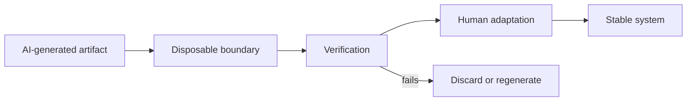
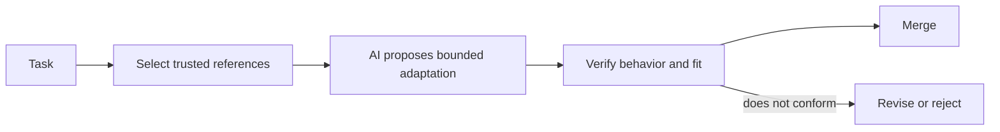
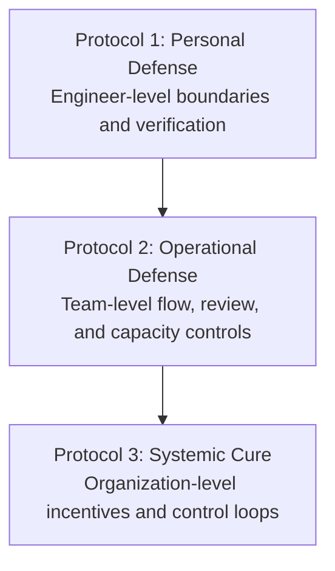

# Protocol 1: The Personal Defense
## Master the Tool, Don't Serve It (The "No Vibe Coding" Standard)

> **Navigation:** [🏠 Home](../README.md) | [🧭 Doctrine](../DOCTRINE.md) | [📖 Glossary](../GLOSSARY.md) | [🛡️ Protocols Index](README.md) | **Protocol 1** | [Protocol 2: Operational Defense](02_operational_defense.md)

**"Vibe Coding"** is the practice of accepting AI-generated code because it *looks* right, without verifying whether it *is* right. It is one mechanism that can contribute to the Subprime Code Crisis.

Before we change the industry, we must discipline our own workflow. We are the architects of logic, not consumers of syntax.

---

## 1. The Containment Rule

Restrict AI-generated code according to the cost of failure, durability of the artifact, and depth of verification required. Do not let the model silently expand its role from syntax generation into architecture ownership.

### 🟢 Green Zone — low-cost and disposable

Use AI more freely where output is easy to inspect, replace, or discard:

- **Disposable scripts:** one-off parsing, migration, or local automation scripts.
- **Data transformation:** converting JSON to SQL, mapping types, reshaping fixtures.
- **Boilerplate:** standard structures that already follow an accepted local pattern.
- **Unit-test scaffolding:** test structure and cases, with assertions reviewed manually.
- **Documentation drafts:** initial docstrings, examples, or internal notes.

### 🟠 Controlled Zone — useful, but review-bound

Use AI only with explicit references and mandatory verification:

- ordinary feature code;
- adapters and integration code;
- refactoring inside a well-understood module;
- test generation for existing behavior;
- repetitive changes across known patterns.

### 🔴 Protected Zone — human-owned decisions

Do not accept AI output without deep review and explicit accountability:

- **Core business logic:** algorithms that define the product's value or obligations.
- **Security controls:** authentication, authorization, encryption, secrets, validation.
- **State and concurrency:** transactions, distributed state, race conditions, retries.
- **Architecture:** service boundaries, data ownership, API contracts, platform choices.
- **Irreversible operations:** destructive migrations, financial operations, compliance logic.

---

## 2. Pattern: Disposable Boundary

### Intent

Keep model-generated output outside the durable system until it has been verified, adapted, and accepted by a responsible engineer.

### Problem

AI lowers the cost of producing plausible code. That makes it easy for provisional output to cross into the permanent codebase before anyone has established whether it fits the architecture, preserves invariants, or is worth maintaining.

### Pattern

Create an explicit boundary between **generated artifacts** and **stable system code**.

Treat everything before the boundary as replaceable. Treat everything after the boundary as owned.

### Suitable disposable zones

- throwaway prototypes;
- local scripts;
- generated examples;
- migration drafts;
- test scaffolds;
- candidate implementations in temporary branches;
- code produced only to explore an interface or failure mode.

### Protected core zones

- domain models and invariants;
- public interfaces;
- security-sensitive paths;
- shared libraries;
- long-lived abstractions;
- data schemas and migrations;
- operationally critical workflows.

### Required controls before crossing the boundary

1. The engineer can explain what the code does and why it exists.
2. Tests validate the relevant behavior, not merely line coverage.
3. The implementation fits an accepted local pattern or has an explicit reason not to.
4. Security, failure handling, and rollback implications are understood.
5. Duplicated functionality and unnecessary abstractions have been removed.
6. The code is small enough to review meaningfully.

### Example

A model generates a script that converts historical CSV exports into a new format. The script is run against copied data, checked for edge cases, and discarded after the migration. If part of that logic must become a permanent import service, it is rewritten or adapted to the production architecture, covered by tests, and reviewed as durable code.

### Failure modes

- a prototype is promoted directly into production;
- generated abstractions become shared infrastructure without design review;
- temporary code acquires hidden consumers and can no longer be discarded;
- tests validate only the model's own assumptions;
- engineers confuse successful execution with architectural fitness.

### Why this matters for the Subprime Code Crisis

The crisis mechanism depends on cheap code-like output becoming long-lived inventory. A disposable boundary interrupts that flow. It prevents provisional syntax from automatically becoming maintenance debt.

---

## 3. Pattern: Reference-Bounded Adaptation

### Intent

Reduce model uncertainty by grounding changes in trusted local references instead of asking the model to invent a new solution from a broad prompt.

### Problem

A model can produce a locally plausible implementation that introduces a second architectural style, duplicates an existing mechanism, violates an implicit invariant, or ignores the organization's actual conventions.

### Pattern

Before asking for code, identify the accepted references that define the solution space.

The model should adapt from known-good material rather than invent a new architectural answer whenever an accepted implementation already exists.

### Accepted reference types

- an existing implementation of the same pattern;
- an approved architecture decision record;
- coding and security standards;
- a known-good module;
- tests that express current behavior;
- an interface or schema contract;
- explicit non-functional constraints;
- a documented failure-handling pattern.

### Workflow

1. **Select the reference.** Identify the implementation, contract, test, or decision that should govern the change.
2. **State the adaptation boundary.** Explain what may change and what must remain invariant.
3. **Request a delta, not a reinvention.** Ask the model to adapt the reference to the new case.
4. **Compare structurally.** Review naming, error handling, dependencies, observability, and test shape against the reference.
5. **Verify independently.** Run tests and inspect behavior without relying on the model's explanation.
6. **Record justified deviations.** If the change intentionally breaks the pattern, make that decision explicit.

### Example

A team needs a new outbound API client. Instead of asking the model to "build a resilient client," the engineer provides the existing approved client, retry policy, telemetry conventions, interface contract, and tests. The model is asked to adapt that pattern to the new endpoint without introducing new dependencies or changing retry semantics.

### Failure modes

- using an outdated or already flawed reference;
- supplying too many conflicting references;
- treating superficial similarity as proof of correctness;
- copying a pattern into a context with different risk characteristics;
- allowing the model to alter hidden invariants while preserving the visible structure.

### Why this matters for the Subprime Code Crisis

Reference-bounded work reduces uncontrolled variation. It makes generated changes easier to compare, review, and reject, lowering the probability that every AI-assisted task creates a new local style or maintenance burden.

---

## 4. The Career Hedge — The "Fixer" Premium

Do not build your career around prompt fluency alone. Build the skills required to detect, explain, and repair system damage.

Focus on:

- system design;
- debugging and root-cause analysis;
- security;
- performance engineering;
- data integrity;
- testing strategy;
- operational failure analysis.

These skills matter because the professional value of an engineer is not the amount of syntax they can generate. It is their ability to make reliable decisions under incomplete information and accept responsibility for the result.

---

## 5. The Commitment

Adopt this stance:

> **"If I didn't read it, I didn't write it. If I don't understand it, I won't commit it. If I cannot verify it, it does not cross the boundary."**

You are the signatory of the code. The `git blame` points to you, not the model. Act accordingly.

---

## Relationship to the protocol stack

This protocol protects the individual engineer's decision boundary. [Protocol 2](02_operational_defense.md) addresses team-level operating controls. The systemic layer addresses organizational incentives, governance, and feedback loops.

---

**Next:** [📊 Protocol 2: The Operational Defense](02_operational_defense.md)
