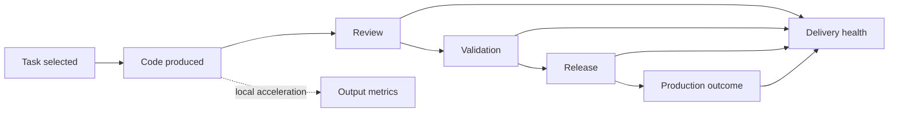
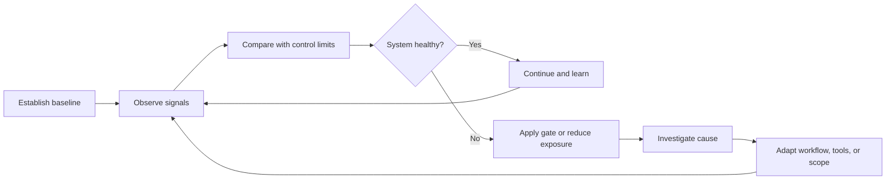

# Protocol 2: The Operational Defense
## Measure Delivery Health, Not Output Volume

> **Navigation:** [🏠 Home](../README.md) | [🛡️ Protocols Index](README.md) | [🔙 Protocol 1](01_personal_defense.md) | **Protocol 2** | [Protocol 3: Public Defense](03_public_defense.md) | [📚 References](../REFERENCES.md)

AI-assisted development changes the flow of work. It can reduce the effort required to produce code while increasing pressure on review, testing, security validation, architecture, and maintenance.

The operational response is not a single productivity metric. It is a control loop that compares local acceleration with downstream delivery health and changes team behavior when the system becomes unstable.

---

## 1. The Vanity Metric Trap

Do not treat generated code volume, prompt count, acceptance rate, or raw commit count as proof of delivery improvement.

These measures may describe tool activity, but they do not establish that the organization shipped more value, reduced lead time, improved reliability, or lowered total engineering cost.

**Operating rule:** measure the complete path from task start to production outcome, not only the speed of code generation.

---

## 2. The Operational Control Loop

Use the following loop for every team or pilot adopting AI-assisted coding:

### Step 1 — Establish a baseline

Before judging the effect of AI assistance, record a representative pre-adoption baseline or a comparable non-AI workstream.

At minimum, capture:

- pull-request cycle time;
- review wait time and review effort;
- change failure or defect escape rate;
- rework and code churn;
- deployment frequency or release completion;
- work-in-progress volume;
- size and risk class of changes.

A universal threshold is rarely credible. A team should first understand its own normal variation, then define control limits based on local history, risk tolerance, and system criticality.

### Step 2 — Observe leading and lagging signals

Do not rely on one metric. Pair flow measures with quality and production outcomes.

| Signal | What it helps detect | Important boundary |
| --- | --- | --- |
| **PR cycle time** | Bottleneck migration into review or validation | Segment by change size and risk class |
| **Review wait time** | Reviewer capacity saturation | Separate waiting from active review effort |
| **Review effort** | Hidden senior-engineer load | Estimate through review time, comments, rework, or sampled studies |
| **Code churn / early rework** | Changes that fail to stabilize after merge | Define the observation window locally |
| **Defect escape rate** | Failures discovered after development or review | Normalize by release or change volume |
| **Change failure rate** | Production changes requiring rollback, hotfix, or remediation | Use a consistent operational definition |
| **Duplication and complexity trends** | Growth in maintenance burden | Treat as diagnostic signals, not standalone proof |
| **Release completion** | Whether local code output becomes shipped value | Distinguish commits, merged work, releases, and production use |
| **Work in progress** | Inventory accumulating before constrained stages | Inspect queues by review, QA, security, and release stage |

### Step 3 — Compare deltas, not isolated numbers

A metric becomes useful when it is compared against something meaningful:

- the team's own baseline;
- a non-AI comparison group;
- the same change category before and after adoption;
- an agreed service-level expectation;
- a locally defined control limit.

Example:

> AI-assisted tasks open pull requests faster, but median review wait time, rework, and change failure rate all increase. The team has accelerated code production while reducing system throughput.

This is a stronger operational conclusion than either "developers are faster" or "AI code is worse" in isolation.

---

## 3. Risk Classes and Review Gates

Apply different controls according to the cost of failure and durability of the change.

| Risk class | Typical work | Minimum gate |
| --- | --- | --- |
| **Low** | Disposable scripts, documentation drafts, isolated test scaffolds | Author verification and automated checks |
| **Moderate** | Ordinary feature code, adapters, bounded refactoring | Reference-bounded implementation, tests, independent review |
| **High** | Business rules, shared interfaces, persistent data changes | Senior review, integration tests, rollback plan, explicit acceptance criteria |
| **Critical** | Security controls, financial logic, destructive migrations, concurrency, compliance paths | Named accountable owner, specialist review, staged release, production monitoring, rollback or kill mechanism |

AI assistance does not determine the risk class. The system impact of the change does.

### Gate rule

A change may move forward only when the required evidence exists for its risk class. Successful code generation, compilation, or unit-test execution is not sufficient evidence for high-risk changes.

---

## 4. Escalation Rules

Define escalation before the pilot begins. Otherwise teams tend to reinterpret negative signals as temporary noise.

### Investigate

Trigger a focused review when one or more delivery-health signals move outside the locally expected range for a sustained period or across several comparable changes.

Possible responses:

- sample recent AI-assisted changes;
- inspect review queues and reviewer load;
- compare defect types and rework causes;
- check whether changes exceeded the intended risk boundary;
- verify that references, tests, and acceptance criteria were adequate.

### Constrain

Reduce exposure when the team cannot explain or contain the degradation.

Possible responses:

- restrict AI assistance to lower-risk zones;
- reduce change size;
- require reference-bounded adaptation;
- add pre-review automated checks;
- increase reviewer capacity temporarily;
- stop autonomous or multi-file changes in the affected area.

### Pause

Pause the affected adoption path when critical controls fail, production risk rises materially, or the team cannot verify what the generated changes do.

A pause is not a rejection of AI. It is a control action used to prevent an unstable workflow from producing additional inventory and downstream cost.

---

## 5. Weekly Operating Review

Use a short recurring review for the pilot or team.

### Inputs

- current metrics against baseline;
- notable AI-assisted changes;
- escaped defects and rollback events;
- reviewer capacity and queue age;
- exceptions to risk-class gates;
- qualitative findings from engineers, QA, security, and operations.

### Decisions

The review should produce explicit decisions, not only a dashboard:

1. Continue without change.
2. Adjust prompts, references, tests, or tooling.
3. Change the permitted risk boundary.
4. Add or strengthen a gate.
5. Reduce work in progress.
6. Pause a specific use case.
7. Expand only after stable evidence across multiple cycles.

### Decision record

Record:

- the observed signal;
- the interpretation;
- the chosen action;
- the owner;
- the review date;
- the condition for reversal or further escalation.

This creates an inspectable history of why the operating model changed.

---

## 6. What Not to Claim

Operational metrics support local decisions. They do not automatically prove universal effects.

Avoid claims such as:

- one churn threshold is correct for every team;
- every cycle-time increase is caused by AI;
- duplication alone proves lower quality;
- more commits equal higher productivity;
- one successful pilot establishes organization-wide safety.

Use bounded language:

> In this team, for this class of work, under this operating model, AI assistance improved or degraded these measured outcomes during this observation period.

---

## 7. Leadership Communication

When asked why code output has increased without equivalent delivery acceleration, explain the full production hierarchy:

> "The tools have reduced the cost of producing candidate code. We are now measuring whether that acceleration survives review, validation, release, and production use. Where downstream queues or failures rise, we will change the operating model rather than count additional output as productivity."

This keeps the discussion grounded in shipped value and system health rather than hype or fear.

---

## Relationship to the protocol stack

[Protocol 1](01_personal_defense.md) defines engineer-level boundaries and verification practices. This protocol turns those boundaries into team-level metrics, gates, and escalation rules. Protocol 3 addresses the wider organizational and public incentives surrounding adoption.

---

**Next:** [📢 Protocol 3: The Public Defense](03_public_defense.md)
