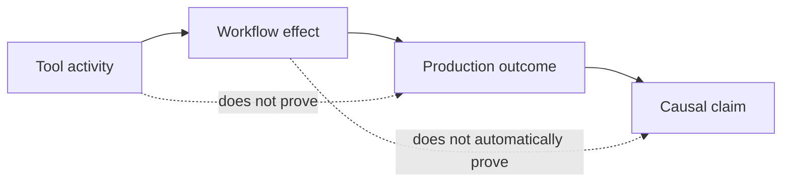
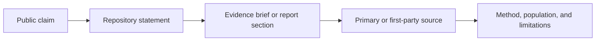

# Protocol 3: The Public Defense
## Publish Evidence, Bound Claims, Correct the Record

> **Navigation:** [🏠 Home](../README.md) | [🛡️ Protocols Index](README.md) | [🔙 Protocol 2](02_operational_defense.md) | **Protocol 3** | [Protocol 4: Systemic Cure](04_systemic_cure.md) | [📚 References](../REFERENCES.md)

Protocols 1 and 2 protect the engineer and the team. Protocol 3 protects the wider decision environment in which AI adoption is justified, funded, expanded, and judged.

The goal is not to flood the market with a counter-narrative. It is to make claims about AI-assisted software delivery inspectable, bounded, and correctable.

---

## 1. The Public Evidence Problem

AI adoption is often communicated through activity measures:

- generated lines of code;
- acceptance rates;
- prompt volume;
- developer-reported time savings;
- demo speed;
- number of enabled users;
- isolated success stories.

These signals may describe tool use, but they do not by themselves establish better delivery outcomes.

A credible public statement should distinguish among:

1. **Tool activity** — what people or models did.
2. **Local workflow effects** — what changed in coding, review, testing, or release flow.
3. **Production outcomes** — what changed in reliability, defects, throughput, customer value, or total cost.
4. **Causal interpretation** — what evidence supports attributing those changes to AI assistance.

**Public rule:** never collapse these levels into one productivity claim.

---

## 2. The Claim Boundary

Before publishing a statement, classify it.

| Claim type | Example | Minimum support |
| --- | --- | --- |
| **Observation** | "PRs were opened sooner during the pilot." | Defined metric, timeframe, population |
| **Comparison** | "Median review wait increased relative to baseline." | Comparable baseline and segmentation |
| **Association** | "Higher AI use coincided with more rework." | Data source, confounders, bounded wording |
| **Causal claim** | "AI caused the increase in rework." | Strong design, credible controls, limitations |
| **Generalization** | "AI coding tools reduce software quality." | Multiple relevant studies and explicit scope |
| **Recommendation** | "High-risk changes should require independent review." | Risk rationale, operational experience, or cited evidence |

Use the weakest claim that the evidence can honestly support.

Prefer:

> In this team, during this observation period, AI-assisted changes were associated with higher review effort.

Avoid:

> AI makes developers less productive.

The first statement is bounded and inspectable. The second generalizes beyond the evidence unless supported by a broader body of research.

---

## 3. Public Disclosure Template

Use this structure for external reports, case studies, conference talks, executive updates, vendor claims, and public posts.

### 3.1 Context

State:

- organization or team type;
- project and system characteristics;
- change risk class;
- AI tool and mode of use;
- observation period;
- number and type of participants;
- whether participation was voluntary or required.

### 3.2 Baseline or comparator

State what the result is being compared with:

- pre-adoption history;
- a parallel non-AI group;
- matched task categories;
- a service-level expectation;
- no comparator.

If there is no comparator, say so.

### 3.3 Measures

Define every reported metric:

- numerator and denominator;
- start and end points;
- inclusion and exclusion rules;
- aggregation method;
- observation window;
- segmentation by change size, risk, team, or experience where relevant.

### 3.4 Result

Report the observed change without inflating it into a broader conclusion.

### 3.5 Limitations

Include at least the major threats to interpretation:

- self-selection;
- novelty effects;
- task mix changes;
- small sample size;
- reporting bias;
- incomplete production follow-up;
- organizational changes during the period;
- tool or model version changes;
- inability to isolate causality.

### 3.6 Operational response

Explain what changed because of the result:

- continue;
- constrain the use case;
- strengthen a gate;
- change the metric;
- run a better comparison;
- pause the affected workflow.

### 3.7 Reproduction path

Link or point to what can be inspected:

- source references;
- metric definitions;
- anonymized data or aggregates where possible;
- analysis method;
- decision record;
- correction history.

---

## 4. Minimum Disclosure Card

A short public communication should still include the essentials.

> **Context:** One product team, ordinary feature work, eight-week pilot.  
> **Intervention:** AI coding assistant used for implementation and test scaffolding.  
> **Comparator:** Previous eight weeks, segmented by change size.  
> **Observed result:** Time to first PR decreased, while active review effort and early rework increased. Release completion did not materially change.  
> **Interpretation:** The team accelerated candidate-code production but did not yet improve end-to-end throughput.  
> **Limitations:** Small sample, changing task mix, no randomized assignment.  
> **Action:** Continue for low- and moderate-risk work with smaller PRs and stronger reference-bounded review.

This is more useful than an unqualified percentage improvement because it tells the reader what changed, what did not, and how much confidence to place in the conclusion.

---

## 5. Anti-Hype Rules

Do not publish or repeat claims that rely on the following substitutions.

### Activity for outcome

- generated code for shipped value;
- accepted suggestions for correct implementation;
- commits for productivity;
- enabled users for adoption quality;
- demo completion for production readiness.

### Local effect for universal truth

A result from one team, repository, vendor, task category, or short pilot should not be presented as an industry-wide conclusion.

### Perception for measured outcome

Developer sentiment and estimated time savings are useful signals, but they should be labeled as self-reported evidence.

### Benchmark performance for delivery performance

Model benchmark scores do not establish that a team will review faster, release more safely, or lower total engineering cost.

### Citation volume for evidence strength

Many weak or derivative sources do not become strong evidence through repetition. Trace claims back to the strongest available primary or first-party source.

### Urgency for certainty

A risk can justify precaution without being overstated as proven inevitability.

---

## 6. Source Traceability

Every externally repeated quantitative claim should have a traceable path.

Use the repository's [Evidence Library](../evidence/README.md), [References](../REFERENCES.md), and claim-confidence distinctions in the main README.

When a source is secondary, label it as secondary. When a company reports its own outcomes, label it as first-party evidence rather than independent validation.

Do not cite a source for a stronger claim than the source itself supports.

---

## 7. Communication Patterns

### Pattern A — Internal decision note

> We observed faster code production, but review queues and early rework also increased. The current evidence supports a workflow change, not a company-wide productivity claim. We will keep AI assistance in bounded use cases, strengthen review gates, and reassess after the next measurement cycle.

### Pattern B — External case-study statement

> During a limited pilot, AI assistance reduced time to first implementation for selected tasks. End-to-end delivery results were mixed: review effort increased and production throughput remained broadly stable. The team is continuing the pilot with smaller changes, clearer references, and risk-based controls.

### Pattern C — Response to an inflated claim

> The reported result appears to measure code-production activity rather than complete delivery performance. To interpret it, we would need the baseline, task mix, review and defect outcomes, observation period, and whether the comparison controlled for other changes.

These patterns challenge weak claims without replacing them with equally weak counterclaims.

---

## 8. Correction Protocol

Public credibility depends on the ability to correct errors.

When a material problem is found:

1. Identify the affected claim.
2. Preserve the original record where practical.
3. State what was wrong or incomplete.
4. Replace it with bounded language or remove it.
5. Update the source and evidence classification.
6. Record the correction date.
7. Revisit dependent claims, diagrams, and recommendations.

Corrections are not a weakness. They are evidence that the project treats its own claims as inspectable artifacts.

---

## 9. What Public Coordination Should Mean

Coordination should improve evidence quality, not manufacture consensus.

Useful coordination includes:

- shared metric definitions;
- reproducible case-study formats;
- independent replication;
- publication of negative and null results;
- open discussion of limitations;
- common terminology for risk and control;
- correction of misquoted or overstated findings.

Avoid:

- coordinated amplification without source review;
- presenting repository popularity as evidence;
- treating disagreement as disloyalty;
- repeating emotionally strong claims because they are rhetorically effective;
- pressuring people to endorse conclusions beyond their experience.

Repository stars, reposts, and attention may help distribution. They do not validate the thesis.

---

## 10. Public Review Checklist

Before publishing, ask:

- What exact claim am I making?
- Is it an observation, association, causal claim, or recommendation?
- What is the strongest source?
- Does the source support this wording?
- What is the population and timeframe?
- What comparator exists?
- Which outcomes are missing?
- What alternative explanations remain?
- What would change my conclusion?
- Is there a visible correction path?

If these questions cannot be answered, narrow the claim.

---

## Relationship to the protocol stack

[Protocol 1](01_personal_defense.md) defines engineer-level boundaries. [Protocol 2](02_operational_defense.md) establishes team-level measurement, gates, and escalation. This protocol governs how resulting evidence is communicated outside the immediate workflow. [Protocol 4](04_systemic_cure.md) addresses the incentives and organizational structures that shape adoption decisions.

---

**Next:** [🏗️ Protocol 4: The Systemic Cure](04_systemic_cure.md)
