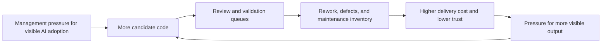
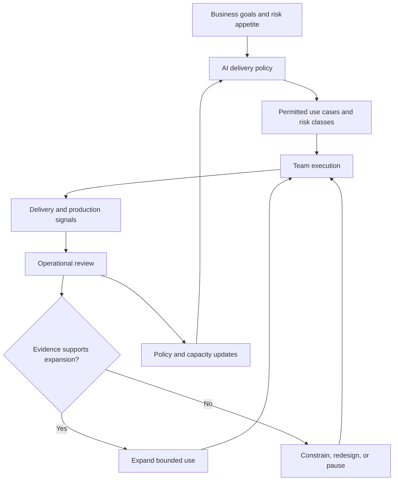
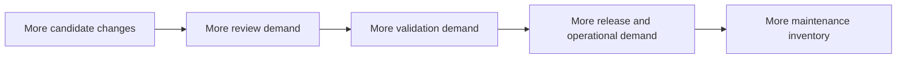
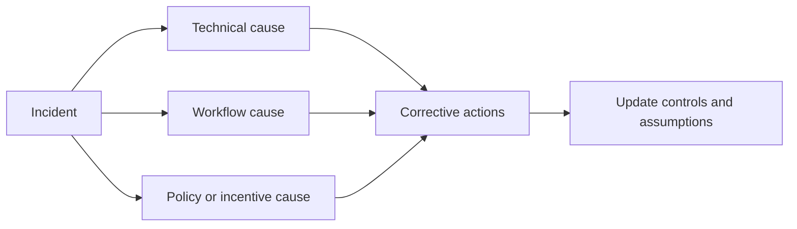
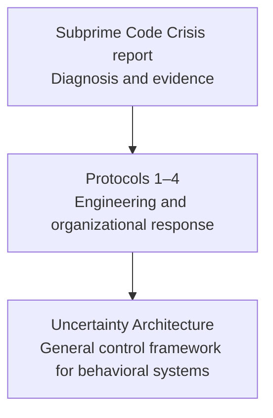

# Protocol 4: The Systemic Cure
## Build an Organizational Control System for AI-Assisted Delivery

> **Navigation:** [🏠 Home](../README.md) | [🧭 Doctrine](../DOCTRINE.md) | [📖 Glossary](../GLOSSARY.md) | [🛡️ Protocols Index](README.md) | [🔙 Protocol 3](03_public_defense.md) | **Protocol 4** | [📚 References](../REFERENCES.md)

The Subprime Code Crisis cannot be solved by asking individual engineers to be more careful. Personal discipline and team-level gates matter, but they operate inside a larger system of incentives, budgets, deadlines, ownership, and executive expectations.

A systemic cure changes that system.

The goal is not to slow AI adoption. The goal is to make adoption conditional on evidence that the organization can absorb the additional code-production capacity without overloading review, testing, architecture, security, release, and maintenance.

---

## 1. The Systemic Failure Mechanism

AI-assisted coding can increase the rate at which candidate changes are produced. If downstream capacity and controls remain unchanged, the organization may create more work than it can reliably verify and absorb.



The loop is reinforced when organizations reward activity signals such as generated lines, commits, tool usage, or short-term task completion while the cost appears later in another team, another quarter, or production operations.

**Systemic rule:** the unit of optimization is the complete delivery system, not the coding step.

---

## 2. The Organizational Control Plane

An organization adopting AI-assisted development needs a control layer that connects policy, observation, decision rights, and corrective action.



The control plane must answer five questions:

1. **What is permitted?**
2. **Who is accountable?**
3. **What evidence is required?**
4. **What happens when signals degrade?**
5. **Who may expand, constrain, or stop the adoption path?**

Without these answers, an AI policy is guidance, not governance.

---

## 3. Required Organizational Roles

Roles may be combined in smaller organizations, but the responsibilities must remain explicit.

| Role | Primary responsibility | Must not be confused with |
| --- | --- | --- |
| **Executive sponsor** | Sets business objective, risk appetite, and funding boundary | Declaring productivity gains without delivery evidence |
| **Adoption owner** | Owns the end-to-end pilot or operating model | Tool procurement alone |
| **Engineering owner** | Owns technical boundaries, architecture, and review standards | Individual prompt support |
| **Delivery owner** | Tracks flow, queues, capacity, and production outcomes | Counting generated output |
| **Security / compliance owner** | Defines restricted data, tools, and critical controls | Reviewing every ordinary change |
| **Measurement owner** | Maintains definitions, baselines, comparators, and reporting | Selecting only favorable metrics |
| **Team lead / manager** | Applies local gates and escalation rules | Absorbing governance work invisibly |
| **Engineer** | Verifies and owns accepted changes | Acting as a passive recipient of model output |

### Named accountability rule

Every adoption path must have one named owner with authority to:

- reduce permitted scope;
- require additional controls;
- pause a use case;
- request capacity changes;
- escalate unresolved risk.

A committee may advise. A committee cannot replace accountable ownership.

---

## 4. Policy as an Executable Operating Model

A useful policy defines decisions and actions, not only principles.

At minimum, document:

### Permitted scope

- approved tools and models;
- approved repositories, environments, and data classes;
- permitted task categories;
- prohibited or restricted use cases;
- maximum autonomy level;
- requirements for third-party code and licensing review.

### Risk classification

Use the risk classes defined in [Protocol 2](02_operational_defense.md), or an equivalent local model. Classification must depend on system impact, not whether AI was used.

### Required evidence

For each risk class, define:

- review requirements;
- test and validation requirements;
- security checks;
- observability requirements;
- rollback or kill mechanism;
- required decision records.

### Escalation actions

Define in advance what conditions trigger:

- investigation;
- constrained use;
- temporary pause;
- incident review;
- policy revision;
- executive escalation.

### Expiration and review

Every policy exception, pilot approval, and elevated permission should have:

- an owner;
- a start date;
- an expiration or review date;
- evidence required for renewal;
- a reversal condition.

---

## 5. Capacity Must Follow Acceleration

An organization cannot safely increase code-production capacity while treating review, testing, security, architecture, and operations as fixed overhead.



Before expanding adoption, assess whether constrained functions can absorb the new load.

### Capacity questions

- Is review wait time increasing?
- Are senior engineers spending more time correcting generated changes?
- Is QA inventory growing?
- Are security and architecture reviews becoming late-stage bottlenecks?
- Are incidents, hotfixes, or rollbacks rising?
- Is planned product work displaced by cleanup?
- Is maintenance ownership clear for generated changes?

### Capacity responses

Possible actions include:

- reduce work in progress;
- limit change size;
- reserve reviewer capacity;
- strengthen automated checks before human review;
- add QA, security, or platform capacity;
- narrow permitted use cases;
- redesign team boundaries;
- delay expansion until queues stabilize.

**Operating rule:** productivity gains are not real if they are financed by invisible downstream overload.

---

## 6. Incentives and Performance Management

The system will reproduce the behavior it rewards.

Do not reward individuals or teams primarily for:

- generated lines of code;
- raw commit count;
- prompt volume;
- AI acceptance rate;
- tool activation;
- number of AI-assisted tasks;
- isolated coding-speed improvements.

Reward outcomes that reflect the whole delivery system:

- completed and adopted product value;
- lead time through production;
- reliability and change success;
- reduced avoidable rework;
- maintainability;
- quality of decision records;
- successful containment of incidents;
- learning that improves policy or controls.

### Anti-Goodhart rule

No single metric should determine performance evaluation or adoption success. Pair local acceleration measures with downstream flow, quality, and production outcomes.

---

## 7. Adoption Gates

Expansion should be earned through stable evidence, not calendar deadlines or executive enthusiasm.

### Gate 0 — Problem definition

Before tool rollout, define:

- the problem being solved;
- target users and task classes;
- expected benefit;
- known risks;
- baseline metrics;
- decision owner;
- stopping conditions.

### Gate 1 — Controlled pilot

Run in a bounded environment with:

- limited teams or repositories;
- explicit risk classes;
- local baselines or comparators;
- required review gates;
- weekly operating review;
- reversible permissions.

### Gate 2 — Stable operating evidence

Expansion requires evidence across multiple cycles that:

- downstream queues remain controlled;
- quality and production outcomes do not materially degrade;
- engineers can explain and maintain accepted changes;
- exceptions are visible and handled;
- reviewer and operational capacity are sufficient;
- gains survive beyond code generation.

### Gate 3 — Bounded expansion

Expand one dimension at a time:

- more users;
- more repositories;
- higher-risk work;
- greater autonomy;
- additional tools or models.

Do not expand all dimensions simultaneously. Otherwise the organization cannot identify which change caused a new failure mode.

### Gate 4 — Institutionalization

A mature operating model includes:

- policy ownership;
- recurring measurement;
- auditability;
- incident learning;
- model and tool change management;
- capacity planning;
- scheduled reassessment of assumptions.

---

## 8. Exception and Override Management

Exceptions are inevitable. Invisible exceptions are dangerous.

Every exception should record:

- the policy or gate being bypassed;
- business justification;
- affected systems and risk class;
- accountable approver;
- compensating controls;
- duration;
- monitoring plan;
- rollback condition;
- review date.

### Emergency override rule

Emergency use may reduce process, but it must not erase accountability. Record the override after stabilization and review whether urgency was genuine or produced by planning failure.

### Exception debt

Repeated exceptions indicate one of three problems:

1. the policy does not fit reality;
2. incentives encourage bypassing controls;
3. the organization lacks required capacity.

Treat exception volume as a system signal, not only a compliance issue.

---

## 9. Audit Trail and Decision Memory

The organization should be able to reconstruct:

- which tools and models were permitted;
- which policy version applied;
- who approved the use case;
- what evidence supported expansion;
- which exceptions existed;
- what signals triggered corrective action;
- why a control was changed or removed.

This does not require logging every prompt. It requires preserving the decisions that shaped the operating system.

### Minimum decision record

```text
Decision:
Scope:
Owner:
Evidence reviewed:
Assumptions:
Risks accepted:
Controls added or removed:
Review date:
Reversal condition:
```

Decision memory prevents organizations from copying yesterday's workflow after the assumptions that justified it have changed.

---

## 10. Incident Learning Loop

When an AI-assisted change contributes to a defect or incident, do not stop at “the model made a mistake” or “the engineer should have reviewed better.”

Investigate the full control system:

- Was the work correctly classified?
- Were required references and tests available?
- Did the review gate match the risk?
- Was reviewer capacity adequate?
- Did incentives favor speed over verification?
- Was the failure observable before production?
- Did an exception bypass the intended control?
- Had a model, tool, prompt, or context source changed?



A useful incident review changes the system that produced the failure.

---

## 11. What the Systemic Cure Is Not

It is not:

- a universal ban on AI-generated code;
- mandatory central approval for every change;
- surveillance of individual prompt usage;
- a dashboard with no decision rights;
- a static policy written once;
- a claim that deterministic checks can eliminate all uncertainty;
- a replacement for engineering judgment.

The goal is **bounded autonomy with inspectable control**, not bureaucracy for its own sake.

---

## 12. Relationship to Uncertainty Architecture

This protocol defines an organizational operating model for AI-assisted software delivery.

[Uncertainty Architecture](https://github.com/UncertaintyArchitectureGroup/uncertainty-architecture) provides a broader open specification for governing non-deterministic systems through control planes, sensors, constraints, actuators, ownership, and feedback loops.

The relationship is:



This repository should remain useful without requiring readers to adopt another framework. The UA repository is a deeper reference for teams that want to formalize or extend the control model.

---

## 13. Systemic Readiness Checklist

Before organization-wide expansion, verify that:

- [ ] the business objective is explicit;
- [ ] a named adoption owner exists;
- [ ] permitted and prohibited use cases are documented;
- [ ] risk classes and gates are defined;
- [ ] local baselines exist;
- [ ] downstream capacity is measured;
- [ ] escalation and pause authority are explicit;
- [ ] exceptions expire and are reviewed;
- [ ] incentives do not reward output volume alone;
- [ ] incidents update policy and controls;
- [ ] public claims follow Protocol 3 disclosure rules;
- [ ] expansion is reversible;
- [ ] model and tool changes trigger reassessment.

If several of these are missing, the organization is not scaling an operating model. It is scaling exposure.

---

## Final Principle

The durable advantage of AI-assisted engineering will not come from maximizing generated code. It will come from building an organization that can increase autonomy while preserving accountability, evidence, and control.

**Generate less blindly. Verify proportionally. Expand only when the system can absorb it.**

---

*End of Report.*
