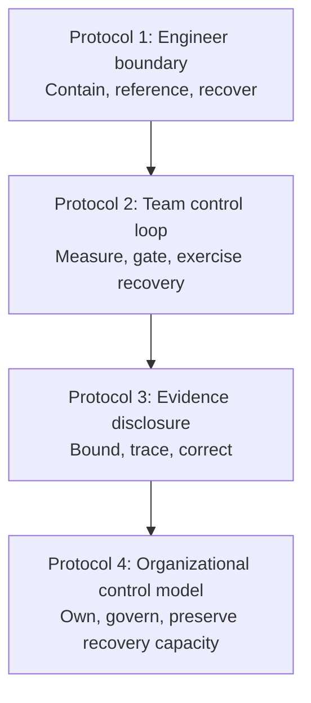

# 🛡️ Operational Protocols

> **Navigation:** [🏠 Home](../README.md) | [🎯 Scope](../SCOPE.md) | [🧩 Artifact Model](../ARTIFACT_MODEL.md) | [🧭 Doctrine](../DOCTRINE.md) | [📖 Glossary](../GLOSSARY.md) | [📉 The Report](../report/01_the_illusion.md) | **Protocols** | [🧾 Evidence Library](../evidence/README.md) | [📋 Source Registry](../evidence/SOURCES.md) | [📚 References](../REFERENCES.md)

## From diagnosis to operating practice

These protocols translate the repository's delivery-system risk analysis into practical controls for AI-assisted software development.

They are not empirical proof and they are not universal policy. They are operating patterns that teams and organizations can adapt to their own architecture, risk profile, regulatory obligations, and delivery constraints.

The protocol boundaries and adaptation principles are defined in the [Repository Doctrine](../DOCTRINE.md#protocol-principles). The [Repository Scope](../SCOPE.md) defines which delivery risks and adjacent topics belong in this project. The [Repository Artifact Model](../ARTIFACT_MODEL.md) shows how protocols relate to evidence, interpretation, report claims, and implementation feedback. Canonical terms such as **delivery system**, **verification capacity**, **protocol**, **risk scenario**, and **throughput** are defined in the [Glossary](../GLOSSARY.md).

The four protocols form one control stack:

Each layer addresses a different failure mode. None of them is sufficient alone.

---

## Protocol library

### [Protocol 1: Personal Defense](01_personal_defense.md)

**Primary users:** Engineers, senior engineers, tech leads, reviewers.

**Purpose:** Protect the individual engineering decision boundary.

**Core controls:**

- Green, Controlled, and Protected work zones;
- Disposable Boundary Pattern;
- Reference-Bounded Adaptation;
- Independent Human Recovery Path;
- explicit verification before generated output becomes durable code;
- engineer accountability for every committed change.

**Use this when:** AI-generated output is entering day-to-day implementation work and the team needs clear boundaries for what may be generated, adapted, reviewed, rejected, or recovered without depending exclusively on the agentic layer.

---

### [Protocol 2: Operational Defense](02_operational_defense.md)

**Primary users:** Engineering managers, delivery leaders, QA leaders, architects, platform teams.

**Purpose:** Turn AI-assisted development into a measurable team-level control loop.

**Core controls:**

- local baselines rather than universal thresholds;
- flow, review, rework, quality, release, and production signals;
- change-risk classes and minimum review gates;
- Recovery Independence Gate and AI-off game days for consequential systems;
- investigate, constrain, and pause escalation rules;
- recurring operating review and decision records.

**Use this when:** A team or pilot is adopting AI assistance and needs to determine whether local acceleration survives review, validation, release, production use, and loss or failure of the agentic layer.

---

### [Protocol 3: Public Evidence and Disclosure](03_public_defense.md)

**Primary users:** Engineering leaders, researchers, vendors, analysts, internal communications teams, public advocates.

**Purpose:** Make claims about AI-assisted software delivery inspectable, bounded, and correctable.

**Core controls:**

- separation of tool activity, workflow effects, production outcomes, and causal interpretation;
- claim classification and minimum support expectations;
- public disclosure and minimum disclosure templates;
- source traceability and explicit limitations;
- anti-hype rules and a correction protocol.

**Use this when:** Publishing a benchmark, case study, executive claim, adoption result, vendor statement, internal update, or criticism of AI-assisted development.

---

### [Protocol 4: Systemic Cure](04_systemic_cure.md)

**Primary users:** CTOs, engineering executives, architects, platform leaders, security and governance owners.

**Purpose:** Establish an organizational operating model for governing AI-assisted software delivery as a system change.

**Core controls:**

- organizational control plane;
- named ownership and decision rights;
- executable policy lifecycle;
- review, QA, security, architecture, release, and maintenance capacity planning;
- Human Recovery Reserve for consequential systems;
- staged adoption gates;
- exception debt, decision memory, and incident learning.

**Use this when:** AI adoption is expanding beyond a local team and the organization needs consistent policy, capacity, accountability, feedback loops, and retained recovery capability outside the agentic failure domain.

---

## How to apply the stack

Do not begin with organization-wide policy and assume the lower layers will follow automatically.

A practical adoption sequence is:

1. Establish engineer-level boundaries, verification practices, and a direct recovery path.
2. Pilot a team-level control loop with local baselines, explicit gates, and recovery-independence exercises.
3. Communicate results through bounded, traceable disclosures.
4. Expand only when organizational ownership, capacity, policy, pause authority, and Human Recovery Reserve exist.

The reverse sequence is a common failure mode: executives announce broad adoption, teams absorb the output, reviewers become the hidden constraint, deep system knowledge atrophies, and governance is added only after defects or maintenance costs appear.

---

## Evidence boundary

These protocols are derived from the report's risk analysis and evidence synthesis. They should be evaluated through implementation feedback, local measurement, and further empirical study.

- The [Repository Scope](../SCOPE.md) defines the subject boundary and adjacent-topic rules.
- The [Repository Artifact Model](../ARTIFACT_MODEL.md) shows the relationship from evidence through report claims to protocols and feedback.
- The [Repository Doctrine](../DOCTRINE.md) defines how protocols relate to evidence, interpretation, and claim boundaries.
- The [Glossary](../GLOSSARY.md) defines the canonical terms used across the protocol stack.
- The [Source Registry](../evidence/SOURCES.md) is the canonical source inventory and status registry. It records evidence-review status, integration-audit status, verification date, and actual repository use.
- The [Evidence Library](../evidence/README.md) documents source classes and evidence briefs.
- [References](../REFERENCES.md) is the compact human-readable bibliography; it is not the canonical inventory or status database.
- The [Claim confidence map](../README.md#claim-confidence-map) identifies the current support level of major repository claims.
- [Uncertainty Architecture](https://github.com/UncertaintyArchitectureGroup/uncertainty-architecture) provides a broader specification for governing non-deterministic systems; it complements this repository but does not replace these software-delivery protocols.

A protocol may be motivated by one or more sources, but it is not empirical proof. During a source integration audit, protocol implications must be recorded as exactly one of:

- **No protocol change**
- **Protocol clarification**
- **Protocol change proposed**

---

## Operating principle

> Faster generation is useful only when the surrounding system can still understand, verify, release, operate, maintain, and recover the result when the agentic layer is unavailable or wrong.

---

*License: CC-BY-SA 4.0*
