# Part 1: The Illusion of Speed

> **Navigation:** [🏠 Home](../README.md) | **Part 1** | [⚙️ Part 2: Broken Mechanics](02_broken_mechanics.md) | [🔥 Part 3: The Aftermath](03_the_aftermath.md) | [🛡️ Protocols](../protocols/README.md) |  [📚 References](../REFERENCES.md)

**Table of Contents:**
*   [Chapter 1. The Great Illusion](#chapter-1-the-great-illusion-why-we-feel-faster-but-data-shows-were-slowing-down)
*   [Chapter 2. The Missing Price Tag](#chapter-2-the-missing-price-tag-the-true-cost-of-making-ai-work)
*   [Chapter 3. The "Free Lunch" Trap](#chapter-3-the-free-lunch-trap-why-the-board-chooses-a-strategy-of-degradation)
*   [Chapter 4. Anatomy of the Break](#chapter-4-anatomy-of-the-break-how-the-safe-scenario-kills-the-sdlc)
---

## Chapter 1. The Great Illusion: Why We Feel Faster, but Data Shows We're Slowing Down

Ask any developer today how it feels to code with an AI Code Assistant, and you will hear the same word: *empowering*. The "blank page syndrome" is dead. Boilerplate is generated in milliseconds. Subjectively, the friction of typing has vanished, leading to a widespread feeling that we are moving 10x faster.

But if you step back from the IDE and look at the delivery metrics, a disturbing paradox emerges. If every individual engineer is "faster," why hasn't our Time-to-Market collapsed? Why are feature releases stalling?

To understand this, we must look at the cold, hard data from independent research, not vendor marketing.

---

### The "Senior Penalty": Confirmed at Scale (METR & Xu et al.)

The most damaging myth of the AI era is that it turns junior engineers into seniors, and senior engineers into "10x" architects. The reality is far more complex. We now have evidence from two independent vectors: a controlled trial and a massive longitudinal study.

**1. [The Mechanics of Slowdown (METR, July 2025)](https://metr.org/blog/2025-07-10-early-2025-ai-experienced-os-dev-study/):**
In a randomized controlled trial, researchers measured the impact of AI on **experienced open-source developers** working on their own repositories.
* **The Result:** When using frontier AI Code Assistants (Cursor Pro with Claude 3.5/3.7), developers took **19% longer** to complete tasks compared to working without them.
* **The Subjective Illusion:** Despite being slower, the developers *believed* the AI made them faster. They forecasted a **24% speedup** and, even after the experiment, estimated they had gained **20%**.

**2. [The Scale Validation (Xu et al., arXiv 2025)](https://arxiv.org/abs/2510.10165):**
Critics often dismiss controlled trials as "too small." However, **Xu et al. (2025)** analyzed telemetry from over **10,000 developers** across diverse enterprise environments, independently confirming the "Senior Penalty" at scale.
* **Labor Redistribution:** While peripheral contributors (Juniors) exploded their output (**+43.5% commits**), Core Contributors (Seniors) saw their coding output collapse (**-19% commits**).
* **The Maintenance Trap:** Instead of writing code, seniors were forced to shift to reviewing it, with their review load increasing by **+6.5%**. Crucially, the AI-generated code required **2.4% more rework** per PR to meet quality standards.

**Why the Disconnect?**
The AI shifted the senior engineer's role from "Author" to "Reviewer/Debugger." Seniors didn't save time writing; they lost time untangling machine-generated complexity.

---

### [The Cognitive Tax: Complexity & Warnings (Agarwal et al., 2026)](https://arxiv.org/abs/2601.13597)

If we are typing faster, what exactly are we producing? **Agarwal et al. (2026)** conducted a deep structural analysis of AI-generated codebases versus human-authored ones. The findings explain *why* the maintenance burden is exploding:

* **Static Analysis Warnings (+18%):** AI agents consistently introduce subtle violations of linting rules and best practices that human seniors typically filter out instinctively.
* **Cognitive Complexity (+39%):** This is the killer metric. The code generated by AI is functionally correct but structurally convoluted. It lacks the elegance and readability of human-crafted logic.

**The Implication:** We are not just generating code; we are generating **technical debt** at a rate of +39% complexity per feature. This explains why Code Reviews are becoming the new bottleneck.

---

### [The Data: A Crisis of Quality (GitClear)](https://www.gitclear.com/ai_assistant_code_quality_2025_research)

When we overlay the complexity data (Agarwal) with volume data (GitClear), the picture becomes complete. Analyzing **211 million lines of code** relative to a 2022 baseline:

**The Illusion of Output (Activity Metrics):**
* **Lines of Code Added: +131.1%**
    The volume of raw syntax being pushed has more than doubled. We are generating code at an industrial scale.
* **The Duplication Explosion (~10x Increase):**
    Commits containing duplicate code surged from 0.70% (2020) to 6.66% (2025). Instead of refactoring, we are copy-pasting via AI.
* **The Death of Reuse:**
    Code reuse ("Moved" lines) dropped from ~25% to <10%. AI simply generates new versions of existing functions.

**The Reality of Progress (Value Metrics):**
* **Net Productivity Gain (Blended Median): ~9.0%**
    By averaging median Commit Counts (+6.1%) and meaningful code changes (Diff Delta +14.1%), we arrive at a net gain of roughly 9-10%.

This aligns with public statements from Google leadership. In late 2025, CEO Sundar Pichai disclosed an internal measurement of engineering velocity: *"Our estimates are that number is now at 10%."* While this is an unaudited executive claim, its modest figure is notable given Google's incentive to report higher gains — and given the billions in internal infrastructure that make even that 10% possible (see Chapter 2).

---

### Acknowledging the Positive Evidence

Scientific integrity demands that we address findings that appear to contradict our thesis.

We do not dispute that AI accelerates isolated coding tasks, particularly for less-experienced developers. The evidence for this is robust. [**Peng et al. (2023)**](https://arxiv.org/abs/2302.06590) conducted a randomized controlled trial ($n = 196$) showing a **55.8% speedup** on greenfield coding tasks. [**Xu et al. (2025)**](https://arxiv.org/abs/2510.10165) — the same study we cite above — confirms that peripheral contributors saw a **+43.5% increase** in commit volume. Individual developers, particularly juniors, genuinely do produce code faster with AI assistance.

Our concern is different: **these local gains do not translate into system-level productivity improvements, and may actively degrade them.** The Peng et al. study measured isolated task completion in a greenfield environment — writing small programs from scratch. This has limited relevance to brownfield enterprise engineering, where 80-90% of work involves maintaining, extending, and debugging existing systems. And as Xu et al. themselves demonstrate, the aggregate productivity increase at the project level disappears once you account for the redistribution of labor onto seniors and the increased rework rate.

The question is not whether AI makes typing faster. It does. The question is whether faster typing makes the *system* faster. The data says it does not.

---

### The "Fear Factor" in Productivity

There is an even darker interpretation of the modest ~10% net productivity gain seen in some datasets. We must ask: Is this gain technological, or is it psychological?

The widespread narrative that "AI makes coding free" has reached every project sponsor. This has created a coordinated, implicit pressure on engineering teams to deliver faster.

*We note the following as an unverified hypothesis that warrants dedicated research, not as established fact:*

* **The Reality:** Developers are not just using AI; they are working harder to meet inflated expectations.
* **The Hidden Variable:** A significant portion of this "gain" may be the result of **increased working hours** and **elevated stress**, driven by the fear of being replaced or seen as "slow" in the age of AI. Early survey data suggests rising anxiety among developers regarding AI displacement (Stack Overflow Developer Survey, 2024), though direct causation with overtime has not been rigorously established. We may be confusing "efficiency" with "exhaustion."

---

### The Evidence Gap: When Marketing "Vibes" Replace Operational Data

Scientific honesty requires us to pause here. Any senior engineer reading this report should rightly feel a twinge of skepticism: **Is it objective to build a crisis narrative based primarily on these few sources?**

In a healthy engineering culture, we would demand a dozen independent data points to triangulate the truth. We would want to compare these negative findings against the longitudinal telemetry from the vendors themselves.

But we are forced to rely on these limited signals for one disturbing reason: **The Vendor data does not exist**.

Three years into the "AI Revolution," the companies selling this future — who sit on the largest dataset of engineering behavior in human history — have yet to publish a single rigorous, independent study demonstrating that AI reduces **Total Cost of Ownership** or **Defect Rates** in a real Enterprise environment.

Instead of operational evidence, the public narrative is dominated by what can only be described as **"Placebo Analytics."**

* **The Survey Pattern:** Vendors frequently cite figures such as *"88% of developers feel more productive."* However, as demonstrated by METR and Xu et al., subjective confidence is a poor proxy for real productivity. These surveys measure **adoption sentiment** ("Do you like the tool?"), not **delivery outcomes** ("Did the system ship value faster?").
* **The Synthetic Benchmark Pattern:** Claims like *"55% faster development"* originate from Greenfields — writing small code from scratch. As we acknowledged above, these gains are real but narrow. They have limited relevance to Brownfields — maintaining large, legacy codebases, which represents 80-90% of enterprise engineering.

---

### The "You're Holding It Wrong" Fallacy

We anticipate the standard defense from vendors regarding the degradation of code quality: *"If developers are merging bad code, that is a user error, not a tool error. You are using the assistant incorrectly."*

We find this defense insufficient.

If the "default mode" of usage across the entire market — driven by the vendors' own marketing promises of "speed" — results in the degradation of codebases, then this is not simply a user error. It is a **systemic design and positioning failure**. When a power tool is sold aggressively to consumers without adequate safety instructions, without protective equipment, and with marketing that emphasizes speed over caution — we do not blame only the user when injuries spike. We hold the manufacturer accountable for selling power without adequate safeguards.

It is the responsibility of platform vendors to pivot their strategy. The primary metrics of AI Code Assistants must shift from **"Acceptance Rate"** (how often you press Tab) to **"Defect Reduction"** and **"Maintainability."**

---

### The Broken Economic Model

The current economic relationship between AI vendors and Engineering organizations is fundamentally misaligned.

* **The Model:** You pay a subscription fee to "accelerate" coding.
* **The Reality:** You are paying to inject invisible risk into your asset. The vendor extracts value (revenue) today from the *volume* of code generated, while you accumulate "Toxic Assets" (unverified, high-churn code) that will bankrupt your maintenance budget tomorrow.

---

### Conclusion: The Conveyor Belt of Disposable Code

The data leads to an unavoidable conclusion: We have confused **Typing Speed** with **Engineering Velocity**.

We have built a high-speed conveyor belt for disposable code. By lowering the cost of generating syntax to near zero, we have flooded our SDLC with low-quality (+18% warnings), high-complexity (+39%) code. We *feel* faster because we are typing less, but we are delivering slower because we are drowning in the noise we created.

> We haven't accelerated software engineering; we've just accelerated the creation of technical debt.
> 
---

#### References

* **METR Study (July 2025):** [Measuring the Impact of Early-2025 AI on Experienced Open-Source Developer Productivity](https://metr.org/blog/2025-07-10-early-2025-ai-experienced-os-dev-study/) — AI Copilots make experienced developers 19% slower. RCT with 246 tasks, 16 developers. Developers believe they're 20% faster → perception gap is the killer.
* **Xu et al. (arXiv, 2025):** ["AI-Assisted Programming Decreases the Productivity of Experienced Developers"](https://arxiv.org/abs/2510.10165) — Analysis of 10,000+ developers confirming increased review load (+6.5%) and rework (+2.4%) for seniors, with a 19% drop in original code productivity for core contributors. Also confirms +43.5% output increase for peripheral contributors.
* **Agarwal et al. (arXiv, 2026):** ["AI IDEs or Autonomous Agents? Measuring the Impact of Coding Agents"](https://arxiv.org/abs/2601.13597) — AI-generated code shows +18% static analysis warnings and +39% higher cognitive complexity. Quality degradation persists even when velocity gains fade.
* **Peng et al. (arXiv, 2023):** ["The Impact of AI on Developer Productivity: Evidence from GitHub Copilot"](https://arxiv.org/abs/2302.06590) — RCT ($n = 196$) showing 55.8% speedup on greenfield coding tasks, primarily benefiting less-experienced developers. Foundational positive evidence for task-level acceleration.
* **GitClear (2025):** [AI Assistant Code Quality 2025 Research](https://www.gitclear.com/ai_assistant_code_quality_2025_research) — 8x increase in duplicated code blocks, code reuse dropped from ~25% to <10%. Dataset: 211 million changed lines.
* **Post-Copilot Burnout (Oct 2025):** [Are AI Assistants Making Senior Developers the New Bottleneck?](https://technodiaries.medium.com/post-copilot-burnout-are-ai-assistants-making-senior-developers-the-new-bottleneck-1689e20364f1) — Senior devs report doubled review time, PR queues described as "tidal wave."
* **Stack Overflow Developer Survey (2024):** [Developer Survey Results](https://survey.stackoverflow.co/2024/) — Documents rising developer anxiety regarding AI displacement and shifting productivity expectations.

---

## Chapter 2. The Missing Price Tag: The True Cost of Making AI Work

*The preceding chapter addressed what the data shows engineers on the ground. This chapter addresses what the data means for the business — specifically, for the executives and financial officers who approve AI budgets without visibility into the full cost of making those budgets productive.*

---

Large technology companies often point out that they successfully use these tools internally. There is little reason to doubt this claim. However, what is rarely discussed is the full cost structure behind that success.

Such organizations operate with exceptional engineering maturity. They have invested heavily over many years in internal platforms, architectural governance, and review automation that absorb the additional complexity introduced by AI. This is not a minor operational detail. It is the foundation upon which any "AI productivity gain" is built.

---

### The Invisible Infrastructure

Consider the engineering infrastructure that existed at Google **before** a single line of AI-assisted code was ever written:

- **Blaze/Bazel:** A build system engineered over a decade to handle a monorepo of billions of lines of code.
- **TAP (Test Automation Platform):** An infrastructure running approximately 4.2 billion test executions per day — a system that took over 15 years and, by reasonable estimates, well over **$1 billion** to build and maintain.
- **Critique:** An internal code review platform with deep integration into static analysis, style enforcement, and automated checks — replacing any need for a human to catch the kind of "plausible lies" that AI generates.
- **Tricorder:** A static analysis framework that automatically flags issues before a reviewer ever sees the code.

These systems are documented extensively in Google's own engineering publications. They represent a cumulative investment of **10–15 years** and, conservatively, **$1–3 billion** in dedicated platform engineering. And this is just one company.

Microsoft maintains **1ES (One Engineering System)** and **CodeFlow**. Meta has rebuilt its internal developer platform multiple times. The R&D expenditures that fund these systems are staggering:

| Company | Annual R&D (CY2024) | Annual CapEx (CY2024) | CapEx Plans (2025) |
|---|---|---|---|
| Alphabet (Google) | $45.4B | $52.5B | ~$75B |
| Meta | $44.4B | $39.2B | $60–65B |
| Microsoft | $29.5B (FY2024) | $44.5B (FY2024) | ~$80B |

*Sources: Alphabet 10-K (CY2024); Meta 10-K (CY2024); Microsoft 10-K (FY2024, ended June 2024). Note: Microsoft's fiscal year ends June 30; CY2024 run rate CapEx is substantially higher (~$64B annualized based on H1 FY2025 spending). 2025 CapEx plans per company earnings calls and Financial Times reporting.*

When Sundar Pichai tells investors that AI provides a "10% productivity gain," that gain is measured **on top of** this multi-billion-dollar foundation. It is not a gain from the AI license alone. It is a gain from the AI license **plus** decades of infrastructure investment that makes safe adoption possible.

---

### The Transformation Multiplier

When the same AI tools are sold externally — to organizations that lack this surrounding operational model — the market creates a dangerous illusion: that comparable results can be achieved primarily through license adoption.

Let us quantify this illusion. The direct cost of AI tooling for a mid-size enterprise (1,000–5,000 engineers) is trivial:

> **GitHub Copilot Business:** $19/user/month ≈ **$228K/year** for 1,000 engineers.

Now consider the actual cost of building the infrastructure required to safely absorb the complexity that AI introduces. The following estimates are based on our analysis of publicly available infrastructure costs, industry benchmarking data, and enterprise transformation case studies. They represent order-of-magnitude ranges, not precise figures:

| Transformation Component | Estimated Cost | Timeline |
|---|---|---|
| CI/CD modernization & automated quality gates | $2–10M | 6–18 months |
| Code quality & security scanning (SonarQube, Semgrep) | $500K–2M | 3–6 months |
| RAG infrastructure for contextual AI review | $1–5M | 6–12 months |
| Developer training & process redesign | $1–3M/year | Ongoing |
| Additional senior engineers for review capacity | $2–5M/year | Ongoing |
| Architectural governance & compliance frameworks | $500K–2M | 3–6 months |
| **Total (Year 1)** | **$7–27M** | — |

This produces a ratio that should alarm any CFO:

$$\text{Transformation Multiplier} = \frac{\text{Real Transformation Cost}}{\text{License Cost}} = \frac{\$7\text{–}27M}{\$228K} \approx 30\text{–}120\times$$

**The license is 1–3% of the real cost of making AI work safely.** The remaining 97–99% — the transformation bill — is invisible on every vendor pitch deck.

---

### The Jevons Paradox of AI Code

The situation is worse than a one-time bill. Enterprise AI spending data reveals a troubling dynamic: even as the unit cost of AI drops, total spending accelerates.

According to 2025 market data, enterprise generative AI spending surged from **$11.5B (2024)** to **$37B (2025)** — a **320% increase** — despite per-token inference costs dropping by approximately **1,000x** over the same period. The average monthly AI budget per organization rose 36% to **$85,521/month**, with **45%** of organizations now spending over **$100K/month**.

This is a textbook **Jevons Paradox**: cheaper AI per unit → more AI consumed → more infrastructure required to govern it → higher total cost. The "savings" from cheaper tokens are consumed — and then exceeded — by the expanding blast radius of AI-generated complexity across the organization.

---

### The License Is Visible. The Transformation Bill Is Not.

This asymmetry is the engine of the crisis. When a Board approves an AI budget, they see a line item:

> ✅ **AI Licenses:** $228K/year — *Approved.*

What they do not see is the operational debt they are implicitly authorizing:

> ❌ **Infrastructure to safely absorb AI output:** $7–27M — *Not requested. Not funded. Not discussed.*

The vendor has no incentive to surface this cost. The CTO may not fully understand it. The CFO has no framework to calculate it. And so the organization deploys a tool that multiplies code volume by 2x into a pipeline that was designed for 1x — and wonders why, 18 months later, the maintenance budget has exploded and the senior engineers are burning out.

Until the industry develops transparent TCO models for AI-assisted development — models that include the full cost of governance, verification, and process transformation — every "AI ROI" calculation presented to a Board is, at best, incomplete, and at worst, a fiction.

---

### The Challenge to Vendors

If AI Code Assistants are as mature and universally beneficial as current messaging implies, the path forward should be straightforward.

Instead of investing predominantly in adoption campaigns, we challenge vendors to allocate capital to **independent, objective research**. Fund university or neutral industry groups to study real teams working on real backlogs, measuring concrete indicators such as cycle time, defect rates, rework, and maintenance cost across diverse organizations over an extended period.

The absence of such evidence does not imply malicious intent. However, it leaves the industry operating in a critical evidence gap. Until rigorous, independent data is available, a prudent conclusion remains unavoidable:

**Without corresponding changes to the operating model, AI Code Assistants are unlikely to deliver net positive outcomes at the system level — and may actively increase long-term cost and risk.**

---

#### References

* **Google Software Engineering (O'Reilly):** [Software Engineering at Google](https://abseil.io/resources/swe-book) — Detailed documentation of Google's internal infrastructure (Blaze, TAP, Critique, Tricorder) built over 15+ years, representing billions in platform investment.
* **Alphabet 10-K (CY2024):** [SEC Filing, goog-20241231](https://www.sec.gov/Archives/edgar/data/1652044/000165204425000014/goog-20241231.htm) — R&D $45.4B, CapEx $52.5B. 2025 CapEx guidance ~$75B.
* **Meta 10-K (CY2024):** [Investor Relations](https://investor.fb.com/) — R&D $44.4B, CapEx $39.2B. 2025 CapEx guidance $60–65B.
* **Microsoft 10-K (FY2024):** [Investor Relations](https://www.microsoft.com/en-us/investor) — R&D $29.5B, CapEx $44.5B. FY ends June 30; H1 FY2025 run rate substantially higher. 2025 CapEx guidance ~$80B.
* **Big Tech 2025 AI Spending:** [Financial Times via delo.ua](https://delo.ua/news/amazon-meta-microsoft-ta-alphabet-vitratyat-300-mlrd-na-si-u-2025-roci-441442) — Amazon, Meta, Microsoft, and Alphabet plan combined CapEx exceeding $320B in 2025, up from $246B in 2024 (+63% YoY from $151B in 2023).
* **Enterprise AI Spending (2025):** [The Inference Cost Paradox: Why Generative AI Spending Surged 320%](https://www.arturmarkus.com/the-inference-cost-paradox-why-generative-ai-spending-surged-320-in-2025-despite-per-token-costs-dropping-1000x-and-what-it-means-for-your-ai-budget-in-2026/) — Jevons Paradox in action: per-token costs down 1000x, total enterprise spend up from $11.5B to $37B. Average monthly AI budget per org: $85,521.
* **Enterprise AI TCO (2025):** [Total Cost of Ownership for Enterprise AI](https://xenoss.io/blog/total-cost-of-ownership-for-enterprise-ai) — Framework for hidden costs beyond API bills: data engineering, RAG infrastructure, MLOps, governance, compliance.
* **Frontier Model Training Costs:** [How Much Does It Cost to Train Frontier AI Models?](https://epoch.ai/blog/how-much-does-it-cost-to-train-frontier-ai-models) — Training costs growing at 2.4x/year; largest runs projected to exceed $1B by 2027.
---

## Chapter 3. The "Free Lunch" Trap: Why the Board Chooses a Strategy of Degradation

If the data from Chapter 1 is so alarming — if senior engineers are slowing down and code churn is exploding — and if the true cost of transformation is 30–120x the license fee (Chapter 2) — why is the industry doubling down on the exact same strategy? Why are smart C-Level executives making decisions that are actively degrading their products?

The answer lies not in engineering, but in market pressure. We are witnessing a classic collision between the **Gartner Hype Cycle** and corporate budgeting reality.

---

### The Mechanics of the "Execution Mandate"

The disaster starts long before a developer installs an AI Code Assistant. It starts with the investors.

Driven by reports promising **"55% productivity gains"** and **"democratized coding,"** investors are pressuring Boards to demonstrate an AI strategy *now*. The message to the CEO is clear: **"Adopt AI or become irrelevant."**

However, the Board faces a dilemma. They demand AI adoption, but they lack a clear understanding of the ROI or the complexity of the necessary transformation. They view AI as a tool (like a faster IDE), not as a change in the operating model.

Consequently, they refuse to allocate budget for a deep transformation (new roles, re-architecting processes, training agents). Instead, they issue what we call the **"Execution Mandate"**:

> *"Implement AI. Here is the budget for licenses. Here is a small budget for a prompt engineering workshop. Go."*

This appears to be the "safe" strategy. It's low cost (CapEx) and easy to implement. But in reality, it is a strategic error of massive proportions. By funding the *generation* of code without funding the *management* of code, the Board has authorized a sustained volume increase that far exceeds their engineering team's processing capacity — with no plan to close the gap.

---

### The Adoption-Impact Gap: 88% In, 6% Out

The scale of this disconnect is not theoretical. It is already measurable at the macro level.

McKinsey's 2025 global survey on the state of AI in the enterprise found that **88% of organizations** have adopted AI in some form. Yet only **6% report meaningful impact on EBIT** — the metric that actually reflects whether AI is creating business value, not just activity.

This is the "Execution Mandate" rendered in aggregate data. Nearly nine out of ten companies have bought the licenses. Fewer than one in fifteen can demonstrate that the investment is paying for itself.

The 82-percentage-point gap between adoption and impact is not a mystery. It is the predictable result of what Chapter 2 quantified: organizations are funding 1–3% of the real cost of making AI productive (the license) while leaving the remaining 97–99% (the transformation) unaddressed.

---

### The Blindness of Scale: Vertical Curves vs. Horizontal Planning

This gap between executive planning and technical reality is being acknowledged even by those leading the AI "Renaissance."

**Andreas Horn, Head of AIOps at IBM**, recently noted that software development has crossed a line it cannot uncross. While he advocates for the power of these tools, he highlights a staggering disconnect in leadership planning. While this is social media commentary rather than peer-reviewed analysis, the observation from a senior AI practitioner at a major vendor is notable precisely because it comes from inside the industry:

> *"The curve is going vertical. Most planning is still horizontal."*

This is where the **Subprime Crisis** ignites. Proponents like Horn see a vertical curve of *capability* and predict that the minority of manual coders will be *"smaller than anyone in a boardroom is currently planning for."* But when we intersect this "vertical curve" with **METR's March 2025 data** on *reliability* (a 50% failure rate for tasks requiring 7 hours of expert human work), the danger becomes clear.

Boardrooms are planning for a linear, "horizontal" increase in efficiency. Meanwhile, the technology is delivering a vertical spike in **unverified complexity**. Horn's warning of **"vibe coding"** resulting in a *"patchwork of plausible code that ages badly"* confirms our thesis: without a total overhaul of the SDLC, we aren't accelerating engineering; we are accelerating **entropy**.

---

### The Startup vs. Enterprise Paradox

This "Execution Mandate" is particularly dangerous because it ignores context.

For an early-stage **Startup**, this strategy might actually work. Startups operate on a **"fail fast"** model. Their goal is to validate a hypothesis before they run out of cash. If the code is messy but the product finds product-market fit, they survive to rewrite it.

For an **Enterprise**, however, this strategy is **toxic**.
In a mature organization, the cost of software is not in writing it; it is in **maintaining it**. Industry standards suggest that **80% of the Total Cost of Ownership (TCO)** of software occurs *after* deployment.

When an Enterprise adopts the **"Startup Strategy"** of AI (maximum speed, minimum process), they flood their long-term codebase with **"disposable"** code. But unlike a startup, they cannot throw it away. They have to support it for years. By saving pennies on code generation today, the Board is guaranteeing millions in increased maintenance costs tomorrow.

---

### The Dashboard Blind Spot

Why doesn't the C-Suite see this looming crisis? Because they are looking at the wrong dashboard.

Most executive dashboards measure **Activity**, not **Health**.
* They see: *Number of Commits (Up), Features Released (Steady), AI Adoption Rate (100%).*
* They do not see: *Code Complexity (Skyrocketing), Technical Debt Ratio (Critical), Maintainability Index (Plummeting).*

McKinsey's data reinforces this: the dashboard shows **88% adoption**. It does not show that only **6% are deriving real value**. The ship is taking on water, but the Captain is only looking at the speedometer.

With **METR's 2025 data** showing that even the best agents reach only **50% reliability** on substantive projects, the "Activity" shown on dashboards is increasingly decoupled from value. Half of that "speed" is simply the rapid accumulation of toxic assets.

Deloitte's 2025 enterprise survey corroborates this shift: organizations are moving from experimentation to demanding measurable ROI — an implicit acknowledgment that the initial "adopt first, measure later" strategy has not delivered as expected.

---

### Conclusion: The Strategy of Degradation

The **"Free Lunch"** trap is the belief that you can get the benefits of AI (speed) without paying the price (process transformation).

The Board has successfully optimized the cheapest part of the SDLC — **typing** — while ignoring the most expensive part — **thinking**. Until leadership understands that AI requires a fundamental shift in *how* we build, not just *what tools* we use, they will continue to fund the degradation of their own assets.

---

#### References

* **McKinsey & Company (2025):** [The state of AI in early 2025](https://www.mckinsey.com/capabilities/quantumblack/our-insights/the-state-of-ai) — Global survey: 88% of organizations report AI adoption; only 6% report meaningful EBIT impact. Highlights the gap between deployment activity and business value creation.
* **METR (March 19, 2025):** [Measuring AI Ability to Complete Long Tasks](https://metr.org/blog/2025-03-19-measuring-ai-ability-to-complete-long-tasks/) — AI task horizons are doubling every 7 months; GPT-5.2 handles 7-hour tasks at 50% reliability.
* **Andreas Horn, IBM (Feb 2026):** ["The most important chart in AI" (Vertical Curves)](https://www.linkedin.com/posts/andreashorn1_𝗧𝗵𝗲-𝗺𝗼𝘀𝘁-𝗶𝗺𝗽𝗼𝗿𝘁𝗮𝗻𝘁-𝗰𝗵𝗮𝗿𝘁-activity-7425435461994635264-IW2S/) — Social media commentary from a senior AI practitioner at IBM on the disconnect between vertical AI capability curves and horizontal boardroom planning.
* **Andreas Horn, IBM (Feb 2026):** ["AI writes code faster than teams can keep up with" (Vibe Coding)](https://www.linkedin.com/posts/andreashorn1_%F0%9D%97%94%F0%9D%97%9C-%F0%9D%98%84%F0%9D%97%BF%F0%9D%97%B6%F0%9D%98%81%F0%9D%97%B2%F0%9D%98%80-%F0%9D%97%B0%F0%9D%97%BC%F0%9D%97%B1%F0%9D%97%B2-%F0%9D%97%B3%F0%9D%97%AE%F0%9D%98%80%F0%9D%98%81%F0%9D%97%B2%F0%9D%97%BF-%F0%9D%98%81%F0%9D%97%B5%F0%9D%97%AE%F0%9D%97%BB-activity-7422178629528330240-Z4Bc) — Analysis of "patchwork of plausible code" and entropy acceleration in enterprise codebases.
* **Deloitte (2025):** [Now decides next: Insights from the leading edge of generative AI adoption](https://www2.deloitte.com/us/en/pages/consulting/articles/state-of-generative-ai-in-enterprise.html) — Enterprise survey documenting the shift from AI experimentation toward ROI accountability, with observations on failure rates in scaling initiatives.
* **Microsoft (2025):** [FY25 Q2 Financial Results](https://www.microsoft.com/en-us/investor/earnings/fy-2025-q2/press-release-webcast) — Record Copilot revenue highlights the market-wide "Execution Mandate" and vendor-side incentive structure.

---

## Chapter 4. Anatomy of the Break: How the "Safe Scenario" Kills the SDLC

We have established that the Board has mandated a "high volume" strategy (Chapter 3), funded at 1–3% of the real transformation cost (Chapter 2), into a system already showing signs of quality degradation (Chapter 1). Now, let's look at the precise mechanism by which that strategy breaks the engineering process itself.

To understand the catastrophe unfolding in engineering teams, we don't need complex AI theories. We just need basic manufacturing physics — specifically, Eliyahu Goldratt's **Theory of Constraints**.

---

### The Physics of Software Delivery

Every manufacturing process, including software development, is a chain of events. The total output of the system (Throughput) is determined by exactly one thing: the speed of the slowest link (the **Bottleneck**).

The classic SDLC (Software Development Life Cycle) was architected for a human-speed world:

1. **Coding (The Constraint):** Writing code was hard, slow, and mentally taxing. It was the natural bottleneck.
2. **Review & QA (The Capacity):** Because coding was slow, the downstream steps (Review, QA) had enough capacity to handle the flow.

The system was balanced. The "slowness" of writing code acted as a natural **flow control valve**. This is not a flaw to be optimized away — it is a design feature of a stable delivery system.

---

### Breaking the Valve

```mermaid
flowchart TD
    %% Nodes
    AI[("🌊 AI GENERATION 🌊 (Unlimited Input)")]
    
    subgraph Sdlc ["The Jammed System"]
        Queue[/"⚠️PR Queue (Inventory)⚠️"\]
        Context("Loss of Context")
    end

    Bottleneck(("⛔ SENIOR ENGINEER ⛔ (The Bottleneck)"))
    
    Output[("💧 Delivered Value 💧 (Trickle)")]

    %% Connections
    AI == "Firehose of Code" ==> Queue
    Queue --> Context
    Context --> Bottleneck
    
    Bottleneck -.->|"Rubber Stamp (Risk)"| Output
    Bottleneck == "Deep Review (Slow)" ==> Output

    %% Styles
    style AI fill:#aaffaa,stroke:#333,stroke-width:2px
    style Queue fill:#ffaaaa,stroke:#333,stroke-width:2px
    style Bottleneck fill:#ff0000,color:white,stroke:#333,stroke-width:4px
    style Output fill:#e1f5fe,stroke:#333,stroke-width:2px

```

The introduction of AI Code Assistants removed the flow control valve.

Suddenly, the "Coding" phase is no longer the constraint. A junior developer with an AI Code Assistant can generate code faster than they can read it. As demonstrated in Chapter 1, the volume of code entering the pipeline has more than doubled (+131% lines added), while its structural quality has degraded significantly (+39% cognitive complexity, +18% static analysis warnings).

But here is the **"Anatomy of the Break"**: We changed the input parameters of the system without changing the architecture of the processing nodes.

We are pumping a firehose of water (**AI-generated code**) into a garden hose (**Human Review**).

According to the Theory of Constraints, when you increase flow upstream of a bottleneck, you do not get more throughput. You get **Inventory**.

---

### The Inventory Problem

In manufacturing, inventory sitting on the factory floor is a known cost — it takes up space, ties up capital, and degrades over time. In software, the equivalent is even more toxic because it is invisible:

* **WIP (Work In Progress):** Explodes, creating context-switching hell. Xu et al. (2025) quantified this: senior engineers saw their review load increase by +6.5% while their own coding output dropped by -19%. They are no longer building — they are triaging.
* **Merge Conflicts:** Grow exponentially as PRs sit longer in the queue. What was a 10-minute merge becomes a 2-hour archeological expedition.
* **Cognitive Load:** Reviewers are forced to debug code they didn't write and don't understand. As Agarwal et al. (2026) showed, AI-generated code carries +39% higher cognitive complexity — meaning each review takes disproportionately more mental effort than equivalent human-written code.
* **Stale Context:** By the time a PR reaches the front of the queue, the codebase has moved on. The reviewer must now evaluate code against a state that no longer exists.

This is not a theoretical concern. Industry analysis confirms that AI-generated code requires **2–3x longer review time** due to plausible bugs hidden within syntactically elegant output — what this report terms "plausible lies."

---

### The Binary Choice at the Bottleneck

When a senior engineer faces a queue of 30 AI-generated PRs and a sprint deadline, they have exactly two options:

**Option A: Deep Review (Slow, Safe)**
Read every line. Understand the logic. Verify edge cases. Reject what doesn't meet standards. This is the correct engineering practice — but at AI-generated volume, it creates a delivery bottleneck that makes the team appear "slow" to management.

**Option B: Rubber Stamp (Fast, Dangerous)**
Skim the PR. Check that tests pass. Trust the AI. Approve. This keeps the dashboard green and the sprint velocity high — but it is the mechanism by which unverified complexity enters production.

Under the pressure of the "Execution Mandate" described in Chapter 3, Option B becomes the rational individual choice even though it is the catastrophic systemic choice. The senior engineer is not lazy or negligent — they are responding to a system that punishes thoroughness and rewards speed.

This is the **Rubber Stamp Trap**: a structural incentive to approve code you haven't fully verified, created not by individual failure but by a system that generates code faster than humans can evaluate it.

---

### The Illusion of "Safe" Adoption

This is why the "**Safe Scenario**" — buying licenses without changing the process — is actually the most dangerous strategy available.

By keeping the old process intact (where humans are expected to manually review every line of code) while dramatically increasing the volume and complexity of that code, organizations have turned their senior engineers into the **new bottleneck** without giving them any new tools or capacity to handle the load.

The "safe" scenario is only safe for the budget line. For the engineering system, it is a slow-motion collapse:

1. **Volume doubles** (Chapter 1: +131% lines added)
2. **Complexity increases** (Chapter 1: +39% cognitive complexity per unit)
3. **Review capacity stays constant** (no new senior hires, no automated review infrastructure)
4. **Queue grows** → **Context degrades** → **Rubber stamps increase** → **Defects escape**
5. **Maintenance costs explode** → **Seniors burn out** → **Review capacity shrinks**

This is a **positive feedback loop** — a death spiral where each cycle degrades the system further. The queue gets longer, the reviews get shallower, the bugs get deeper, and the remediation gets more expensive.

---

### Conclusion: The Traffic Jam

Imagine a highway where we suddenly give every car a **Ferrari engine (AI)**, but we don't add any new lanes and we keep the same single toll booth (Review) at the end.

The cars are faster. The engine noise is louder. But the traffic jam at the toll booth is now miles long.

We haven't built a faster highway. **We've just built a faster way to get to the traffic jam.**

The Theory of Constraints tells us that optimizing any step *other than the bottleneck* is not just useless — it is actively harmful, because it floods the bottleneck with more work than it can process. AI Code Assistants have optimized the one step in the SDLC that didn't need optimization (typing speed), while ignoring the steps that actually constrain delivery (review, integration, verification).

Until organizations invest in expanding the bottleneck — through automated review infrastructure, AI-assisted verification, architectural governance, and senior capacity planning — they are not accelerating delivery. They are accelerating the accumulation of risk.

---

#### References

* **Goldratt, E. M. (1984):** *The Goal: A Process of Ongoing Improvement.* North River Press. — The foundational text on Theory of Constraints, establishing that optimizing non-bottleneck steps increases inventory without improving throughput.
* **Theory of Constraints in Software Development:** [Finding and Fixing the Real Bottleneck](https://www.theagilemindset.co.uk/2025/10/07/the-theory-of-constraints-in-software-development-finding-and-fixing-the-real-bottl) — Applied analysis of how AI shifts the coding bottleneck to human review capacity.
* **AI Code Review Paradox (2025):** [Why AI Coding Speed Gains Disappear in Code Reviews](https://www.softwareseni.com/why-ai-coding-speed-gains-disappear-in-code-reviews/) — Industry analysis confirming AI code requires 2–3x longer review due to plausible bugs hidden in elegant syntax.
* **Cross-references:** This chapter synthesizes data presented in Chapters 1–2. For primary sources on volume (+131%), complexity (+39%), review load (+6.5%), and rework (+2.4%), see Chapter 1 References (METR, Xu et al., Agarwal et al., GitClear).

---

**Next:** [⚙️ Part 2: Broken Mechanics](02_broken_mechanics.md)
