# Part 1: The Illusion of Speed

> **Navigation:** [🏠 Home](../README.md) | **Part 1** | [⚙️ Part 2: Broken Mechanics](02_broken_mechanics.md) | [🔥 Part 3: The Aftermath](03_the_aftermath.md) | [🛡️ Protocols](../protocols/README.md) |  [📚 References](../REFERENCES.md)

**Table of Contents:**
*   [Chapter 1. The Great Illusion](#chapter-1-the-great-illusion-why-we-feel-faster-but-data-shows-were-slowing-down)
*   [Chapter 2. The "Free Lunch" Trap](#chapter-2-the-free-lunch-trap-why-the-board-chooses-a-strategy-of-degradation)
*   [Chapter 3. Anatomy of the Break](#chapter-3-anatomy-of-the-break-how-the-safe-scenario-kills-the-sdlc)
---

## Chapter 1. The Great Illusion: Why We Feel Faster, but Data Shows We're Slowing Down

Ask any developer today how it feels to code with an AI Code Assistant, and you will hear the same word: *empowering*. The "blank page syndrome" is dead. Boilerplate is generated in milliseconds. Subjectively, the friction of typing has vanished, leading to a widespread feeling that we are moving 10x faster.

But if you step back from the IDE and look at the delivery metrics, a disturbing paradox emerges. If every individual engineer is "faster," why hasn't our Time-to-Market collapsed? Why are feature releases stalling?

To understand this, we must look at the cold, hard data.

### The "Senior" Penalty: 19% Slower (The METR Study)

The most damaging myth of the AI era is that it turns junior engineers into seniors, and senior engineers into "10x" architects. The reality is far more complex.

In a landmark randomized controlled trial released in **July 2025 by METR (Model Evaluation & Threat Research)**, researchers measured the impact of AI on **experienced open-source developers**. Crucially, these were not random freelancers; they were maintainers working on *their own repositories* (averaging 22k+ stars)—the ideal scenario where context knowledge is maximized.

The results were shocking:

*   **Objective Reality:** When using frontier AI Code Assistants (Cursor Pro with Claude 3.5/3.7), developers took **19% longer** to complete tasks compared to working without them.
*   **Subjective Illusion:** Despite being slower, the developers *believed* the AI made them faster. They forecasted a **24% speedup** and, even after the experiment, estimated they had gained **20%**.

**Why the Disconnect?**
The study suggests that AI excels at generating "plausible" code but fails at the "implicit requirements" of high-quality engineering—strict testing standards, architectural consistency, and edge-case handling.
The AI shifted the senior engineer's role from "Author" to "Reviewer/Debugger." The seniors didn't save time writing; they lost time untangling machine-generated complexity that *looked* correct but failed the rigorous standards of a mature codebase.

### The Data: A Crisis of Quality (GitClear)

When we analyze the output of professional developers relative to a 2022 baseline, we see two completely different worlds:

**The Illusion of Output (Activity Metrics):**
*   **Lines of Code Added: +131.1%**
    The volume of raw syntax being pushed has more than doubled. We are generating code at an industrial scale.
*   **The Duplication Explosion (~10x Increase):**
    Commits containing duplicate code surged from 0.70% (2020) to 6.66% (2025). Instead of refactoring, we are copy-pasting via AI.
*   **The Death of Reuse:**
    Code reuse ("Moved" lines) dropped from ~25% to <10%. AI simply generates new versions of existing functions.

**The Reality of Progress (Value Metrics):**
*   **Net Productivity Gain (Blended Median): ~9.0%**
    By averaging median Commit Counts (+6.1%) and meaningful code changes (Diff Delta +14.1%), we arrive at a net gain of roughly 9-10%.

This aligns perfectly with the "Pichai Constant." In late 2025, Google CEO Sundar Pichai rigorously measured engineering velocity and confirmed: "Our estimates are that number is now at 10%."

### The "Fear Factor" in Productivity

There is an even darker interpretation of the modest ~10% net productivity gain seen in some datasets. We must ask: Is this gain technological, or is it psychological?

The widespread narrative that "AI makes coding free" has reached every project sponsor. This has created a coordinated, implicit pressure on engineering teams to deliver faster.

*   **The Reality:** Developers are not just using AI; they are working harder to meet inflated expectations.
*   **The Hidden Variable:** A significant portion of this "gain" is likely the result of **unpaid overtime** and **crunch culture**, driven by the fear of being replaced or seen as "slow" in the age of AI. We are confusing "efficiency" with "exhaustion."

### The Evidence Gap: When Marketing "Vibes" Replace Operational Data

Scientific honesty requires us to pause here. Any senior engineer reading this report should rightly feel a twinge of skepticism: **Is it objective to build a crisis narrative based primarily on two sources—METR and GitClear?**

In a healthy engineering culture, we would demand a dozen independent data points to triangulate the truth. We would want to compare these negative findings against the longitudinal telemetry from the vendors themselves.

But we are forced to rely on these limited signals for one disturbing reason: **The other data does not exist**.

Three years into the "AI Revolution," the companies selling this future—who sit on the largest dataset of engineering behavior in human history—have yet to publish a single rigorous, independent study demonstrating that AI reduces **Total Cost of Ownership** or **Defect Rates** in a real Enterprise environment.

Instead of operational evidence, the public narrative is dominated by what can only be described as **“Placebo Analytics.”**

*   **The Survey Pattern:** Vendors frequently cite figures such as *“88% of developers feel more productive.”* However, as demonstrated by METR, subjective confidence is a poor proxy for real productivity. These surveys measure **adoption sentiment** (“Do you like the tool?”), not **delivery outcomes** (“Did the system ship value faster?”).
*   **The Synthetic Benchmark Pattern:** Claims like *“55% faster development”* originate from Greenfields—writing small code from scratch. This has limited relevance to Brownfields—maintaining large, legacy codebases, which represents 90% of enterprise engineering.

### The "You're Holding It Wrong" Fallacy

We anticipate the standard defense from vendors regarding the degradation of code quality: *"If developers are merging bad code, that is a user error, not a tool error. You are using the assistant incorrectly."*

We categorically reject this defense.

If the "default mode" of usage across the entire market—driven by the vendors' own marketing promises of "speed"—results in the degradation of codebases, then this is not a user error. It is a **Systemic Product Failure**. When a car is sold with the promise of speed, but its steering geometry causes crashes at 60mph, we do not blame the driver for pressing the gas. We blame the manufacturer for selling an unsafe design.

It is the responsibility of platform vendors to pivot their strategy. The primary metrics of AI Code Assistants must shift from **"Acceptance Rate"** (how often you press Tab) to **"Defect Reduction"** and **"Maintainability."**

### The Broken Economic Model

The current economic relationship between AI vendors and Engineering organizations is fundamentally misaligned.

*   **The Model:** You pay a subscription fee to "accelerate" coding.
*   **The Reality:** You are paying to inject invisible risk into your asset. The vendor extracts value (revenue) today from the *volume* of code generated, while you accumulate "Toxic Assets" (unverified, high-churn code) that will bankrupt your maintenance budget tomorrow.

### The Missing Price Tag

Large technology companies often point out that they successfully use these tools internally. There is little reason to doubt this claim. However, what is rarely discussed is the full cost structure behind that success.

Such organizations operate with exceptional engineering maturity. They have invested heavily over many years in internal platforms, architectural governance, and review automation that absorb the additional complexity introduced by AI.

When the same tools are sold externally *without* this surrounding operational model, the market creates a dangerous illusion: that comparable results can be achieved primarily through license adoption.
**The license is visible. The transformation bill is not.**

### The Challenge to Vendors

If AI Code Assistants are as mature and universally beneficial as current messaging implies, the path forward should be straightforward.

Instead of investing predominantly in adoption campaigns, we challenge vendors to allocate capital to **independent, objective research**. Fund university or neutral industry groups to study real teams working on real backlogs, measuring concrete indicators such as cycle time, defect rates, rework, and maintenance cost across diverse organizations over an extended period.

The absence of such evidence does not imply malicious intent. However, it leaves the industry operating in a critical evidence gap. Until rigorous, independent data is available, a prudent conclusion remains unavoidable:

**Without corresponding changes to the operating model, AI Code Assistants are unlikely to deliver net positive outcomes at the system level—and may actively increase long-term cost and risk.**

### Conclusion: The Conveyor Belt of Disposable Code

The data leads to an unavoidable conclusion: We have confused **Typing Speed** with **Engineering Velocity**.

We have built a high-speed conveyor belt for disposable code. By lowering the cost of generating syntax to near zero, we have flooded our SDLC with low-quality, high-churn code. We *feel* faster because we are typing less, but we are delivering slower because we are drowning in the noise we created.

We haven't accelerated software engineering; we've just accelerated the creation of technical debt.

---

#### References:
*   **METR Study (July 2025):** [Measuring the Impact of Early-2025 AI on Experienced Open-Source Developer Productivity](https://metr.org/blog/2025-07-10-early-2025-ai-experienced-os-dev-study/) — AI Copilots make experienced developers 19% slower. But developers believe they're 20% faster → perception gap is the killer. RCT with 246 issues.
*   **GitClear:** [How much more productive are AI-powered developers? Large sample productivity data (2022-2025)](https://www.gitclear.com/research/ai_tool_impact_on_developer_productive_output_from_2022_to_2025)
*   **GitClear (2025):** [AI Assistant Code Quality 2025 Research](https://www.gitclear.com/ai_assistant_code_quality_2025_research) — 8x increase in duplicated code blocks, first-ever year where bug rates rose, code reuse dropped from 25% to <10%. Dataset: 211 million changed lines from Google, Meta, Microsoft repos.
*   **Post-Copilot Burnout (Oct 2025):** [Are AI Assistants Making Senior Developers the New Bottleneck?](https://technodiaries.medium.com/post-copilot-burnout-are-ai-assistants-making-senior-developers-the-new-bottleneck-1689e20364f1) — Senior devs report doubled review time, PR queues described as "tidal wave".

---
## Chapter 2. The "Free Lunch" Trap: Why the Board Chooses a Strategy of Degradation

If the data from Chapter 1 is so alarming—if senior engineers are slowing down and code churn is exploding—why is the industry doubling down on the exact same strategy? Why are smart C-Level executives making decisions that are actively degrading their products?

The answer lies not in engineering, but in market pressure. We are witnessing a classic collision between the **Gartner Hype Cycle** and corporate budgeting reality.

### The Mechanics of the "Execution Mandate"

The disaster starts long before a developer installs an AI Code Assistant. It starts with the investors. 

Driven by reports promising **"55% productivity gains"** and **"democratized coding,"** investors are pressuring Boards to demonstrate an AI strategy *now*. The message to the CEO is clear: **"Adopt AI or become irrelevant."**

However, the Board faces a dilemma. They demand AI adoption, but they lack a clear understanding of the ROI or the complexity of the necessary transformation. They view AI as a tool (like a faster IDE), not as a change in the operating model. 

Consequently, they refuse to allocate budget for a deep transformation (new roles, re-architecting processes, training agents). Instead, they issue what we call the **"Execution Mandate"**: 

> *"Implement AI. Here is the budget for licenses. Here is a small budget for a prompt engineering workshop. Go."*

This appears to be the "safe" strategy. It's low cost (CapEx) and easy to implement. But in reality, it is a strategic error of massive proportions. By funding the *generation* of code without funding the *management* of code, the Board has inadvertently authorized a DDoS attack on their own engineering teams.

### The Blindness of Scale: Vertical Curves vs. Horizontal Planning

This gap between executive planning and technical reality is being acknowledged even by those leading the AI "Renaissance." 

**Andreas Horn, Head of AIOps at IBM**, recently noted that software development has crossed a line it cannot uncross. While he advocates for the power of these tools, he highlights a staggering disconnect in leadership planning:

> *"The curve is going vertical. Most planning is still horizontal."*

This is where the **Subprime Crisis** ignites. Proponents like Horn see a vertical curve of *capability* and predict that the minority of manual coders will be *"smaller than anyone in a boardroom is currently planning for."* But when we intersect this "vertical curve" with **METR’s March 2025 data** on *reliability* (a 50% failure rate for tasks requiring 7 hours of expert human work), the danger becomes clear. 

Boardrooms are planning for a linear, "horizontal" increase in efficiency. Meanwhile, the technology is delivering a vertical spike in **unverified complexity**. Horn’s warning of **"vibe coding"** resulting in a *"patchwork of plausible code that ages badly"* confirms our thesis: without a total overhaul of the SDLC, we aren't accelerating engineering; we are accelerating **entropy**.

### The Startup vs. Enterprise Paradox

This "Execution Mandate" is particularly dangerous because it ignores context.

For an early-stage **Startup**, this strategy might actually work. Startups operate on a **"fail fast"** model. Their goal is to validate a hypothesis before they run out of cash. If the code is messy but the product finds product-market fit, they survive to rewrite it. 

For an **Enterprise**, however, this strategy is **toxic**. 
In a mature organization, the cost of software is not in writing it; it is in **maintaining it**. Industry standards suggest that **80% of the Total Cost of Ownership (TCO)** of software occurs *after* deployment. 

When an Enterprise adopts the **"Startup Strategy"** of AI (maximum speed, minimum process), they flood their long-term codebase with **"disposable"** code. But unlike a startup, they cannot throw it away. They have to support it for years. By saving pennies on code generation today, the Board is guaranteeing millions in increased maintenance costs tomorrow.

### The Dashboard Blind Spot

Why doesn't the C-Suite see this looming crisis? Because they are looking at the wrong dashboard. 

Most executive dashboards measure **Activity**, not **Health**. 
*   They see: *Number of Commits (Up), Features Released (Steady), AI Adoption Rate (100%).*
*   They do not see: *Code Complexity (Skyrocketing), Technical Debt Ratio (Critical), Maintainability Index (Plummeting).*

The ship is taking on water, but the Captain is only looking at the speedometer. With **METR’s 2025 data** showing that even the best agents reach only **50% reliability** on substantive projects, the "Activity" shown on dashboards is increasingly decoupled from value. Half of that "speed" is simply the rapid accumulation of toxic assets.

### Conclusion: The Strategy of Degradation

The **"Free Lunch"** trap is the belief that you can get the benefits of AI (speed) without paying the price (process transformation). 

The Board has successfully optimized the cheapest part of the SDLC—**typing**—while ignoring the most expensive part—**thinking**. Until leadership understands that AI requires a fundamental shift in *how* we build, not just *what tools* we use, they will continue to fund the degradation of their own assets.

---

#### References

*   **METR (March 19, 2025):** [Measuring AI Ability to Complete Long Tasks](https://metr.org/blog/2025-03-19-measuring-ai-ability-to-complete-long-tasks/) — AI task horizons are doubling every 7 months; GPT-5.2 handles 7-hour tasks at 50% reliability.
*   **Andreas Horn, IBM (Feb 2026):** ["The most important chart in AI" (Vertical Curves)](https://www.linkedin.com/posts/andreashorn1_𝗧𝗵𝗲-𝗺𝗼𝘀𝘁-𝗶𝗺𝗽𝗼𝗿𝘁𝗮𝗻𝘁-𝗰𝗵𝗮𝗿𝘁-activity-7425435461994635264-IW2S/) — Warnings on vertical AI acceleration vs. horizontal boardroom planning.
*   **Andreas Horn, IBM (Feb 2026):** ["AI writes code faster than teams can keep up with" (Vibe Coding)](https://www.linkedin.com/posts/andreashorn1_%F0%9D%97%94%F0%9D%97%9C-%F0%9D%98%84%F0%9D%97%BF%F0%9D%97%B6%F0%9D%98%81%F0%9D%97%B2%F0%9D%98%80-%F0%9D%97%B0%F0%9D%97%BC%F0%9D%97%B1%F0%9D%97%B2-%F0%9D%97%B3%F0%9D%97%AE%F0%9D%98%80%F0%9D%98%81%F0%9D%97%B2%F0%9D%97%BF-%F0%9D%98%81%F0%9D%97%B5%F0%9D%97%AE%F0%9D%97%BB-activity-7422178629528330240-Z4Bc) — Analysis of "patchwork of plausible code" and entropy acceleration.
*   **McKinsey & Company (2025):** [McKinsey's 2025 AI Report: 88% Adoption, 6% Impact](https://www.banandre.com/blog/mckinsey-2025-ai-report-widespread-adoption-limited-impact) — Discrepancy between widespread AI adoption and meaningful EBIT impact.
*   **Deloitte (2025):** [State of Generative AI in the Enterprise](https://www.linkedin.com/pulse/deloittes-state-generative-ai-enterprise-q3-report-patro-ncbkc) — Observations on experimental failure rates and the shift toward ROI focus.
*   **Microsoft (2025):** [FY25 Q2 Financial Results](https://cloudywithachanceoflicensing.com/2025/01/30/microsoft-financial-results-fy25-q2/) — Record Copilot revenue highlights the market-wide "Execution Mandate."

---
## Chapter 3. Anatomy of the Break: How the "Safe Scenario" Kills the SDLC

We have established that the Board has mandated a "high volume" strategy. Now, let's look at what happens when that strategy hits the factory floor.

To understand the catastrophe unfolding in engineering teams, we don't need complex AI theories. We just need basic physics—specifically, Eliyahu Goldratt's Theory of Constraints.

### The Physics of Software Delivery

Every manufacturing process, including software development, is a chain of events. The total output of the system (Throughput) is determined by exactly one thing: the speed of the slowest link (the Bottleneck).

The classic SDLC (Software Development Life Cycle) was architected for a human-speed world:

1.  **Coding (The Constraint):** Writing code was hard, slow, and mentally taxing. It was the natural bottleneck.
2.  **Review & QA (The Capacity):** Because coding was slow, the downstream steps (Review, QA) had enough capacity to handle the flow.

The system was balanced. The "slowness" of writing code acted as a natural flow control valve.

### Breaking the Valve

```mermaid
flowchart TD
    %% Nodes
    AI[("🌊 AI GENERATION 🌊 (Unlimited Input)")]
    
    subgraph Sdlc ["The Jammed System"]
        Queue[/"⚠️PR Queue (Inventory)⚠️"\]
        Context("Loss of Context")
    end

    Bottleneck(("⛔ SENIOR ENGINEER ⛔ (The Bottleneck)"))
    
    Output[("💧 Delivered Value 💧 (Trickle)")]

    %% Connections
    AI == "Firehose of Code" ==> Queue
    Queue --> Context
    Context --> Bottleneck
    
    Bottleneck -.->|"Rubber Stamp (Risk)"| Output
    Bottleneck == "Deep Review (Slow)" ==> Output

    %% Styles
    style AI fill:#aaffaa,stroke:#333,stroke-width:2px
    style Queue fill:#ffaaaa,stroke:#333,stroke-width:2px
    style Bottleneck fill:#ff0000,color:white,stroke:#333,stroke-width:4px
    style Output fill:#e1f5fe,stroke:#333,stroke-width:2px

```

The introduction of AI Code Assistants removed the flow control valve.

Suddenly, the "Coding" phase is no longer the constraint. A junior developer with a AI Code Assistant can generate code faster than they can read it. According to GitClear’s 2025 data, the volume of "Lines Added" has exploded by 131% compared to the 2022 baseline.

But here is the **"Anatomy of the Break"**: We changed the input parameters of the system without changing the architecture of the processing nodes.
We are pumping a firehose of water (**AI Code**) into a garden hose (**Human Review**).
According to the Theory of Constraints, when you increase flow upstream of a bottleneck, you do not get more throughput. You get Inventory.

In software terms, "Inventory" is toxic:
*   **WIP (Work In Progress):** Explodes, creating context-switching hell.
*   **Merge Conflicts:** Grow exponentially as PRs sit longer in the queue.
*   **Cognitive Load:** Reviewers are forced to debug code they didn't write and don't understand.

### The Illusion of "Safe" Adoption

This is why the "**Safe Scenario**" (buying licenses without changing the process) is actually fatal.
By keeping the old process—where humans are expected to manually review every line of code—we have turned our senior engineers into the **new bottleneck**. The system is not designed to scale to machine speeds.

The degradation is not theoretical; it is measurable.
When we analyze the output of professional developers relative to a 2022 baseline, the "Productivity Boom" reveals itself as a "Maintenance Bomb":

* **The Illusion of Speed:** Raw lines of code added surged by **+131%**. We are typing faster than ever.
* **The Reality of Decay:** Despite the volume, meaningful code reuse dropped to **<10%**, while **Copy/Pasted code exploded by ~10x**. 
* **The Net Result:** GitClear calculates a modest **~10% net gain** in output. But this "gain" is toxic: it is achieved by flooding the codebase with duplicated, low-quality syntax that will require exponentially more time to debug and maintain.

### Conclusion: The Traffic Jam

Imagine a highway where we suddenly give every car a **Ferrari engine (AI)**, but we don't add any new lanes and we keep the same single toll booth (Review) at the end.
The cars are faster. The engine noise is louder. But the traffic jam at the toll booth is now miles long.

We haven't built a faster highway. **We've just built a faster way to get to the traffic jam.**

---

#### References
*   **Theory of Constraints (TOC):** [TOC in Software Development](https://www.theagilemindset.co.uk/2025/10/07/the-theory-of-constraints-in-software-development-finding-and-fixing-the-real-bottl) — AI shifts coding bottleneck to human review capacity.
*   **Software Engineering Insights (2025):** [AI Code Review Paradox](https://www.softwareseni.com/why-ai-coding-speed-gains-disappear-in-code-reviews/) — AI code requires 2-3x longer review due to plausible bugs hidden in elegant syntax.

---
**Next:** [⚙️ Part 2: Broken Mechanics](02_broken_mechanics.md)
