# INDUSTRY ALERT: The Subprime Code Crisis
## How AI Code Assistants, "Placebo Analytics" and Default Market Strategy Are Engineering a Collapse

***

### Executive Summary
We are issuing this report because we detect a systemic failure unfolding in real-time. While the market celebrates the "AI Productivity Boom," the objective delivery metrics on the ground tell a completely different story. We are not witnessing a revolution in value; we are witnessing the inflation of a bubble—a **Subprime Code Bubble**.

This crisis is not a result of "user error." It is the direct result of a collision between two structural flaws:

1.  **The Tool's Default Behavior:** AI Code Assistants are architected to prioritize **Typing Speed** over **Engineering Velocity**. They generate "plausible" syntax at zero cost, effectively flooding the SDLC with unverified complexity.
2.  **The Market's Default Strategy:** The industry's standard approach—the "Safe Strategy" of purchasing licenses without fundamentally restructuring the operating model—is actively bundling toxic technical debt into enterprise codebases.

This report analyzes the mechanics of this failure. It demonstrates how the current "AI Code Assistants-first" workflow is placing organizations in the riskiest possible position. Unless we reject the market's default behavior and change our operating model immediately, the "AI Boom" will end in **"Technical Bankruptcy"** for thousands of companies, triggering a backlash that could freeze the industry for a decade.
 

***

## Chapter 1. The Great Illusion: Why We Feel Faster, but Data Shows We're Slowing Down

Ask any developer today how it feels to code with an AI Code Assistant, and you will hear the same word: *empowering*. The "blank page syndrome" is dead. Boilerplate is generated in milliseconds. Subjectively, the friction of typing has vanished, leading to a widespread feeling that we are moving 10x faster.

But if you step back from the IDE and look at the delivery metrics, a disturbing paradox emerges. If every individual engineer is "faster," why hasn't our Time-to-Market collapsed? Why are feature releases stalling?

To understand this, we must look at the cold, hard data.

### The "Senior" Penalty: 19% Slower (The METR Study)

The most damaging myth of the AI era is that it turns junior engineers into seniors, and senior engineers into "10x" architects. The reality is far more complex.

In a landmark randomized controlled trial released in **July 2025 by METR (Model Evaluation & Threat Research)**, researchers measured the impact of AI on **experienced open-source developers**. Crucially, these were not random freelancers; they were maintainers working on *their own repositories* (averaging 22k+ stars)—the ideal scenario where context knowledge is maximized.

The results were shocking:

* **Objective Reality:** When using frontier AI Code Assistants (Cursor Pro with Claude 3.5/3.7), developers took **19% longer** to complete tasks compared to working without them.
* **Subjective Illusion:** Despite being slower, the developers *believed* the AI made them faster. They forecasted a **24% speedup** and, even after the experiment, estimated they had gained **20%**.

**Why the Disconnect?**
The study suggests that AI excels at generating "plausible" code but fails at the "implicit requirements" of high-quality engineering—strict testing standards, architectural consistency, and edge-case handling.
The AI shifted the senior engineer's role from "Author" to "Reviewer/Debugger." The seniors didn't save time writing; they lost time untangling machine-generated complexity that *looked* correct but failed the rigorous standards of a mature codebase.

### The Data: A Crisis of Quality (GitClear)
When we analyze the output of professional developers relative to a 2022 baseline, we see two completely different worlds:

**The Illusion of Output (Activity Metrics):**
• **Lines of Code Added: +131.1%**
The volume of raw syntax being pushed has more than doubled. We are generating code at an industrial scale.
• **The Duplication Explosion (~10x Increase):**
Commits containing duplicate code surged from 0.70% (2020) to 6.66% (2025). Instead of refactoring, we are copy-pasting via AI.
• **The Death of Reuse:**
Code reuse ("Moved" lines) dropped from ~25% to <10%. AI simply generates new versions of existing functions.

**The Reality of Progress (Value Metrics):**
• **Net Productivity Gain (Blended Median): ~9.0%**
By averaging median Commit Counts (+6.1%) and meaningful code changes (Diff Delta +14.1%), we arrive at a net gain of roughly 9-10%.

This aligns perfectly with the "Pichai Constant." In late 2025, Google CEO Sundar Pichai rigorously measured engineering velocity and confirmed: "Our estimates are that number is now at 10%."

### The "Fear Factor" in Productivity

There is an even darker interpretation of the modest ~10% net productivity gain seen in some datasets. We must ask: Is this gain technological, or is it psychological?

The widespread narrative that "AI makes coding free" has reached every project sponsor. This has created a coordinated, implicit pressure on engineering teams to deliver faster.

* **The Reality:** Developers are not just using AI; they are working harder to meet inflated expectations.
* **The Hidden Variable:** A significant portion of this "gain" is likely the result of **unpaid overtime** and **crunch culture**, driven by the fear of being replaced or seen as "slow" in the age of AI. We are confusing "efficiency" with "exhaustion."

### The Evidence Gap: When Marketing "Vibes" Replace Operational Data

Scientific honesty requires us to pause here. Any senior engineer reading this report should rightly feel a twinge of skepticism: **Is it objective to build a crisis narrative based primarily on two sources—METR and GitClear?**

In a healthy engineering culture, we would demand a dozen independent data points to triangulate the truth. We would want to compare these negative findings against the longitudinal telemetry from the vendors themselves.

But we are forced to rely on these limited signals for one disturbing reason: **The other data does not exist**.

Three years into the "AI Revolution," the companies selling this future—who sit on the largest dataset of engineering behavior in human history—have yet to publish a single rigorous, independent study demonstrating that AI reduces **Total Cost of Ownership** or **Defect Rates** in a real Enterprise environment.

Instead of operational evidence, the public narrative is dominated by what can only be described as **“Placebo Analytics.”**

* **The Survey Pattern:** Vendors frequently cite figures such as *“88% of developers feel more productive.”* However, as demonstrated by METR, subjective confidence is a poor proxy for real productivity. These surveys measure **adoption sentiment** (“Do you like the tool?”), not **delivery outcomes** (“Did the system ship value faster?”).
* **The Synthetic Benchmark Pattern:** Claims like *“55% faster development”* originate from Greenfields—writing small code from scratch. This has limited relevance to Brownfields—maintaining large, legacy codebases, which represents 90% of enterprise engineering.

### The "You're Holding It Wrong" Fallacy

We anticipate the standard defense from vendors regarding the degradation of code quality: *"If developers are merging bad code, that is a user error, not a tool error. You are using the assistant incorrectly."*

We categorically reject this defense.

If the "default mode" of usage across the entire market—driven by the vendors' own marketing promises of "speed"—results in the degradation of codebases, then this is not a user error. It is a **Systemic Product Failure**. When a car is sold with the promise of speed, but its steering geometry causes crashes at 60mph, we do not blame the driver for pressing the gas. We blame the manufacturer for selling an unsafe design.

It is the responsibility of platform vendors to pivot their strategy. The primary metrics of AI Code Assistants must shift from **"Acceptance Rate"** (how often you press Tab) to **"Defect Reduction"** and **"Maintainability."**

### The Broken Economic Model

The current economic relationship between AI vendors and Engineering organizations is fundamentally misaligned.

* **The Model:** You pay a subscription fee to "accelerate" coding.
* **The Reality:** You are paying to inject invisible risk into your asset. The vendor extracts value (revenue) today from the *volume* of code generated, while you accumulate "Toxic Assets" (unverified, high-churn code) that will bankrupt your maintenance budget tomorrow.

### The Missing Price Tag

Large technology companies often point out that they successfully use these tools internally. There is little reason to doubt this claim. However, what is rarely discussed is the full cost structure behind that success.

Such organizations operate with exceptional engineering maturity. They have invested heavily over many years in internal platforms, architectural governance, and review automation that absorb the additional complexity introduced by AI.

When the same tools are sold externally *without* this surrounding operational model, the market creates a dangerous illusion: that comparable results can be achieved primarily through license adoption.
**The license is visible. The transformation bill is not.**

### The Challenge to Vendors

If AI Code Assistants are as mature and universally beneficial as current messaging implies, the path forward should be straightforward.

Instead of investing predominantly in adoption campaigns, we challenge vendors to allocate capital to **independent, objective research**. Fund university or neutral industry groups to study real teams working on real backlogs, measuring concrete indicators such as cycle time, defect rates, rework, and maintenance cost across diverse organizations over an extended period.

The absence of such evidence does not imply malicious intent. However, it leaves the industry operating in a critical evidence gap. Until rigorous, independent data is available, a prudent conclusion remains unavoidable:

**Without corresponding changes to the operating model, AI Code Assistants are unlikely to deliver net positive outcomes at the system level—and may actively increase long-term cost and risk.**

### Conclusion: The Conveyor Belt of Disposable Code

The data leads to an unavoidable conclusion: We have confused **Typing Speed** with **Engineering Velocity**.

We have built a high-speed conveyor belt for disposable code. By lowering the cost of generating syntax to near zero, we have flooded our SDLC with low-quality, high-churn code. We *feel* faster because we are typing less, but we are delivering slower because we are drowning in the noise we created.

We haven't accelerated software engineering; we've just accelerated the creation of technical debt.

---

#### References:
* **METR Study (July 2025):** [Measuring the Impact of Early-2025 AI on Experienced Open-Source Developer Productivity](https://metr.org/blog/2025-07-10-early-2025-ai-experienced-os-dev-study/) — AI Copilots make experienced developers 19% slower. But developers believe they're 20% faster → perception gap is the killer. RCT with 246 issues.
* **GitClear:** [How much more productive are AI-powered developers? Large sample productivity data (2022-2025)](https://www.gitclear.com/research/ai_tool_impact_on_developer_productive_output_from_2022_to_2025)
* **GitClear (2025):** [AI Assistant Code Quality 2025 Research](https://www.gitclear.com/ai_assistant_code_quality_2025_research) — 8x increase in duplicated code blocks, first-ever year where bug rates rose, code reuse dropped from 25% to <10%. Dataset: 211 million changed lines from Google, Meta, Microsoft repos.
* **Post-Copilot Burnout (Oct 2025):** [Are AI Assistants Making Senior Developers the New Bottleneck?](https://technodiaries.medium.com/post-copilot-burnout-are-ai-assistants-making-senior-developers-the-new-bottleneck-1689e20364f1) — Senior devs report doubled review time, PR queues described as "tidal wave".

---

## Chapter 2. The "Free Lunch" Trap: Why the Board Chooses a Strategy of Degradation

If the data from Chapter 1 is so alarming—if senior engineers are slowing down and code churn is exploding—why is the industry doubling down on the exact same strategy? Why are smart C-Level executives making decisions that are actively degrading their products?

The answer lies not in engineering, but in market pressure. We are witnessing a classic collision between the **Gartner Hype Cycle** and corporate budgeting reality.

---

### The Mechanics of the "Execution Mandate"

The disaster starts long before a developer installs an AI Code Assistant. It starts with the investors. 

Driven by reports promising **"55% productivity gains"** and **"democratized coding,"** investors are pressuring Boards to demonstrate an AI strategy *now*. The message to the CEO is clear: **"Adopt AI or become irrelevant."**

However, the Board faces a dilemma. They demand AI adoption, but they lack a clear understanding of the ROI or the complexity of the necessary transformation. They view AI as a tool (like a faster IDE), not as a change in the operating model. 

Consequently, they refuse to allocate budget for a deep transformation (new roles, re-architecting processes, training agents). Instead, they issue what we call the **"Execution Mandate"**: 

> *"Implement AI. Here is the budget for licenses. Here is a small budget for a prompt engineering workshop. Go."*

This appears to be the "safe" strategy. It's low cost (CapEx) and easy to implement. But in reality, it is a strategic error of massive proportions. By funding the *generation* of code without funding the *management* of code, the Board has inadvertently authorized a DDoS attack on their own engineering teams.

---

### The Blindness of Scale: Vertical Curves vs. Horizontal Planning

This gap between executive planning and technical reality is being acknowledged even by those leading the AI "Renaissance." 

**Andreas Horn, Head of AIOps at IBM**, recently noted that software development has crossed a line it cannot uncross. While he advocates for the power of these tools, he highlights a staggering disconnect in leadership planning:

> *"The curve is going vertical. Most planning is still horizontal."*

This is where the **Subprime Crisis** ignites. Proponents like Horn see a vertical curve of *capability* and predict that the minority of manual coders will be *"smaller than anyone in a boardroom is currently planning for."* But when we intersect this "vertical curve" with **METR’s March 2025 data** on *reliability* (a 50% failure rate for tasks requiring 7 hours of expert human work), the danger becomes clear. 

Boardrooms are planning for a linear, "horizontal" increase in efficiency. Meanwhile, the technology is delivering a vertical spike in **unverified complexity**. Horn’s warning of **"vibe coding"** resulting in a *"patchwork of plausible code that ages badly"* confirms our thesis: without a total overhaul of the SDLC, we aren't accelerating engineering; we are accelerating **entropy**.

---

### The Startup vs. Enterprise Paradox

This "Execution Mandate" is particularly dangerous because it ignores context.

For an early-stage **Startup**, this strategy might actually work. Startups operate on a **"fail fast"** model. Their goal is to validate a hypothesis before they run out of cash. If the code is messy but the product finds product-market fit, they survive to rewrite it. 

For an **Enterprise**, however, this strategy is **toxic**. 
In a mature organization, the cost of software is not in writing it; it is in **maintaining it**. Industry standards suggest that **80% of the Total Cost of Ownership (TCO)** of software occurs *after* deployment. 

When an Enterprise adopts the **"Startup Strategy"** of AI (maximum speed, minimum process), they flood their long-term codebase with **"disposable"** code. But unlike a startup, they cannot throw it away. They have to support it for years. By saving pennies on code generation today, the Board is guaranteeing millions in increased maintenance costs tomorrow.

---

### The Dashboard Blind Spot

Why doesn't the C-Suite see this looming crisis? Because they are looking at the wrong dashboard. 

Most executive dashboards measure **Activity**, not **Health**. 
* They see: *Number of Commits (Up), Features Released (Steady), AI Adoption Rate (100%).*
* They do not see: *Code Complexity (Skyrocketing), Technical Debt Ratio (Critical), Maintainability Index (Plummeting).*

The ship is taking on water, but the Captain is only looking at the speedometer. With **METR’s 2025 data** showing that even the best agents reach only **50% reliability** on substantive projects, the "Activity" shown on dashboards is increasingly decoupled from value. Half of that "speed" is simply the rapid accumulation of toxic assets.

---

### Conclusion: The Strategy of Degradation

The **"Free Lunch"** trap is the belief that you can get the benefits of AI (speed) without paying the price (process transformation). 

The Board has successfully optimized the cheapest part of the SDLC—**typing**—while ignoring the most expensive part—**thinking**. Until leadership understands that AI requires a fundamental shift in *how* we build, not just *what tools* we use, they will continue to fund the degradation of their own assets.

***

#### References

* **METR (March 19, 2025):** [Measuring AI Ability to Complete Long Tasks](https://metr.org/blog/2025-03-19-measuring-ai-ability-to-complete-long-tasks/) — AI task horizons are doubling every 7 months; GPT-5.2 handles 7-hour tasks at 50% reliability.
* **Andreas Horn, IBM (Feb 2026):** ["The most important chart in AI" (Vertical Curves)](https://www.linkedin.com/posts/andreashorn1_%F0%9D%97%A7%F0%9D%97%B5%F0%9D%97%B2-%F0%9D%97%BA%F0%9D%97%BC%F0%9D%98%80%F0%9D%98%81-%F0%9D%97%B6%F0%9D%97%BA%F0%9D%97%BD%F0%9D%97%BC%F0%9D%97%BF%F0%9D%98%81%F0%9D%97%AE%F0%9D%97%BB%F0%9D%98%81-%F0%9D%97%B0%F0%9D%97%B5%F0%9D%97%AE%F0%9D%97%BF%F0%9D%98%81-activity-7425435461994635264-IW2S/) — Warnings on vertical AI acceleration vs. horizontal boardroom planning.
* **Andreas Horn, IBM (Feb 2026):** ["AI writes code faster than teams can keep up with" (Vibe Coding)](https://www.linkedin.com/posts/andreashorn1_%F0%9D%97%94%F0%9D%97%9C-%F0%9D%98%84%F0%9D%97%BF%F0%9D%97%B6%F0%9D%98%81%F0%9D%97%B2%F0%9D%98%80-%F0%9D%97%B0%F0%9D%97%BC%F0%9D%97%B1%F0%9D%97%B2-%F0%9D%97%B3%F0%9D%97%AE%F0%9D%98%80%F0%9D%98%81%F0%9D%97%B2%F0%9D%97%BF-%F0%9D%98%81%F0%9D%97%B5%F0%9D%97%AE%F0%9D%97%BB-activity-7422178629528330240-Z4Bc) — Analysis of "patchwork of plausible code" and entropy acceleration.
* **McKinsey & Company (2025):** [McKinsey's 2025 AI Report: 88% Adoption, 6% Impact](https://www.banandre.com/blog/mckinsey-2025-ai-report-widespread-adoption-limited-impact) — Discrepancy between widespread AI adoption and meaningful EBIT impact.
* **Deloitte (2025):** [State of Generative AI in the Enterprise](https://www.linkedin.com/pulse/deloittes-state-generative-ai-enterprise-q3-report-patro-ncbkc) — Observations on experimental failure rates and the shift toward ROI focus.
* **Microsoft (2025):** [FY25 Q2 Financial Results](https://cloudywithachanceoflicensing.com/2025/01/30/microsoft-financial-results-fy25-q2/) — Record Copilot revenue highlights the market-wide "Execution Mandate."

## Chapter 3. Anatomy of the Break: How the "Safe Scenario" Kills the SDLC

We have established that the Board has mandated a "high volume" strategy. Now, let's look at what happens when that strategy hits the factory floor.

To understand the catastrophe unfolding in engineering teams, we don't need complex AI theories. We just need basic physics—specifically, Eliyahu Goldratt's Theory of Constraints.

### The Physics of Software Delivery

Every manufacturing process, including software development, is a chain of events. The total output of the system (Throughput) is determined by exactly one thing: the speed of the slowest link (the Bottleneck).

The classic SDLC (Software Development Life Cycle) was architected for a human-speed world:

1. **Coding (The Constraint)**: Writing code was hard, slow, and mentally taxing. It was the natural bottleneck.

2. **Review & QA (The Capacity)**: Because coding was slow, the downstream steps (Review, QA) had enough capacity to handle the flow.

The system was balanced. The "slowness" of writing code acted as a natural flow control valve.

### Breaking the Valve

```mermaid
flowchart TD
    %% Nodes
    AI[("🌊 AI GENERATION 🌊 (Unlimited Input)")]
    
    subgraph Sdlc ["The Jammed System"]
        Queue[/"⚠️PR Queue (Inventory)⚠️"\]
        Context("Loss of Context")
    end

    Bottleneck(("⛔ SENIOR ENGINEER ⛔ (The Bottleneck)"))
    
    Output[("💧 Delivered Value 💧 (Trickle)")]

    %% Connections
    AI == "Firehose of Code" ==> Queue
    Queue --> Context
    Context --> Bottleneck
    
    Bottleneck -.->|"Rubber Stamp (Risk)"| Output
    Bottleneck == "Deep Review (Slow)" ==> Output

    %% Styles
    style AI fill:#aaffaa,stroke:#333,stroke-width:2px
    style Queue fill:#ffaaaa,stroke:#333,stroke-width:2px
    style Bottleneck fill:#ff0000,color:white,stroke:#333,stroke-width:4px
    style Output fill:#e1f5fe,stroke:#333,stroke-width:2px

```

The introduction of AI Code Assistants removed the flow control valve.

Suddenly, the "Coding" phase is no longer the constraint. A junior developer with a AI Code Assistant can generate code faster than they can read it. According to GitClear’s 2025 data, the volume of "Lines Added" has exploded by 131% compared to the 2022 baseline.  

But here is the **"Anatomy of the Break"**: We changed the input parameters of the system without changing the architecture of the processing nodes.
We are pumping a firehose of water (**AI Code**) into a garden hose (**Human Review**).
According to the Theory of Constraints, when you increase flow upstream of a bottleneck, you do not get more throughput. You get Inventory.

In software terms, "Inventory" is toxic:
• **WIP (Work In Progress)**: Explodes, creating context-switching hell.
• **Merge Conflicts**: Grow exponentially as PRs sit longer in the queue.
• **Cognitive Load**: Reviewers are forced to debug code they didn't write and don't understand.

### The Illusion of "Safe" Adoption

This is why the "**Safe Scenario**" (buying licenses without changing the process) is actually fatal.
By keeping the old process—where humans are expected to manually review every line of code—we have turned our senior engineers into the **new bottleneck**. The system is not designed to scale to machine speeds.

The degradation is not theoretical; it is measurable.
• **Stability Collapses**: According to Google DORA data cited in the GitClear report, a 25% increase in AI adoption correlates with a projected 72% decrease in Delivery Stability.  
• **Review Time Doubles**: Reports from the field indicate that review times are doubling, as seniors shift from "mentoring" to "debugging plausible nonsense."  
• **Throughput Falls**: Despite the massive increase in typing speed, actual system throughput drops by roughly 7%.  

### Conclusion: The Traffic Jam

Imagine a highway where we suddenly give every car a **Ferrari engine (AI)**, but we don't add any new lanes and we keep the same single toll booth (Review) at the end.
The cars are faster. The engine noise is louder. But the traffic jam at the toll booth is now miles long.

We haven't built a faster highway. **We've just built a faster way to get to the traffic jam.

***

#### References
* **Theory of Constraints (TOC):** [TOC in Software Development](https://www.theagilemindset.co.uk/2025/10/07/the-theory-of-constraints-in-software-development-finding-and-fixing-the-real-bottl) — AI shifts coding bottleneck to human review capacity.
* **Software Engineering Insights (2025):** [AI Code Review Paradox](https://www.softwareseni.com/why-ai-coding-speed-gains-disappear-in-code-reviews/) — AI code requires 2-3x longer review due to plausible bugs hidden in elegant syntax.

***

## Chapter 4. Deep Dive: The Death of Code Review

If the SDLC is a highway and Code Review is the toll booth, let's look at the poor soul sitting inside that booth: the **Senior Engineer**.

For decades, the software industry has operated on an unwritten ratio: **One Senior Engineer can effectively mentor and review the work of 3 to 5 Juniors.** This math worked because Juniors were naturally limited by their lack of knowledge. They wrote code slowly. They got stuck often. Their output was sporadic, giving the Senior time to review, teach, and maintain their own tasks.

**AI has broken this ratio forever.**

---

### The Multiplier Effect: The "Super-Junior"
With an AI Code Assistant, a Junior developer no longer gets stuck on syntax or boilerplate. They can generate code at the speed of a Mid-level or even Senior engineer. 

Suddenly, that single Senior is not reviewing the output of 3-5 Juniors. **In terms of volume, they are reviewing the output of 10+ developers.** As GitClear data confirmed, the sheer volume of code added has exploded by **131%**. The "flow control" provided by the Junior's lack of experience is gone. The Senior is bombarded by Pull Requests (PRs) at a rate that is physically impossible to process with high quality.

---

### The Trap of "Plausible Lies"
But volume is only half the problem. The *nature* of the code has changed.

When a human Junior makes a mistake, it is usually obvious: a variable is named poorly, a loop is inefficient, or the style is messy. These are easy to spot. 
**AI, however, generates "Plausible Lies."**

The code looks perfect. The syntax is elegant. The comments are professional. It compiles. But deep inside the business logic, there is a hallucination. A subtle race condition. A security vulnerability that only manifests in edge cases. A misunderstanding of the broader system architecture that the LLM doesn't know about.

This creates an **Asymmetry of Effort**:
* **Generation time:** 10 seconds (by the Junior).
* **Review time:** 30+ minutes (by the Senior).

---

### The Exponential Liability: Why a 7-Hour Task is the New Unit of Risk

While the 30-minute review of a 10-second snippet is already a failure, the crisis is scaling exponentially. According to **METR’s March 19, 2025 research**, the "Time Horizon" for AI agents—the length of tasks they can complete—is doubling every **7 months**. 

Current frontier models (like GPT-5.2) have crossed a critical threshold: they can now autonomously handle tasks that would take an expert human **6 to 7 hours** to complete. However, METR notes a lethal catch: **the success rate for these long tasks is only 50%.**

**This is not productivity; this is "Engineering Roulette."**

When an AI agent "vibe codes" a 7-hour architectural task with a 50/50 chance of success, it creates a massive **Subprime Unit** of risk. Because the reliability is no better than a coin flip, the Senior Engineer cannot simply "scan" the result. They are forced to perform a **forensic audit** of 7 hours' worth of autonomous logic they did not architect. 

The **7-Month Doubling Time** is not a metric of progress; it is the **tempo of code inflation**. We are doubling the volume of unverified complexity every seven months, while the human capacity for systemic understanding remains fixed. We are witnessing a rapid degradation of systemic knowledge as the "Black Boxes" generated by AI grow larger than any human can reasonably audit.

---

### The Impossible Choice: Block or Rubber Stamp?
Reports from the field indicate that review times have already **doubled** for AI-generated code. The Senior cannot just "scan" the code anymore. They have to mentally simulate the execution of code they didn't write, looking for bugs that are actively hiding behind perfect syntax. This spikes the **Cognitive Load** to unsustainable levels.

Faced with this flood of "plausible but dangerous" code, the Senior Engineer is forced into a dilemma where every option is a loss for the company:

1.  **The Bottleneck Option:** They do their job properly. They review every line deeply.
    * **Result:** PRs pile up (the "tidal wave" queues). The Junior sits idle waiting for feedback. Management screams about "velocity." The Senior burns out working nights.
2.  **The "Rubber Stamp" Option:** They surrender. They glance at the code, see that it looks **"LGTM"** (Looks Good To Me), and click Approve.
    * **Result:** The feature ships on time. Management is happy. But the codebase is silently poisoned with logic bombs that will explode in production 6 months later.

---

### Conclusion: The Collapse of Mentorship
In the "Safe Scenario" of AI adoption, most Seniors eventually choose Option 2. They have to, to survive. 
This marks the **death of Code Review as a quality gate**. It becomes a theater of security.

Worse, it kills mentorship. Since the Senior is just trying to survive the flood, they stop explaining *why* the code is wrong. The Junior stops learning. The organization loses its ability to transfer knowledge. 

**We are left with a fast-moving team where nobody actually understands how the system works.**

***
#### References
* **METR (March 19, 2025)**: [Measuring AI Ability to Complete Long Tasks](https://metr.org/blog/2025-03-19-measuring-ai-ability-to-complete-long-tasks/) — AI task completion horizons are doubling every 7 months; GPT-5.2 reaches a 7-hour human-equivalent task horizon at 50% reliability.
***

## Chapter 5. A Case Study in Complexity: Why There Is No Simple Fix

We have diagnosed the bottleneck at the Code Review stage. A logical engineer might say: **"If AI created the flood, let's use AI to build a dam."**
Let's explore this hypothetical solution—the **AI Code Review Agent**—not as a silver bullet, but as a case study to demonstrate the immense cost and complexity of rebalancing just *one* node of the SDLC.

### The Theoretical Fix

To protect the Senior Engineer, we could deploy an autonomous agent to pre-screen Pull Requests. It would check for architectural compliance, security, and logic before a human ever sees the code. It sounds perfect: machines checking machines.

### The Hidden Cost: The "Context" Tax

However, implementing this creates a new, invisible layer of technical debt. The problem is not intelligence; the problem is **Context**.

According to **GitClear’s 2025 analysis**, the most popular AI models in 2024 were effectively limited to a context window of approximately **10 files**.
This creates a fatal flaw for an "Architectural Review Agent." To judge if a piece of code is correct, the agent needs to understand the *entire* system, not just the 10 files being changed.

To bypass this limitation, Engineering Teams must build and maintain complex **RAG (Retrieval-Augmented Generation)** pipelines. They must "feed" the agent the right context.
This transforms the Senior Engineer's job description:
* **Old Job:** Reviewing Code.
* **New Job:** Managing the Knowledge Graph that allows the AI to Review Code.

### The Paradox of Maintenance

By deploying this agent, we haven't solved the bottleneck; we have simply **shifted the toil**.

1.  **Intelligence as Code:** The agent's prompts and context rules must be versioned, tested, and debugged like production code.
2.  **The "Guardrail" Paradox:** As GitClear data shows, "Moved Code" (Refactoring) has dropped to **<10%**. The codebase is becoming less modular and harder to index. This means the "AI Reviewer" gets *worse* over time as the underlying asset degrades, requiring even *more* tuning.

**We are not gaining velocity. We are trading "Code Review Time" for "Agent Tuning Time."**

### Conclusion: No Easy Answers

The fantasy of **"AI fixes AI problems"** ignores systems thinking. Every solution creates new constraints.

**AI Code Review Agents don't eliminate the human bottleneck—they multiply it.** Now your senior engineers aren't just reviewers; they are AI wranglers, context curators, and RAG architects. The cognitive load doesn't decrease—it transforms into a more complex, opaque shape.

This case study proves a frightening truth: **There is no "plugin" that fixes the SDLC.** Even the most advanced technical solution requires a massive investment in operations and maintenance, potentially negating the savings from the "fast coding."

***

## Chapter 6. The Chain Reaction: How AI Broke the Entire Value Stream

The failure of Code Review (Chapter 4) and the complexity of fixing it (Chapter 5) are just one localized fracture.
If we look at the Software Development Life Cycle through the lens of the **Theory of Constraints**, we see that AI has introduced "Local Optima" (local speed) at multiple points, which has paradoxically degraded the "Global Optima" (delivery of value).

AI has intervened in the entire chain, creating points of failure from the Boardroom to QA.

### 1. The Sponsor-Team Disconnect (The "Zero-Cost" Fallacy)
The first break happens before a project even starts.
* **The Shift:** Sponsors and Executives, reading about "AI coding," now perceive software development as "fast, cheap, and nearly instant."
* **The Break:** This creates a false expectation of zero-cost delivery. Sponsors exert immense pressure on teams to deliver "yesterday," ignoring the fact that while **typing** is free, **engineering** (security, scalability, integration) is as expensive as ever.
* **Result:** The Iron Triangle (Scope, Cost, Time) breaks. Teams are crushed between unrealistic deadlines and the reality of complex system integration.

### 2. Product & Analysis (The "Backlog Inflation")
AI has intervened in the work of Product Managers (PMs) and Business Analysts (BAs).
* **The Shift:** PMs use AI to generate user stories, specs, and even prototypes in seconds.
* **The Break:** We are generating requirements faster than we can validate their business value. We are flooding the backlog with "plausible" features that haven't been deeply thought through.
* **Result:** The team builds features at breakneck speed, only to realize during UAT (User Acceptance Testing) that the AI-generated requirements missed critical edge cases or business rules. **We are building the wrong things, faster.**

### 3. Quality Assurance (The "Tautology Trap")
This is perhaps the most dangerous failure mode.
* **The Shift:** Developers use AI to write code, and then use the *same* AI to write the unit tests for that code.
* **The Break:** This leads to **Tautological Testing**—tests that confirm the code *does what it does*, not what it *should do*.
    > *The AI writes the implementation. The AI writes the test. They agree with each other. And they are both wrong.*
* **Result:** We have "Green Builds" and high test coverage metrics, but production bugs skyrocket because the tests themselves are hallucinations of quality.

### Conclusion: A System Out of Balance

According to the Theory of Constraints, a system is only as fast as its slowest bottleneck.
AI has drastically accelerated specific nodes (Spec Generation, Code Generation, Test Generation) without rebalancing the whole system.

We have created **Islands of Speed** separated by **Oceans of Chaos**. The result is not a faster factory; it is a pile-up of half-baked, unverified, and unmaintainable artifacts at every stage of the process.

***

## ## Chapter 7. Conclusion: The Paradox of Local Solutions and the Necessity of Balance

We began this article with a paradox: Why does everyone feel faster, while the data shows we are slowing down?
The answer, as we have explored, is that the industry has fundamentally misunderstood the nature of AI in software engineering. We treated AI as a **Tool**—a faster keyboard—when in reality, it acts as a massive, unregulated **Workforce**.

### The Trap of the "Silver Bullet"

In Chapter 5, we explored the hypothetical solution of the **AI Code Review Agent**. To a logical engineer or a desperate manager, this seems like the obvious fix: "If AI created the flood of code, let's use AI to build a dam."

However, this highlights the central paradox of the current crisis: **A local solution often generates a new, more complex systemic problem.**

If you deploy an AI Agent to review code, you haven't removed the burden from your Senior Engineers; you have simply **shifted the point of tension**.
* **Before:** The Senior Engineer was drowning in low-quality Pull Requests.
* **After:** The Senior Engineer is now responsible for **maintaining the Agent**. They must audit its decisions, update its context (RAG), debug its hallucinations, and ensure it isn't rejecting valid code or approving subtle security flaws.

The bottleneck didn't disappear; it mutated. The Senior Engineer stops being a "Reviewer of Code" and becomes a "Maintainer of Infrastructure." The cognitive load remains critically high, but now it is hidden behind the illusion of automation.

### The Challenge of Systemic Rebalancing

This example proves that there is no "correct" solution for a single node of the SDLC in isolation. The crisis we face is not a problem of individual efficiency; it is a problem of **systemic synchronization**.

The Software Development Life Cycle is a tightly coupled ecosystem. Every intervention creates a ripple effect:
* If you use AI to accelerate **Requirements Gathering**, you risk flooding the backlog with unverified ideas that the team cannot digest.
* If you use AI to accelerate **Coding**, you crush the Review process.
* If you use AI to accelerate **Review**, you shift the bottleneck to QA and Maintenance, potentially automating the deployment of bugs.

The true challenge for Engineering Leadership is not to find the "right tool" to plug a specific hole. It is the immensely difficult task of **rebalancing the entire assembly line** to accommodate this new reality.

### Final Verdict

There is no playbook for this. There is no vendor who can sell you a "Balanced SDLC."
What works for a startup (accepting high risk for high speed) will destroy an enterprise (where stability is paramount).

AI is the most powerful force multiplier in the history of software engineering. But a multiplier works both ways.
* If applied to a chaotic, unbalanced process, it multiplies **Chaos**.
* If applied to a disciplined, synchronized system, it multiplies **Value**.

The choice is yours. You can continue to chase local optimizations—buying tools to make specific tasks faster—and watch your overall engineering velocity grind to a halt under the weight of complexity.
Or you can accept the hard truth: **There is no free lunch.**
The entire system must be redesigned as a whole, accepting that every gain in speed in one area requires a deliberate investment in stability in another.

***
## Chapter 8. The Macro-Economic End Game: The Trajectory of Crisis

The systemic setup we have analyzed—the collision of market pressure, the "Execution Mandate," and a broken SDLC—is not merely a collection of local management errors. It is a **self-reinforcing degradation mechanism** that is currently driving the entire industry toward a precipice.

We are not asserting that a collapse is inevitable. However, we must recognize the vector of our current movement: **The longer we operate under the "Safe Strategy" of unregulated AI adoption, the higher the probability of a systemic correction.**

Every day that an enterprise prioritizes "Typing Speed" over "Systemic Balance," it adds compound interest to a debt that will eventually come due. If this trajectory remains unchecked, we foresee two potential end games for the industry.

### Scenario 1: The "Lehman Moment" of AI (Systemic Shock)
*Low Probability, High Impact*

In this scenario, the accumulation of "Subprime Code" reaches a critical mass, leading to a sudden, visible collapse of trust.
-   **The Mechanism:** Just as subprime mortgages were bundled into "safe" assets, toxic AI-generated code is currently being bundled into critical infrastructure (Banking, Logistics, Healthcare).
-   **The Trigger:** A series of catastrophic failures in non-tech enterprises—perhaps a massive security breach caused by hallucinated vulnerabilities, or a total paralysis of a core banking system due to unmaintainable complexity.
-   **The Consequence:** The market realizes that the "assets" (codebases) are toxic. Investor trust evaporates. Boards issue panic-driven bans on AI tools. We enter **AI Winter 2.0**, not because the technology failed, but because our *management* of it failed.

### Scenario 2: The Slow Rot (Productivity Depression)
*High Probability, High Friction*

This is the more likely outcome. There is no explosion, only a gradual suffocation of innovation.
-   **The Mechanism:** The degradation of the SDLC slowly eats away at the engineering capacity of thousands of companies.
-   **The Process:** Maintenance budgets balloon as teams spend 80-90% of their time fixing the "plausible lies" generated in previous years. Feature delivery grinds to a halt.
-   **The Consequence:** The industry suffers a **"Productivity Depression."** We end up spending *more* money to build *less* software than we did in 2020. Small and medium businesses, unable to afford the massive refactoring required to clean their codebases, quietly go bankrupt or are acquired for parts.

### The Verdict on the "Safe Strategy"

In both scenarios, the irony is tragic. The strategy that Boards currently view as "Safe" (buying licenses without investing in deep operational transformation) turns out to be the **most dangerous position possible**.

By refusing to pay the upfront cost of rebalancing the SDLC today, leadership is inadvertently betting the company's future on the hope that the bubble won't burst. But as the metrics show, the bubble is already inflating.

***
## Chapter 9. The Architecture of Unintended Consequences: Who Is Actually to Blame?

We live and work in an ecosystem of extreme complexity, bordering on chaos. In such systems, the human brain craves simple answers. We want a villain. We want a name, a company logo, or a job title to point at and say: *"This is your fault."*

But if we are intellectually honest, we must admit a difficult truth: **There is no villain in this story.**

---

### The Tragedy of Rational Actors

If we analyze the motivations of every player in this crisis, we find that they are acting completely rationally within their own paradigms.

* **The Vendors:** They have engineered a technological marvel. Their imperative is to monetize it to fund the massive R&D costs for the next generation. They want to capture market share quickly. Are they "evil" for selling their product aggressively? **No.**
* **The Investors:** They are deploying capital into the highest-growth sector of the economy. They listen to the vendors' projections and demand exposure to AI. They want returns. Are they "guilty" for demanding growth? **No.**
* **The C-Suite:** They are under immense pressure from investors to "not be the next Nokia." They have limited visibility into the granular reality of the codebase. They hear the hype, they fear obsolescence, and they choose the "safest" path: buy the licenses and push for adoption. Are they "incompetent"? **No.**

---

### The Design of Disaster

The profound tragedy of the "Subprime Code Crisis" is that it lacks a **Point of Architecture**.

No one sat down and planned to flood the industry with unmaintainable code. No one architected a collapse.
The crisis is emerging because every actor is optimizing for their **Local Best Interest**, but the vector sum of these rational efforts is driving the **Global System** toward a cliff.

This is the most dangerous type of catastrophe. When everyone is "doing the right thing" from their perspective, there is no obvious error to correct. There is only the silent accumulation of systemic risk. We are collectively sleepwalking into a disaster, driven by the best of intentions.

---

### A Plea to the "Stewards of Capital" (Investors & C-Level)

To the Boards and Executives: We do not ask you to stop innovation. We ask you to stop listening to the echo chamber of hype and remember the fundamentals of your business.

**Your Codebase Is Your Asset.**
It is not a cost center to be minimized; it is the machinery that generates your revenue.
Generating profit today through "AI Speed" is good. But exploding your **Total Cost of Ownership (TCO)** in a way that kills your agility tomorrow is a violation of your fiduciary duty.

**The Pivot:**
1.  **Stop the "License Strategy":** Buying AI Code Assistants is not a strategy. It is a procurement decision.
2.  **Demand a Real AI Strategy:** Calculate the systemic ROI. If you increase coding speed by 50%, what is the cost of the increased Review, QA, and Maintenance?
3.  **Change the Metrics:** Stop measuring "Adoption Rate." Start measuring **Asset Health**:
    * *Technical Debt Ratio*
    * *Defect Escape Rate*
    * *Maintenance Effort vs. New Feature Delivery*
4.  **Resource the Transformation:** Acknowledge that AI is a disruptor. You need to fund the re-architecting of your teams and pipelines to handle the "firehose" of code.

---

### A Plea to the Vendors

To Microsoft, OpenAI, Google, Anthropic, and others:
We have immense respect for the technology you have built. It is a breakthrough.

But profit today cannot be your only metric.
If this technology "kills the host"—if it floods your clients' ecosystems with unmanageable debt until they collapse or reject the tool—you lose too.

**The "Parasitic Model" Risk:**
In biology, a relationship that exhausts the host eventually leads to the demise of the guest. If the market strategy for AI tools remains purely **extractive**—prioritizing short-term revenue from code volume over the long-term survival of the client's codebase—it becomes a **parasitic model**.

And as every biologist knows: a parasite that kills its host does not survive for long. If the industry loses faith in AI because it caused a "Subprime Crash," or if your enterprise clients become paralyzed by the complexity your tools generated, your revenue streams will evaporate.

**The Pivot:**
1.  **Restrain the PR:** Stop selling "magic." Start selling "power tools that require safety protocols."
2.  **Focus on Survival:** Your goal should shift from "User Adoption" to **"Client Survival."** Help us build the governance layers, the testing frameworks, and the educational programs needed to manage this power.
3.  **Balance the Narrative:** Be realistic. Acknowledge the risks. Be a partner in engineering integrity, not just a supplier of raw speed.

We are all in this ecosystem together. If it crashes, it crashes for everyone.

***

## Chapter 10. The Counter-Measure: Breaking the "Speed" Hallucination

The AI circus has been going on for too long, and frankly, the hype is exhausting. But beneath the noise lies a cold, dangerous reality: the potential for **Scenario 1 (The Crash)** or **Scenario 2 (The Slow Rot)** described in this report is growing every day.

We do not want the industry to wake up only after these scenarios become reality—when the companies we work for and the livelihoods we depend on collapse under the weight of unmanageable technical debt. While publishing this analysis carries some risk for the authors, we believe that if these words—and the voices of others who join us—can force the market to "sober up" sooner, the risk is worth it.

We are ending this report not with a request for signatures, but with a call to **Information Defense**.

The "Subprime Code Crisis" is not inevitable. It is happening because the industry is operating on incomplete data. Boards and Executives are making decisions based on marketing brochures that promise "55% speed," unaware of the "19% slowdown" and "Toxic Debt" reality.

**Silence is validation.** Every time we stay silent during a meeting where "AI Velocity" is praised without context, we are complicit in the degradation of our craft.

If you agree that **Engineering Velocity ≠ Typing Speed**, you have a role to play in correcting the narrative.

***

### Protocol 1: The Personal Defense (Master the Tool, Don't Serve It)

Before we change the industry, we must discipline our own workflow. We are the architects of logic, not consumers of syntax.

**The Containment Rule:**
Until AI demonstrates true architectural reasoning and context awareness, restrict autonomous code generation to "Safe Zones":
* 🟢 **Green Zone (AI Allowed):** Disposable scripts, data transformation, boilerplate, unit test scaffolding (with review), and documentation drafts.
* 🔴 **Red Zone (Human Only):** Core business logic, security controls, state management, and architectural decisions.

**The Career Hedge (The "Fixer" Premium):**
Be mentally prepared to be ignored. You might not be heard the first time. Your anchor is the realization that even if the situation worsens today, your market value in 2–3 years will likely double. **Not** because you learned to prompt, but because you possess the foundational engineering skills required to repair the structural damage being inflicted on codebases right now. You are not being left behind; you are becoming the specialist who will be paid to clean up the mess.

**The Commitment:**
Refuse to normalize "coding by probability." If you didn't read it, you didn't write it. If you don't understand it, don't commit it.

***

### Protocol 2: The Operational Defense (Measure Health, Not Hype)

Arguments about "code quality" are often dismissed by management as subjective perfectionism. To protect the codebase, you must shift the conversation from *feelings* to *metrics*.

**The Action:**
Schedule a meeting with your Engineering Manager specifically to discuss "Technical Asset Depreciation." Show them this report. Explain that "Lines of Code" is now a vanity metric that hides liability.

**The New Dashboard:**
Insist on tracking **Health Metrics** that reveal the hidden cost of AI speed. If you aren't measuring these, you are flying blind:
1.  **Code Churn Rate:** The percentage of code rewritten or deleted within 2–4 weeks. *High churn means AI is generating disposable code.*
2.  **Pull Request Cycle Time:** *If coding speed is up but Cycle Time is flat, the bottleneck has shifted to Review.*
3.  **Defect Escape Rate:** *Bugs found after merge expose the "plausible lies" of AI.*
4.  **Copy/Paste Ratio:** *A drop in code reuse indicates architectural degradation.*

***

### Protocol 3: The Public Defense (Correcting the Market Narrative)

The narrative won't change unless we flood the feed with the counter-argument. We have prepared scripts you can use right now to alert your network.

**Option A: The "Wake Up Call" (The Necessary Evil — For LinkedIn/X)**
*Best for: Engineering Leaders, Architects, and Seniors who understand that we cannot change the market narrative without making noise, even if posting on social media feels uncomfortable.*

> We are celebrating the "AI Productivity Boom," but we are ignoring the cost.
>
> New data suggests that while AI AI Code Assistants increase typing speed, they may be actively poisoning enterprise codebases with "Subprime Code"—verified syntax that carries hidden technical debt and logic errors.
>
> We are trading short-term velocity for long-term technical bankruptcy. It is time to stop measuring "Lines of Code" and start measuring "System Health."
>
> Read the full analysis of the #SubprimeCodeCrisis.
>
> #StopSubprimeCodeCrisis #EngineeringIntegrity #TechnicalBankruptcy #AIProductivityParadox

**Option B: The "Reality Check" (For Internal Slack/Teams)**
*Best for: Posting in your company's #engineering-general, #strategy, or similar channels to align your team.*

> Team, sharing an important report on the risks of "AI-generated" metrics.
>
> It argues that we need to be careful not to confuse "generating code" with "solving problems." The industry is seeing a spike in code churn and review bottlenecks where volume is prioritized over value.
>
> Let's ensure we use these tools to remove toil, not to bypass thinking. Our goal is Value, not Volume.
>
> #EngineeringIntegrity #CodeQuality

***

### Protocol 4: The Systemic Cure (For Builders)

For those ready to move from diagnosis to cure, simply slowing down is not enough. We need a new operating model.

We are building the open-source standard for governing AI as a stochastic component. If you want to understand how to build a **"Control Plane"** that contains uncertainty and enforces reliability, review the **Uncertainty Architecture** specification.

🔗 [**Uncertainty Architecture Repository**](https://github.com/UncertaintyArchitectureGroup/uncertainty-architecture)

***

### Final Word

The "AI Revolution" will not be defined by how fast we can generate text. It will be defined by how well we can **govern uncertainty**.

Don't let the hype cycle destroy your codebase.

**Read. Verify. Push Back.**
